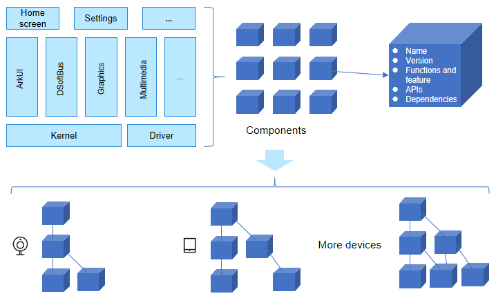
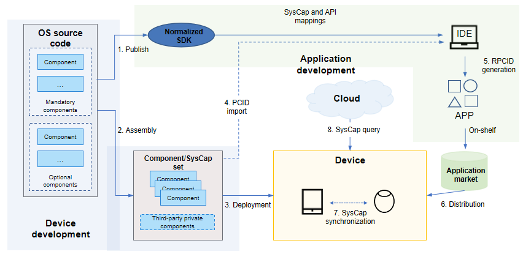

# OpenHarmony Component Design Guide

## Basic Concepts

For easy software design and management, OpenHarmony decouples software from images, components (named components originally), and modules. Their relationship is shown below.


### Component Definition

OpenHarmony abstracts system capabilities as components, so you can customize OSs for different devices by assembling and configuring these components.

A component is the basic unit of system capabilities. Divided based on source code, every component has independent files and directories, and can be instantiated into libraries or executable files on different devices.

The introduction of components is to enable a set of OS code to support a variety of product forms, thereby solving the problem of hardware and product fragmentation in different industries and improving the device development efficiency.



## Component Design

### Component Classification Rules

When developing a new function that is optional and can be tailored, add a component, rather than a module. In addition, observe the following rules:

- A component must have an independent code directory for compiling libraries or executable files.
- A component must be able to be independently deployed in the small system or standard system. Optional functions can be tailored without causing system exceptions.
- A component must be able to be independently tested and verified.

### **Rules and Recommendations**

Comply with the following rules and recommendations during component design:

**Rule 1.1** Components must be developed individually to ensure decoupling and independence.

**Rule 1.2** A common component should not depend on a specific chip, development board, or product form, except for a component related to drivers and kernels.

**Rule 1.3** All components in the minimum system component set are mandatory. They should not depend on an optional component outside the minimum system component set.

> For details about the definition of the minimum system and the minimum system component set, see **PCS** in [OpenHarmony Product Compatibility Specifications](https://www.openharmony.cn/certification/document/pcs).

**Rule 1.4** New components must be reviewed by architects and designers in the respective domain.

**Rule 1.5** Reverse dependency and cyclic dependency between components are prohibited. Lower-layer components must not depend on upper-layer components.

**Rule 1.6** Application APIs provided by a component must be stable and compatible with earlier versions. Deprecated APIs must be reclaimed as planned.

**Rule 1.7** External APIs provided by a component must be the same regardless of whether the configurable features of the component are configured.

**Rule 1.8** The component name must reflect the key function of a component and must be globally unique in the system. The name can contain a maximum of 63 characters and must be in the unix_like style, where only lowercase letters separated by underscores (\_) are used.

**Rule 1.9** The component repository must be named in the format of <Subsystem\>\_<Component\>. For example, the repository name of the storage service component in the file management subsystem is **filemanagement\_storage\_service**. The repository name can contain a maximum of 100 characters.

> **NOTE**
>
> 1. In principle, there is a one-to-one mapping between components and repositories. In some cases, multiple components can share a repository, but they must have independent directories.
>
> 2. For a third-party open source component, retain the original component name, and add the prefix **third_party** to the repository name. All third-party open source components are stored in the **third_party** directory.
>
> 3. The subsystem names in the repository name and path should not contain underscores (\_).

**Rule 1.10**: The component source code path must be in the format of <Domain\>/<Subsystem\>/<Component\>, for example, **foundation/filemanagement/storage_service**.

**Rule 1.11** The component directory structure must be as follows:

```xml
├── interfaces          # APIs
│   ├── kits			# Application APIs (optional)
│   │    ├── js			# JS APIs (optional)
│   │    └── native  	# C/C++ APIs (optional)
│   └── inner_api       # Internal APIs of components
├── frameworks          # Implementation of components without independent processes (optional)
│   ├── native          # C/C++ API implementation (optional)
│   └── js              #  JS API implementation (optional)
│        ├── napi       # Native API implementation (optional)
│        ├── builtin	# Specific to LiteOS-M (optional)
│        └── plugin     # Specific to ArkUI (optional)
├── services            # Implementation of components with independent processes (optional)
├── test                # Test code (mandatory)
├── BUILD.gn            # Entry to build (mandatory)
└── bundle.json         # Component description file (mandatory)
```

**Rec 1.1** Components should support automated build and verification.

### System Capabilities

System capabilities are provided by components. A system capability can be bound to one or more APIs. System capabilities function as a bridge between device development and application development. The differences in devices assembled with various components are represented by different system capabilities. In other words, the APIs that can be used vary according to the device in use. The figure below shows how system capabilities are used in the entire development process.



1. An application developer uses the normalized SDK that supports multiple devices to develop an application. The SDK contains a full set of system capabilities (optional and mandatory) and corresponding APIs.

2. A device developer assembles optional components and adds private components to form the system capability set of a device.

3. The system capability set is automatically written to the device during compilation and packaging.

4. A Product Compatibility ID (PCID) is automatically generated during device compilation. When developing an application for a specific device, the application developer imports the PCID to DevEco Studio to obtain the system capability set of the device during development.

5. A Required Product Compatibility ID (RPCID), a set of system capabilities required by the application, is automatically generated during application compilation and packaging.

6. When distributing an application, the application market matches the application's RPCID against the device's PCID. It distributes the application to that device only if the application's RPCID is within the device's PCID.

7. In the ability continuation scenario, the system capabilities are synchronized between devices.

8. In the installation-free scenario, the system capabilities of a device can be queried on the cloud.

#### Using System Capabilities During Application Development

An application developer can call the **CanIUse** API to query the system capabilities of a device at runtime. The code snippet is as follows:

```javascript
import geolocation from '@ohos.geolocation'

const isLocationAvailable = canIUse('SystemCapability.Location.Location');
if (isLocationAvailable) {
    geolocation.getCurrentLocation((location) => {
        console.log(location.latitude, location.longitue);
    });
} else {
    console.log('Location not by this device.')
}
```

The SDK defines the system capability set for typical device types. If a device type is selected during application development and the API called exceeds the range supported by the mandatory system capabilities of the device type, DevEco Studio displays a message indicating that the API is not supported by the device and the application compilation will fail.

#### Defining System Capabilities During Device Development

There is a one-to-one relationship between components and system capabilities, and the APIs mapped to different system capabilities do not overlap. A system capability must be named in the format of SystemCapability.Category. Feature.Subfeature (optional), for example, **SystemCapability.Media.Camera** and **SystemCapability.Media.Camera.Front**. Generally, a subfeature is implemented by an independent component. This component depends on a component that provides the basic feature, and therefore the dependent component must also be assembled into the product.

1. Declare the system capability in the **bundle.json** file of the component. The code snippet is as follows:

   ```json
   {
     ...
     "component": {
       "name": "camera",                              # Component name.
       "syscap": [ "SystemCapability.Media.Camera" ]  # System capability of the component.
     },
     ...
   }
   ```

2. Declare the system capability attribute of the API in the corresponding .d.ts file for binding. The code snippet is as follows:

   ```js
   /**
    * @name camera
    * @syscap SystemCapability.Media.Camera
    * @ since 9
    */
   declare namespace camera {
       ...
   }
   ```

### Component Review

The addition, modification (function or interface changes), and deletion of components must be reviewed by the architecture SIG and [related domain SIGs](https://gitee.com/openharmony/community/tree/master/sig). The review process is as follows:

1. Prepare the following component attribute review form.

   Table 1 Component attribute review form

   | Component Attribute    | Description                                                        |
   | ------------ | ------------------------------------------------------------ |
   | Component name    | The name must reflect the key function of a component and must be globally unique in the system. The name can contain a maximum of 63 characters and must be in the unix\_like style, where only lowercase letters separated by underscores (\_) are used.|
   | Subsystem      | Subsystem to which the component belongs.                                          |
   | Function description    | Brief description of the functions of the component in one or two sentences.                         |
   | Configurable features  | Features that can be configured externally.                                      |
   | SysCap       | System capability, for example, **SystemCapability.Media.Camera** or **SystemCapability.Media.Camera.Front**.|
   | Applicable systems| Mini system, small system, standard system, or their combinations.    |
   | Source code directory    | Root directory of the source code of the component.                                          |
   | ROM          | ROM baseline value of the component.                                       |
   | RAM          | RAM baseline value of the component.                                       |
   | Dependencies        | Components and open source software on which the component depends.                              |


2. Send an email to the architecture SIG (dev@openharmony.io) and the [related domain SIG leaders](https://gitee.com/openharmony/community/tree/master/sig) for review. Use "Applying for Adding/Modifying/Deleting OpenHarmony Components" as the email subject, and include the filled-in **Table 1 Component Attribute Review Form** in the email body.

   > For deleted components, provide the plan for stopping component maintenance. Exercise caution when deleting or modifying components and evaluate the impact on existing versions.

3. After the review is passed, create a component repository and modify the manifest according to [SIG Management Regulations](https://gitee.com/openharmony/community/blob/master/sig/README_EN.md). After the SIG is incubated, incorporate it into the main code library of OpenHarmony.

## Component Development

After the component passes the review, the component name, repository, and source code path are determined. You can perform component development as follows:

### Adding a Description File

In the development state, create a **bundle.json** file in the root directory of the component. The file contains the component name, compilation, test, system capability, features, and internal interfaces. For details about the fields, see [Description File](../device-dev/subsystems/subsys-build-component-building-rules.md#description-file). The code snippet is as follows:

```json
{
    "name": "@ohos/my_component",
    "description": "my first component",
    "version": "4.0",
    "license": "Apache License 2.0",
    "publicAs": "code-segment",
    "segment": {
        "destPath": "my_domain/my_subsystem/my_component"
    },
    "component": {
        "name": "my_component",
        "subsystem": "my_subsystem",
        "syscap": [
            "SystemCapability.MySubsystem.MyComponent"
        ],
        "build": {
            "moudles": [
                "//my_domain/my_subsystem/my_component/my_module:my_module"
            ],
            "inner_api": [
                "name": "//my_domain/my_subsystem/my_component/my_module:inner_api",
                "header_base": "//my_domain/my_subsystem/my_component/interfaces/inner_api/my_module"
            ],
            "test": [
                "//my_domain/my_subsystem/my_component:unit_test"
            ]
        }
    }
}
```

**inner_api** is an interface declared by the component for dependency between components within the system. The dependency must be specified in **external_deps**. The following is an example:

```c
ohos_executable("other_component") {
    ...
    external_deps = [ "my_module:inner_api" ]
}
```

### Adding a Compilation Script

In the **bundle.json** file, **build:modules** provides the component compilation entry. The following is an example of the compilation script of the **my_module** module in the dynamic library:

```c
ohos_shared_library("my_module") {
  sources = [ ... ]
  ...
  external_deps = [ ... ]
    
  part_name = "my_component"
  subsystem_name = "my_subsystem"
}
```

The component compilation script must comply with component-based requirements. For details, see [Component Building Specifications](../device-dev/subsystems/subsys-build-component-building-rules.md#component-building-specifications).

### Compilation Verification

After adding the description file and compilation script of the component, compile the code source to develop the functions of the component. To enable the compilation of a component, configure the component in the product configuration file. The following is an example:

```json
{
  "product_name": "my_product",
  "device_company": "my_device_company",
  "target_cpu": "arm",
  ...
  "subsystems": [
    {
      "subsystem": "my_subsystem",
      "components": [
        {
          "component": "my_component"
        }
      ]
    },  
  ...
  ]
}
```

The following code snippet is used to compile a component separately:

```c
./build.sh --product-name my_product --build-target my_domain/my_subsystem/my_component/my_module:my_module
```

Upload the compilation products and test cases of the component to the device to verify the functions.

Full compilation can also be used to verify a new component. For details, see [Adding and Compiling Components](../device-dev/subsystems/subsys-build-component.md#adding-and-building-a-component).

## Assembling Components

The product configuration file ***vendor*/*{company}*/*{product}*/config.json** can be used to assemble a product form based on the component and feature dimensions. It allows device developers to quickly build a product without intrusively modifying OpenHarmony source code. The product configuration includes the product name, development board, subsystems, and components. The following is an example:

```json
{
  "product_name": "my_product",
  "device_company": "my_device_company",
  "target_cpu": "arm64",
  "subsystems": [
    {
      "subsystem": "my_subsystem",
      "components": [
        {
          "component": "my_component",
          "features": []
        }
      ]
    },
    ...
   ]
}
```

The compilation command is **./build.sh --product-name my_product**.

### Determining Whether a Component Is Required

A component set can be configured for a product based on hardware and product functions. For example, NFC-related components are not configured on a device that does not need to provide the NFC feature.

> **NOTE**
>
> 1. The minimum system component set must be configured by default.
>
> 2. A component and its dependent components must be configured together. Otherwise, the compilation fails.

### Configuring Features

#### During Compilation

A feature in the **bundle.json** file of a component is the compilation state option declared by the component. It can be of the Boolean, numeric, or string type. The feature in the product configuration file can be changed to the default value provided by the component. For example, the screen saver feature of power management is disabled by default. You can enable it in the product as follows:

```json
{
  {
    "subsystem": "powermgr",
    "components": [
      { "component": "powermgr", "features":[ "powermgr_screensaver_enable = true" ] }
    ]
  }
}
```

For details about the feature configuration, see [Feature](../device-dev/subsystems/subsys-build-feature.md).

#### Runtime

For complex components, system parameters can be read or custom configuration files can be used during runtime to load different features, thereby meeting diverse product requirements. With feature configuration at the runtime, a component needs to be compiled only once. For different products, you only need to modify system parameters or configuration files during assembly and then create images.

### Inheritance

The product configuration file can inherit the component set through the **inherit** field. Currently, OpenHarmony provides two types of components: minimum system component set and typical product form set, which are defined in the **productdefine/common/base** and **productdefine/common/inherit** directories, respectively. The following is an example of inheriting the minimum system component set:

```json
{
    "inherit": [ "productdefine/common/base/standard_system.json" ],
}
```

Inheritance can simplify product configuration and improve efficiency.
