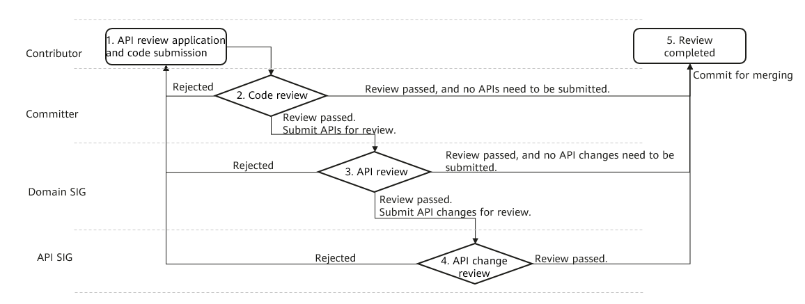

# OpenHarmony API Governance Charter

## Overview

To help the OpenHarmony application ecosystem develop in a healthy and orderly way, this Charter defines the governance process and API lifecycle (create, change, deprecate, and delete) and specifies basic design requirements of OpenHarmony APIs.

## API Scope and Definition

APIs locate between the application layer and framework layer. They are predefined class and methods provided by the framework layer and system to developers for the development of system and third-party applications. The APIs do not include OEM-extended interfaces.

OpenHarmony APIs are classified into the following types by authorized usage:

- Public API: released publicly for third-party application development.
- System API: released privately for applications with authorization signature and privileged applications only.
- Test API: released with restrictions and used only for X test suite (XTS) or application debugging. Unless otherwise specified, the terms defined in this Charter apply to Public APIs, System APIs, and Test APIs of OpenHarmony. Additional requirements or exceptions for the System and Test APIs are provided as a supplement.

OpenHarmony APIs are classified into the following types by programming language:

- Java APIs: Java programming interfaces open to applications.
- JS APIs: JavaScript programming interfaces open to applications.
- Native APIs: C/C++ programming interfaces open to applications. Unless otherwise specified, the terms defined in this Charter also apply to Java APIs, JS APIs, and Native APIs.

## API Governance

### Roles and Responsibilities

| **Role**| **Responsibilities in API Governance**
|----------|----------
| Contributor| Submit API code and design documents.
| Committer| Review the code and submit a pre-review comment on an API commit.
| Domain SIG| 

Comment on the commits of new API code, and the passed commits can be merged. Submit a pre-review comment on updated API code.

| API SIG| Comment on updated API code.
| PMC| Release API version plans. Review amendments of this Charter, revise the terms, and publish the API Governance Charter.

### API Review Process

The review process is as follows.

Process description

1. Initiate review and submit code (Contributor): If any APIs are added or modified, the Contributor needs to additionally submit the the API design document to specify the demand source, application scenarios and usage, permission design, and privacy protection clarification. For details, see the API review application composites. To avoid rework, the Contributor can send an email to submit the API design document to the Committer, Domain SIG, and API SIG for pre-review before the formal API review application and code submission.
2. Review code and pre-review APIs (Committer): After the code review is approved, the Committer should submit the APIs to the Domain SIG. If the API code involve multiple domains, they should be submitted to the Committers of the corresponding domains. The next review step can be performed only after all Committers review and approve the code.
3. Review APIs (Domain SIG): The code of added APIs can be merged only after being reviewed and approved by the Domain SIG. If there are changes of existing APIs to review, the Domain SIG should submit them to the API SIG. If the newly added APIs involve multiple domains, they should be submitted to the SIGs of the corresponding domains. The code can be merged after being reviewed and approved by one of the Domain SIGs. If the changed APIs involve multiple domains, they should be submitted to the SIGs of the corresponding domains. The next review step can be performed only after all Domain SIGs approve the APIs.
4. Review API changes (API SIG): The code of changed APIs can be merged only after being reviewed and approved by the API SIG.
5. The review is complete.

### API Review Application Composites

If an API is added or changed, the corresponding API design document needs to be submitted.

For new APIs, the following elements must be included:

1. (Mandatory) Describe the demand source and application scenario.
2. (Mandatory) Analyze the API as-is and gaps, and describe the necessity of adding or changing APIs.
3. (Mandatory) Describe the API prototype design and usage. (Optional) When necessary, add use examples.
4. (Mandatory) Provide the API permission design.
5. (Mandatory) Clarify the API privacy protection solution and requirements fulfillment.
6. (Mandatory) Submit the corresponding API reference when submitting the code. (Optional) When necessary, submit the corresponding developer guide.
7. (Optional) Describe the compatibility, performance, power consumption, reliability, and tests. (If "API Design Requirements" of this Charter are not met, the description must be included.)

For changed APIs, except the preceding composites, the following must be included:

1. (Mandatory) How old APIs are handled (deprecated, hidden, or permanently deleted) and compatibility measures for developing applications using old SDKs.
2. (Mandatory) Change impact, substitute APIs, and corresponding application adaptation solution.
3. (Mandatory) Update the ChangeLog file. Update the API-diff file (Mandatory if JS/Native API changes are involved. Optional for Java API changes because this file is automatically generated using the tool and do not need to be manually submitted.)

## API Design Requirements

### Consistency

1. Concept: Scenario-based service models are abstracted to form coherent, consistent, and self-consistent OpenHarmony user program model and service concepts.
2. Term: Service terms must be nouns. Multiple nouns with similar semantic meanings are not allowed to represent the same service object. Similarly, to avoid confusion, it is not allowed to use the same noun or linguistically close nouns for different service objects.
3. Operation: Each operation action is expressed using a unique verb.
4. Parameter sequence: The location and sequence of the same parameter or parameter sequence in multiple APIs are the same.
5. Mechanism and algorithm: The communication mechanism, calling mode, authentication mechanism, and encryption algorithm are consistent.
6. API reference, demo, and template style: The layout and usage are consistent.

### Ease of Use

Design APIs from the perspective of their users rather than providers.

1. Readability: API naming, functions, and features must be easy to understand.
2. Ease of use: Provide easy-to-use APIs by reducing unnecessary coupling between APIs, avoiding dependencies on the calling sequence of multiple unrelated APIs, and avoiding calling multiple methods from different packages, modules, or classes at the same time when using a single function.
3. Avoiding misleading: Provide capabilities complying with user expectations to avoid misuse.
4. Provide required API reference documents.

### Naming

1. Be able to express the function clearly. Use full descriptive words.
2. Avoid misleading. Misleading names are more harmful than ill-stated ones.
3. The meaning of the word is clear. Avoid using common words such as info, data, and object.
4. The larger the scope is, the more precise the naming should be.
5. Do not use or minimize the use of abbreviations. Common terms in the industry must comply with industry conventions and can be abbreviated.
6. Package name/module name/namespace prefix convention:
   1. Java API package name: package ohos.\*.
   2. JS API module name: @ohos.\*.
   3. Native API namespace: namespace OHOS.\*.
   4. If external open-source code is referenced, retain the original package name, module name, or namespace, or replace the package name according to the preceding rules.
7. The package name, module name, and namespace must contain at least two and at most four segments. One word is recommended for each segment, and a maximum of two words are allowed.
8. The class name, method name, function name, member variable, and variable name cannot exceed four words.

### Permission Control

1. Completeness principle: All behaviors across application sandboxes must be limited by permission control.
2. Optimal granularity principle: One permission protects only one type of objects. You only need to apply for one permission to access an interface.
3. Clearness principle: The protected object, permission scope, and sensitivity level must be clearly specified in the permission definition.
4. Minimum scope principle: A permission is assigned only to applications that have service requirements to minimize permission scope.

### Privacy Protection

1. The response returned from API calling contains only necessary information.
2. Mobile phone users’ personal data cannot be obtained through API calling unless required permissions are assigned by users.
3. In case that an API is called by multiple applications, if personal data needs to be disclosed to the API to be called, the caller must specify the disclosed data type, data receiver, and data use purpose in the privacy statement.
4. When an API needs to access sensitive user data (such as phone calls, contacts, and media content), the system picker mechanism must be used to prevent the API from accessing the data by applying for sensitive permissions.
5. API openness does not allow unrelated functions.

### Documentation

1. The API reference document is in English.
2. The API reference document must include the brief and detailed descriptions of modules and packages.
3. The API reference document must include brief descriptions of classes, methods, interfaces, enumerations, and member variables.
4. The API reference document can optionally include detailed descriptions of classes, methods, interfaces, enumerations, and member variables.
5. The API reference document must contain descriptions of all input parameters of a method or interface.
6. If a method or interface has a return value, the API reference document must contain a return value description.
7. If an exception may be thrown during the execution, the API reference document must contain the exception description.
8. The starting version number of the API (annotated with @since) must be included.
9. The version number of a module or class (annotated with @version) is optionally included.
10. If incompatible API changes are involved, both API-Diff and ChangeLog files must be delivered.

### Compatibility

1. The API compatibility requirements in descending order are as follows: contract compatibility > binary-code compatibility > source-code compatibility.
   1. Source-code compatibility: After version evolution, the developer’s existing source code can be compiled properly.
   2. Binary-code compatibility: After version evolution, the developer’s existing programs can be linked to and run properly without recompilation.
   3. Contract compatibility: It is also called semantic compatibility. After version evolution, the developer’s original program behaviors remain unchanged.
2. OpenHarmony API backward compatibility must meet binary-code compatibility requirements. Exceptions must be reviewed by the API SIG and approved by the PMC. Common API changes that break binary-code compatibility include:
   1. Delete any API elements.
   2. Reduce the visibility of a method. For example, change from protected to private or from public to protected.
   3. Change the class type. For example, change from an abstract class to a non-abstract class, or from an interface class to a non-interface class.
   4. Change the method prototype. For example, change the return value type, input parameter sequence, or input parameter type.
   5. Change the member attributes. For example, change the member attribute from non-final to final or from non-static to static.
3. Do not modify APIs with the same prototype but incompatible functions. You can modify APIs by deprecating old APIs and adding new ones with restrictions.
4. Depending on the release type, the API lifecycle and compatibility requirements are as follows:

1. Canary version: API preview version released at an earlier date, which cannot ensure API stability.
   1. Canary versions are compatible with the previous release version.
   2. Different Canary versions of the same API version are not required to keep compatible.
2. Beta version: publicly released beta version, which cannot ensure API stability.
   1. Beta versions are compatible with the previous release version.
   2. Beta versions are not compatible with the early canary versions of the same API version.
   3. Different Beta versions of the same API version are not required to keep compatible.
   4. The APIs are frozen after the API Stable version is released. API additions or changes are not allowed for later Beta versions.
3. Release version: official API release version. Released APIs must comply with the contractual commitments made to external developers. In principle, incompatible changes cannot be made on released APIs, and deprecation of released APIs is restricted. The basic requirements for deprecating released APIs are as follows:
   1. Add the deprecate annotation.
   2. Provide alternative interfaces.
   3. Retain the deprecated APIs in at least five API versions released since the deprecation.

### Performance, Power Consumption, and Reliability

1. Respond in a timely manner to avoid callers waiting. If an API call takes a long time, use an asynchronous API.
2. Pay attention to the impact of the API call timing and frequency on the RAM usage.
3. Pay attention to the impact of the API call timing and frequency on power consumption.
4. The lifecycle of an object created in an API must be complete to prevent object resource leakage.
5. The idempotence requirement must be met. The caller can obtain the same effect after calling request APIs with the same service meaning for one or multiple times (except for the APIs whose calling depends on the change of external resources). To call a reentrant API, avoid introducing time-varying factors, such as system ticks, static variables, and global variables without mutual exclusion protection. To call an API from a client repeatedly, use contextID, clientToken, and sequenceNo as input parameters.

### Testing

1. Automatic API test cases must be delivered for all new APIs.
2. Use one test case for each single scenario. One test case covers a single function scenario of an API, simplifying the code logic of each single test case.
3. The test case execution is efficient. The execution time of each test case is limited to milliseconds.