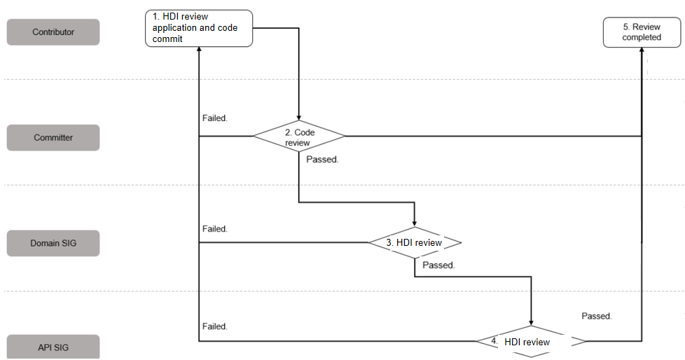

# OpenHarmony HDI Design Specifications

## Overview

Hardware device interface (HDI) provides a set of interfaces that function as a bridge between drivers and system services for data transmission. They have a direct impact on system efficiency, stability, compatibility, and reliability, as well as data accuracy and integrity. This document aims to standardize the design and development of OpenHarmony HDI interfaces, thereby ensuring consistent styles and complete functionalities for the interfaces.
This document is developed by the [driver SIG](https://gitee.com/openharmony/community/blob/master/sig/sig_driver/sig_driver.md) and approved by the [PMC](https://gitee.com/link?target=https%3A%2F%2Fwww.openharmony.cn%2Fcommunity%2Fpmc%2F). Any revision to this document must be reviewed by the driver SIG and approved by the PMC.

**Acronyms**

| Acronym | Full Spelling                           |
| --- | ------------------------------ |
| HDI | Hardware Device Interface      |
| IDL | Interface Description Language |

**Conventions**

**Rule**: a convention that must be complied with

**Rec**: a convention that should be considered

**Note**: an explanation to a rule or rec

**Change History**
| Version | Change Description              |
| ---  | --------------------- |
| v1.0 Beta | This issue is the initial version.              |
| v1.0  | This issue is the official version.              |


## Scope and Definition


Located between the system service layer and the device driver layer, HDI provides unified device function abstract interfaces for device developers. It shields the differences of devices from system services.

## General Rules

### Version Control

The HDI version number must be in the format of `major.minor`, where `major` must be an integer increased in ascending order and `minor` is a one-digit integer.

- A change in `major` indicates architecture adjustment or interface definition that is not backward compatible. 

- A change in `minor` indicates enhanced or extended interface definitions that are backward compatible.

When `major` changes, `minor` is reset to `0`.

[Example]

For released vibrator interfaces:

```cpp
package ohos.hdi.vibrator.v1_0;
interface IVibrator {
   ...
   SetModulationParameter([in] unsigned int vibrationPeriod, [in] int intensity, [in] int frequency);
   ...
}
```

If the update to the existing interfaces does not affect version compatibility, for example, adding a function, adding an enum definition, or changing a variable name, change only `minor`, for example, to `ohos.hdi.vibrator.v1_1`, as follows:

```cpp
package ohos.hdi.vibrator.v1_1;
interface IVibrator {
   ...
   SetModulationParameter([in] unsigned int vibrationPeriod, [in] int intensity, [in] int freq);
   ...
}
```

If the original interface is renamed or the variable list is modified, change `major`, for example, to `ohos.hdi.vibrator.v2_0`, as follows:

```cpp
package ohos.hdi.vibrator.v2_0;
interface IVibrator {
   ...
   SetModulationParameter([in] unsigned int vibrationPeriod, [in] int intensity, [in] int frequency, [int] time);
   ...
}
```

### Review and Control

HDI interfaces are provided to implement upper-layer system service requirements and perform hardware operations (such as initialization). New and updated interfaces must be fully reviewed and strictly controlled. Only interfaces that meet universal requirements can be added.

Table 1 Interface review and control roles

| **Role**   | **Responsibility**                                   |
| ----------- | ------------------------------------------------ |
| Contributor | Write HDI code and submit the code and design documents for review.                   |
| Committer   | Review the HDI code, and submit the code to the domain SIG for further review.                           |
| Domain SIG    | Review the new or updated HDI code.|
| Driver SIG  | Review the new or updated HDI code.                                 |
| PMC         | Revise and publish this design specifications.                 |

### Release

- HDI review process

    

    The main process is as follows:

    1. The contributor commits code and initiates a review. In addition to the code of new or updated HDI interfaces, the contributor must provide information about the HDI requirement source, usage scenario, permission design, and privacy protection design. For details, see "Review application composites" below. To increase the review efficiency, the contributor can email the design documents to the committer, domain SIG, and driver SIG before submitting the review application.
    2. The committer reviews the code and HDI interfaces.
    3. The domain SIG reviews the new or updated HDI interfaces.
    4. The driver SIG reviews and approves the new or updated HDI interfaces.
    5. The review is complete, and the code is merged.

- Review application composites

    After the HDI design is complete, the domain SIG must organize an effective review and provide the following documents before HDI release:

    - Complete and reasonable test cases

    - **HDI version differences, with a clear addition or change scope**

    - Complete interface context, which must be provided in the design document to specify when and how to use each interface

    - Resource status transition diagram in the design document for resource-oriented interfaces

    - Compliance with the HDI design constraints proposed in this document

- Requirements

    1. Change `major` for any release that is incompatible with earlier versions.

    2. Change `minor` for any interface released for function extension.

    3. To deprecate any released interface:

        - The `deprecated` flag must be provided.

        - The deprecated interfaces must be retained in at least four OpenHarmony HDI versions.

## HDI Design Constraints

### Consistency

#### [Rule] Use consistent nouns for terms.

Multiple nouns with similar semantic meanings are not allowed to represent the same service object. Similarly, to avoid confusion, it is not allowed to use the same noun or linguistically close nouns for different service objects.

#### [Rule] Keep the parameter sequence consistent.

The sequence of a parameter or parameter group in multiple interfaces must be the same.

For object-oriented C programming, place the interface object as the first parameter by convention.

#### [Rule] Keep the memory ownership consistent.

If the memory (storage data) passed through the input parameter (in) or output parameter (out) is allocated by the caller, the memory must be released by the caller. If the memory is allocated by the callee, it must be released by the callee. Regardless of whether data is passed from a service to a driver or received from a driver, the ownership of the data should not be changed, which must always be the memory allocator.

[Example]

```cpp
int (*OpenLayer)(uint32_t devId, const LayerInfo *layerInfo, uint32_t *layerId);
```

When **OpenLayer** is called, the graphics layer data memory is allocated based on the input parameter **layerInfo**, and a layer ID is returned.

```cpp
int (*CloseLayer)(uint32_t devId, uint32_t layerId);
```

A **CloseLayer** interface must be provided to release the graphics layer data memory when the caller finishes the operation.

#### [Rule] Provide a specific return value for every synchronous interface.

When defining a synchronous interface, you must define the return value and provide necessary invocation status information to specify whether the invocation is successful. If the invocation fails, specify the cause of the failure. You can define a return value based on the actual error cause.

[Exceptions]

If an interface is unidirectional, which means that a value can be returned without waiting for the interface to be executed, use the keyword `one way` in the comment. Example:

```cpp
/* one way */
void WriteReady();
```

### Naming

#### [Rule] Name an interface in the format of "I" + "*interface name*".
Interface names must be concise, easy to understand, and accurate. Avoid redundant and misleading words, or rare abbreviations.

[Example]
```
    /* Good */
    interface IBattery {
        ...
    }

   /* Bad: The Interface suffix is redundant. */
    interface IBatteryInterface {
        ...
    }
```
#### [Rule] Name the HDI package in the format of "package ohos.hdi.[interface_name].v[major_version]_[minor_version]".
[Example]
```
    /* Good */
    package ohos.hdi.battery.v1_0;
    interface IBattery {
        ...
    }

   /* Bad: The hdi namespace and version information are missing. */
   package ohos.battery;
    interface IBattery {
        ...
    }
```
#### [Rule] Name classes, structs, functions, and parameters in camel case.
**Camel case style**
Camel case is the practice of writing words without spaces. It indicates the separation of words with a single capitalized letter, and the first word starts with either case, bringing about **UpperCamelCase** and **lowerCamelCase**.


| Type                                      | Style     |
| ---------------------------------------- | --------- |
| Interface types, functions, struct types, enum types, and union types      | UpperCamelCase      |
| Parameters, and member variables in a struct or union| lowerCamelCase      |
| Constants and enums                 | All uppercase letters, separated by underscores (_)|

#### [Rule] Use the interface class name as the interface file name and `.idl` as the file name extension.
- An independent interface file must be provided for every interface class, and the file name must be the same as that of the interface class (UpperCamelCase) and end with `.idl`.
- The description file of the type definition must be named `Types.idl` or `ExampleTypes.idl`.

[Example]

```
    package ohos.hdi.battery.v1_0;
    interface IBattery {
        ...
    }
```
   The interface description file must be named `IBattery.idl`.

### Ease to Use

#### [Rule] Follow the single responsibility principle.

The functionalities of each interface must be stable and clear, and the trigger source of interface changes must be unique.

[Example]

When the device status consists of the power status and port status, use two interfaces rather than one.

**Correct Example**

```cpp
int UpdatePowerState(int_t deviceId, int status); // This interface is used to update the power status of the device.

int UpdatePortStatus(int deviceId, int status); // This interface is used to update the port status of the device.
```

**Incorrect Example**

```cpp
int UpdateDeviceStatus(int deviceId, int powerStatus, int portStatus);
```

#### [Rule] Consider cohesion during interface parameter design.

When defining an interface parameter, consider whether to pass the parameter separately or encapsulate the parameter in a struct based on the following factors:

1. Is there a meaningful encapsulation boundary?

    If there is obvious cohesion or association between parameters, you can encapsulate these parameters in a struct.

2. Is there any other use of this struct if structured parameters are used?

    If no, pass the parameter separately.

3. Does a parameter group occur in multiple interfaces?

    If yes, you can pass these parameters as a struct. In this case, you also need to consider whether these parameter groups are cohesive.

4. Is there a large number of optional parameters, or do they usually be assigned a default value?

    If yes, you can use a struct to simplify the invocation.

[Example]

Audio sampling attributes include the sampling format, sampling frequency, and number of channels. These attributes are also sampling related and can be passed as a struct.

```cpp
struct AudioSampleAttributes
{
    enum AudioFormat format;
    uint32_t sampleRate;
    uint32_t channelCount;
};
```

#### [Rule] Make interfaces of different device types independent from each other.

Interfaces are managed by driver type, such as `Camera`, `Input`, `Display`, `Audio`, `Sensor`, and `Storage`. Interfaces of different device types should not depend on each other. It is recommended that common capabilities that may be used by more than two types of driver modules be abstracted as common interfaces and archived to the common interface capability library for management.

[Exceptions]

There is no restriction on the interfaces that provide common capabilities. For example, the definition of primitive types and the declaration of interfaces can be referenced by all interfaces.

### Privacy Protection

### [Rule] Consider privacy security.

System services can access data such as device information and identifiers through drivers. Certain information, such as device names, serial numbers, and device addresses, is sensitive data defined in privacy protection specifications. During HDI design, pay attention to the use of these fields and review them carefully and thoroughly to ensure that the interfaces will never expose sensitive information.

[Example]

`Bluetooth` addresses are mainly used in device discovery and connection scenarios. When a device is discoverable, the `Bluetooth` address could be used for personal tracking.

The major purpose of obtaining a `Bluetooth` address is to uniquely identify a device. Therefore, you can convert the `Bluetooth` address into a unique identifier for invocation or restrict the application scope of this interface.

### Permission Control

#### [Rule] Minimize the interface permissions.

All behaviors across application sandboxes must be controlled by permissions. A specific permission can be granted only to applications that have legitimate service requirements.

### Performance

#### [Rule] Consider data transmission efficiency.

Drivers have a large number of data transmission interfaces. Data transmission may involve inter-process communication (IPC), which increases system overheads or even trigger system scheduling. Therefore, you need to consider all situations when defining interfaces. For the data that must be transmitted between processes with low overhead and low latency, you can use the shared memory or message queue.

[Example]

Define a data transmission interface for a driver module as follows:

```cpp
// IPC is not involved (direct interface calling).
int WriteData (...); // Define the data address pointer and data length as input parameters.

/*
 * IPC is involved.
 *
 * Define a shared memory or message queue object as the input parameter.
 * In this way, data can be efficiently transmitted (since repetitive operations can be minimized).
 */
int PrepareWriteData(…);
```

#### [Rec] Consider the interface execution time.

To improve IPC performance, you are advised to use asynchronous processing for time-consuming services on the server. If the client needs to wait for the result synchronously, you are advised to add a block on the client and use the asynchronous callback mode so that the IPC channel can be released in time.

[Example]

The `Camera` driver provides a device initialization interface, the execution of which takes more than 150 ms due to software and hardware reasons. If this interface uses synchronous mode, the camera HDI service IPC thread may be occupied for a long time, and other requests fail to be responded in time. It is more reasonable to design this interface as an asynchronous one. A callback can be used to return the initialization result to the client. If the client needs to wait for the return value before continuing other operations, it can block the process and wait for the callback result.

#### [Rec] Minimize the number of new process entities.

To reduce the system overhead, interfaces of the same type in the same subsystem must be deployed in the same process. Add processes only when they are necessary.

### Power Consumption

#### [Rule] Consider system power consumption.

When the caller releases hardware resources, the corresponding driver module should release the wake lock so the system will not be prevented from sleeping.

### Reliability

#### [Rule] Mutual dependency is forbidden for the lifecycle of interface parameters.

The lifecycle of interface parameters must be independent. Mutual dependency is prohibited. Pointer parameters should not point to the memory of other objects, for example, the serialized memory. This is because when the serialized memory is passed to the peer function, the memory block lifecycle disappears after the parameter is parsed, but the pointer may be passed between different functions, resulting in vulnerabilities such as Used After Free (UAF).

[Example]

Both `ReadUnpadBuffer` and `ReadCString` return a pointer variable that points to the internal memory of the serialized object. When the server callback is triggered, the serialized object used to pass the parameters is destroyed and the memory is free. If other processes on the server still use the pointers returned by the two interfaces, crash may occur due to the UAF.

The correct practice is to copy the data to the memory managed by the service before using the data after the service response interface returns the data.

#### [Rule] Consider reentrancy.

Interfaces often need to support multiple clients, and a single client may have concurrent requests. Therefore, you must consider reentrancy during HDI design. To ensure correct processing of reentrant interfaces, use locks or semaphores to protect critical resources.

[Example]

A driver service provides resource request and release interfaces. When two clients request resources at the same time, if reentrancy is not considered for critical resources on the server, resources may be released in advance or cannot be released due to management data read/write competition. The correct practice is to lock critical resources.

#### [Rec] Consider the transmission buffer capability.

No flow control is posed on the amount of data sent in an interface or callback. However, if the data volume of an interface exceeds the maximum transmission buffer size, consider using a block until the resource is available.

[Example]

When memory application fails, you can use a semaphore to block the current thread until the memory is available.

#### [Rule] Do not pass function pointers across address spaces.

Virtual address space isolation is used between processes. Passing function pointers through IPC will cause access exceptions. Therefore, do not pass function pointers. To implement a callback function, use a callback object instead.

[Example]

The Wi-Fi module provides an interface to receive a callback triggered when the client accepts the server request. An incorrect practice is to write the function pointer implemented by the client to the serialized object, which causes a crash when the function pointer is called on the server.

The correct practice is to design and implement the callback interface using a callback object, and pass the callback object to the server through the serialization interface, so the server can trigger the callback when needed.

### Compatibility

#### [Rule] Verify the version number before the client calls an interface.

Due to the independent component update policy, the version number of an interface on the client may be different from that on the server. This requires the client to verify the version number on the server and use the matching version to call the interface on the server.

[Example]

Assume that the TP module provides interfaces of versions 1.0 and 1.1. The later version has new interfaces. The components on the client have updated to 1.1, and the server still uses 1.0. If the client directly calls an interface of 1.1 on the server, an error may occur. Instead, the client must use the service version query interface to check the server version. If the server version is 1.0, the client must use the interface of 1.0 to call the server.

#### [Rule] Release HDI interfaces in .idl format.

Currently, Unix-like drivers use virtual file system (VFS) interfaces to expose internal interfaces. The user mode and kernel mode communicate with each other using system calls. They are packed in different images, and two sets of interfaces are maintained separately. To ensure the consistency of the interface definition and parameter format between the two and consider the design objective of cross-kernel hardware driver foundation (HDF) deployment, release interfaces in .idl format and use a tool to generate interfaces of the target form. In addition, the user-mode caller is not allowed to operate the driver VFS interfaces through the file interface. This causes the framework to strongly depend on the kernel and violates the principle of depending on the interface instead of the implementation.

Recommended practice: The driver provides interfaces in .idl format and encapsulates the access to the kernel device in the interface implementation.

[Example]

An input device provides query interfaces for attributes such as the device type and data precision. The input service should not directly access the VFS interface created by the kernel in open-ioctl mode. Instead, the input driver should provide an interface to abstract the input device as an object. Then the input service calls this interface to implement the required functionalities.

### Documentation

#### [Rule] Release HDI interfaces in .idl format.
To ensure interface compatibility and consistency, release interfaces in .idl format. It is prohibited to directly release interfaces in C/C++ header files.


#### [Rule] Provide an interface description during interface release.
The interface description must contain the interface functionality, parameter value range, return values, and precautions. The description text must be placed above the interface description in the .idl file and released with the interface.

[Example]

```
/**
    * @brief Obtains the executor information.
    *
    * @param executorInfo Indicates the executor information. For details, see {@link ExecutorInfo}.
    *
    * @return Returns <b>0</b> if the operation is successful.
    * @return Returns a non-zero value if the operation fails.
    */
GetExecutorInfo([out] struct ExecutorInfo executorInfo);
```

### Programming Languages

To ensure data interworking between interfaces implemented in different programming languages, follow the restrictions below when using data types in the interface description.

#### Constraints on using basic data types

| IDL Data Type | C++ Data Type | C Data Type       | Data Length (Bytes)|
| -------------- | ----------- | --------------- | ----------- |
| void           | void        | void            | NA          |
| boolean        | bool        | bool            | 1           |
| byte           | int8_t      | int8_t          | 1           |
| short          | int16_t     | int16_t         | 2           |
| int            | int32_t     | int32_t         | 4           |
| long           | int64_t     | int64_t         | 8           |
| float          | float       | float           | 4           |
| double         | double      | double          | 8           |
| String         | std::string | char*, int size | NA          |
| unsigned char  | uint8_t     | uint8_t         | 1           |
| unsigned short | uint16_t    | uint16_t        | 2           |
| unsigned int   | uint32_t    | uint32_t        | 4           |
| unsigned long  | uint64_t    | uint64_t        | 8           |

#### Constraints on Using Container Types

| IDL Container Data Type| C++ Data Type     | C Data Type      |
| ----------- | ------------ | ----------- |
| List<T>     | std::list<T> | T*,int size |

#### Constraints on Using Array Types

| IDL Array Data Type | C++ Data Type       | C Data Type      |
| --------- | -------------- | ----------- |
| T[]       | std::vector<T> | T*,int size |

#### Constraints on Using Custom Types

| IDL Custom Data Type| C++ Data Type| C Data Type |
| ------- | ------- | ------ |
| struct  | struct  | struct |
| enum    | enum    | enum   |
