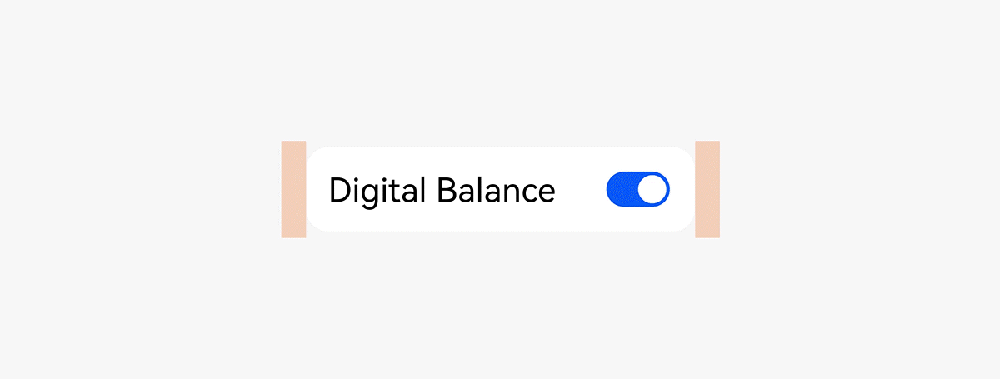
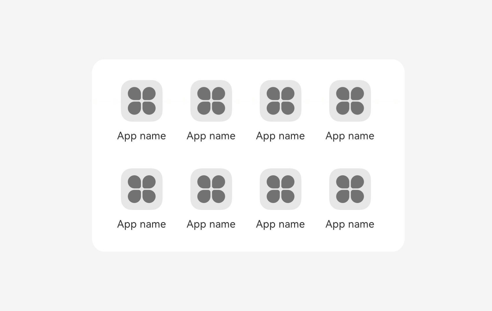
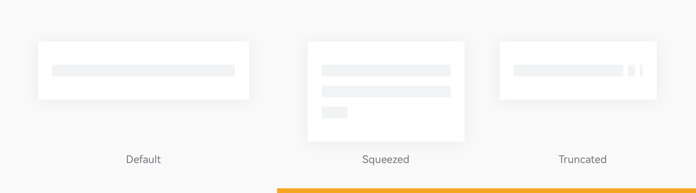
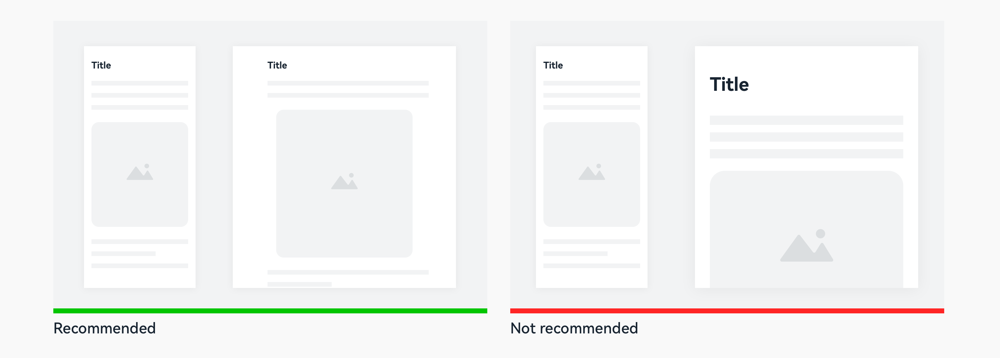
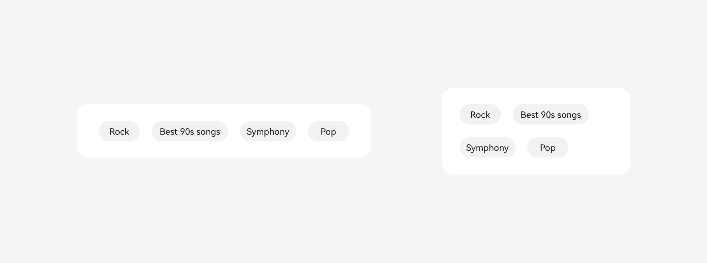

# Adaptive Layouts

An adaptive layout is implemented based on the relationship between a component and its parent container. When the size or position of the parent container changes, the component adapts to the change accordingly. Generally, adaptive layouts can change continuously according to vp or px changes.

## Adaptive Stretching

The display width of a component or a group of components is not fixed. Instead, it is determined based on the relative reference object. When the width of the reference object changes, the content width or content spacing adaptively stretches.

Stretching: For example, in a list and toggle combination, when the window width changes, the toggle has a fixed width and a fixed position relative to the right edge of the list, whereas the combination and the text width adaptively change.

Equalization: For example, in an icon grid, when the window width changes, the distance between two adjacent entry icons and the distance between the icons and the left and right edges change equally.

Adaptive stretching applies to content and content combinations that have a flexible display width and are insensitive to the aspect ratio, such as texts, common buttons, and spacing.

If the width after stretching is insufficient to display the default content, ensure the content integrity or others based on the scenario, and use other adaptive methods such as truncation or line feed.

## Adaptive Scaling

The display size of a component is not fixed. Instead, it is determined based on the relative reference object. When the size of the reference object changes, the component size adaptively scales.

Scaling: For example, no matter how the screen width or height changes, the watch face is always complete and has its width and height determined based on the shorter side.

Proportion: For example, for an illustration with a subject and a background, the image content is cropped based on the width change and scaled by 50% based on the height change.

Adaptive scaling applies to content with a fixed aspect ratio, such as images, round buttons, banners, and images that reflect the shape of real objects.

Do not scale all components or scale a component to a size that exceeds 50% of the screen. Otherwise, the information that users can obtain decreases.

## Adaptive Extension

The number of displayed components is not fixed. Instead, it is determined based on the relative reference object. When the width of the reference object changes, the number of displayed components adaptively extends.

Extension: For example, the last content of a subtab or sliding grid is partially exposed under the default width, indicating that there are more components on the right. When the screen width changes, more components are displayed while each component has a fixed width and supports the sliding interaction.

Hiding: For example, music playback buttons in the same row have different priorities. When the screen width changes, the buttons with lower priorities can be hidden.

Adaptive extension applies to content that has the same interaction level and can be filled with more data, such as tabs, operation blocks, and recommendation columns.

Note: You need to determine whether the hidden content affects the function integrity, and consider using sliding or the **More** button to display the hidden content.

## Adaptive Wrapping

A component with the wrapping feature can present a vertical or horizontal layout based on the available space of the parent container.

For example, when the width of the parent container is sufficient, the operation blocks are located in a same row. When the width reduces, they are arranged vertically.

Adaptive wrapping applies to content that has the same interaction level and wants to ensure type and quantity integrity, such as tabs, operation blocks, and content streams.