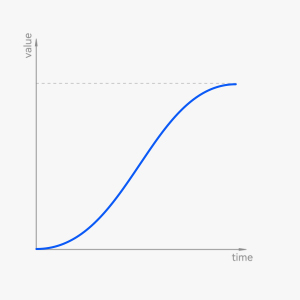
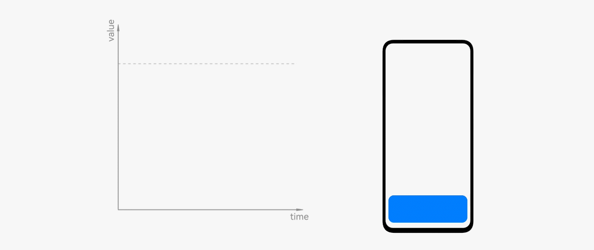
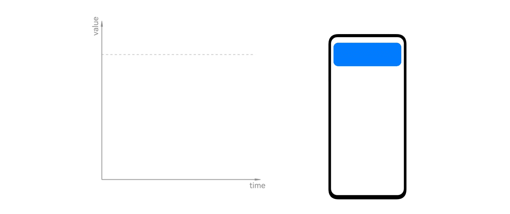
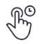
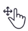

# Animation Attributes

Any type of animations consists of the following attributes: duration, curve, and frame rate.  Different combinations of these attributes can create animations of different styles and characteristics, such as steady, lightheartedly, merry, and soothing.

## Duration

Animation duration varies according to the types of elements and scenarios. Animations that last too long or too short will make users uncomfortable. The following factors should be considered to enable the duration to accommodate different types of animations.

## Unit

The animation duration is usually in milliseconds (ms). 1 second equals 1000 milliseconds. When the frame rate is 60 fps, one frame is equal to 16.67 ms.

## Complexity

It takes more time to express complex animations than simple animations. And animations should be designed based on the characteristics of graphics.

| | |
| -------- | -------- |
| **Simple animation** The status change is expressed only through the change of colors. Duration: 100 ms| **Complex animation** A rotation animation takes some time to display. Duration: 300 ms|

## Regions

The motion of an animation takes place within a certain range, and a small range movement takes less time than a full-screen movement.

|  |  |  |
| -------- | -------- | -------- |
| **Movement in a small range** Toggle. Duration: 150 ms| **Movement in some areas** Deleting a list. Duration: 200 ms| **Movement in full-screen** Opening an image. Duration: 350 ms|

## Curves

The curve and duration cooperate with each other to produce the rhythm of motion. By adjusting the curve, you can make an animated object speed up or slow down, rather than moving at a constant speed. The movement of objects in the real world takes time to accelerate and slow down.

Transitions without moderating curves are stiff and mechanical.

## Animation Curves

The animation curve, also known as the animation interpolator, is essentially a method of adjusting the speed of the moving object on the time line.

|| | ||
| -------- | -------- | -------- | -------- |
| Linear | Easing| Spring| Others|

## Bezier Curve

Bezier curve is a mathematical curve and is widely used in animation design. By form, it can be divided into standard curve, deceleration curve, and acceleration curve.

### Standard Curve

The object is stationary at the start, accelerates to a peak velocity, and then slows down to become stationary again at the end. The acceleration phase takes less time than the deceleration phase.

Usage: Use the standard curve for objects that remain within the users' line of sight before and after movement, to create realism and credibility.

Scenarios: image zooming, tab switching, and switch toggling on/off.

cubic-bezier(0.40,0.00,0.20,1.00)

### Other Types of Standard Curves

| .jpg)| .jpg)|
| -------- | -------- |
| cubic-bezier(0.20,0.00,0.10,1.00) | cubic-bezier(0.33,&nbsp;0.00,&nbsp;0.67,&nbsp;1.00) |

### Deceleration Curve

The object moves at the highest speed at the beginning, gradually slows down over the course, and halts entirely at the end.

Usage: Use the deceleration curve for objects that appear in the line of sight. The natural slowdown at the end allows human eyes to follow the objects.

Scenarios: appearing of dialog boxes.

cubic-bezier(0.00, 0.00, 0.40, 1.00)

### Other Types of Deceleration Curves

| .jpg)| .jpg)|
| -------- | -------- |
| cubic-bezier(0.00,&nbsp;0.00,&nbsp;0.20,&nbsp;1.00) | cubic-bezier(0.00,&nbsp;0.00,&nbsp;0.00,&nbsp;1.00) |

### Acceleration Curve

The object is stationary at the beginning, then starts slowly, and ends fast at full velocity.

Usage: Use the acceleration curve for objects moving out.

Scenarios: exiting of dialog boxes and deleting widgets.

## Spring Curve

Spring curve is a physical curve in which the speed variable is used as a parameter in the curve formula. The same group of parameters can generate different curves at different speeds. Physical attribute parameters, such as stiffness and damping, are used to produce natural spring effect.

### Interpolating Spring Curve

The interpolation spring curve is determined by four physical attributes: stiffness, damping, mass, and velocity.

| Name| Description|
| -------- | -------- |
| Stiffness| Extent to which an object resists deformation in response to an applied force.|
| Damping| Force that converges the vibration of the spring by the shock absorber. Damping reduces the amplitude of the spring over time until the spring stops.|
| Mass| Mass of the object attached to the spring.|
| Velocity| Initial velocity of the object attached to the spring.|

### Spring Motion and Responsive Spring Motion Curves

The spring motion and responsive spring motion curves are determined by response, damping fraction, and overlap duration.

| Name| Description|
| -------- | -------- |
| Response| Period of the undamped natural oscillation.|
| Damping fraction| Damping applied to the animation value.|
| Overlap duration| Duration for animations to overlap, in seconds.|

The interpolation spring curve type and the spring motion or responsive spring motion curve type can be converted to each other to produce the same animation effect.

Interpolating spring: Stiffness: 128, Damping: 12, Msss: 1, Velocity: 0

Spring motion: Response: 0.555, DampingFraction :0.53

### Critical Damping

Critical damping allows objects to reach the stable equilibrium state in the minimum amount of time without oscillating.

### Underdamped

The damping is weak, and objects consume rigid energy by oscillations and finally achieve a stable equilibrium state.

### Overdamped

When the damping is too large, the motion curve of objects is attenuated more slowly, and finally the stable equilibrium state is achieved.

### Characteristics of Elastic Curves

**Automatic Matching of Interruptible Duration**

- Interruption means an update to the status of the target point. The new animation inherits the velocity of the previous one, delivering a natural transition experience.

- The interruption time is not fixed. After the interruption, the animation motion duration is naturally matched. For inelastic curves, the duration must be manually specified.

**Velocity Inheritance**

- Under the same group of elastic curve parameters, different velocity values are passed in, changing the curve form to some extent. This makes the motion more user-friendly.

**Natural Duration**

- The duration is affected by the elastic parameters, attribute changes, velocity passed in, and precision algorithm.

- The elastic curve is a physical model, and the automatic calculation of the motion duration is more in line with the natural law.

### Design Principles

Usage: Use the elastic curve for objects that move with the hand or that need to display the spring characteristics.

Scenarios: scrolling the list up and down, turning pages left and right on the home screen, and sliding up to exit the application.

#### Gesture Animations

|  | |
| -------- | -------- |
| Hand speed inherited (Kinetic Energy)| Hand speed not inherited (potential energy)|
|  Fling (Fast/Slow)|  Long press|
|  | Drag and drop|
|  |  Touch and lift|

#### Transition Animations

| | |
| -------- | -------- |
| Transition animation of level switching| Prompt event entry animation|

#### Micro Animations

Micro animations apply the effect of multiple oscillations to a small-sized element. (Research based on human factors is required.)

| | |
| -------- | -------- |
| Icon micro animation example 1| Icon micro animation example 2|

For details about the elastic curve, see [Spring Curve](../../application-dev/ui/arkts-spring-curve.md).

## Frame Rate

Frame rate is given in the number of frames per second (FPS). To allow animations to be perceived as smooth, the frame rate must be 10 to 12 fps. This is called visual persistence. Faster animations require a higher frame rate to ensure smoothness.

Effects at different frame rates with the same duration and distance (The differences between 90 fps and 120 fps may not be perceived due to the limitations of the browser player.)

### Frame Rate of Interactive Animation

The animation frame rate, consistent with the refresh rate of 60 Hz generally used by mobile device screens, can achieve the best animation effect. Different from watching animations, interactive animations require higher frame rate stability. Otherwise, frame freezing may occur.

|||
| -------- | -------- |
| 60 FPS | 30 FPS |

### Pure Animation Frame Rate

Pure animations, such as the operation guide animation, do not require frame rate as high as that of interactive animations. The basic frame rate of the early Disney hand-painted animation is 24 fps, which can also meet the requirements for smooth watching. Animations with a higher frame rate deliver a more delicate visual experience, especially for fast-moving animations. The frame rate of 8 fps is used for some animations, which is more of animated style needs.

| | |
| -------- | -------- |
| 60 FPS. The animation is smooth and exquisite.| 12 FPS. Due to a low frame rate, the change between two frames of an element is too large, and the intermediate state is missing.|

## Style

You can express different animation effects by adjusting duration and curve parameters for different transitions and features. For example, more use of elastic animation will make the animation style of the product more flexible and lively.
