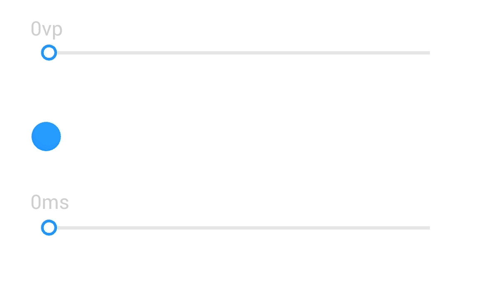

# Animation Design Principles

Animations add meaning to your UI. Animations direct user attention to where it is supposed to be, serve as a type of feedback to user operations, show the hierarchical relationships between elements, facilitate transitions to create a seamless user experience, and promote your brand image. Design animations based on basic rules of the physical world, that is, how objects in the physical world would interact with each other, so your animations will play in ways that meet user expectations. The elements used in your design must be aligned with your brand image and the general tone of your product.

## Smooth and Natural

Smoothness is user experience about the difficulty of information processing. It is a combined response from gesture touch, visual perception, and expectations. Stable frame rate, instant feedback, and responsive operations are basic requirements for animations to deliver a seamless experience.

## **Simple and Efficient**

The motions of UI elements should be kept as simple as possible. The more complex the elements, the longer the user interaction, leading to a sense of sluggishness.

## Quick Response

Keep the displacements of elements short so the animations will not take excessive time to play. For example, keep the animation duration to be less than 350 ms for a long displacement, 250 ms for a medium displacement, and 150 ms for a short displacement.

## Consistent Motions

When orchestrating motions, use consistent motion paths and appropriate orchestration methods to allow users to focus only on the tasks at hand.

## Easing the Wait Time

Animations can ease the wait time between operations for users by leveraging intuitive, eye-pleasing graphical elements and also smooth the transitions between different screens and elements. You can also use animations to make serial tasks appear as if they were parallel tasks.

## Highlighting the Brand

Well designed animations help enhance the brand image by delivering delightful, high-quality user experience. Brand animations, imitations of astronomical phenomena, such as tailing, melt ball, light emitting, and magnetic attraction, if used throughout the entire system, give your UI signatures that are unique to your brand.

