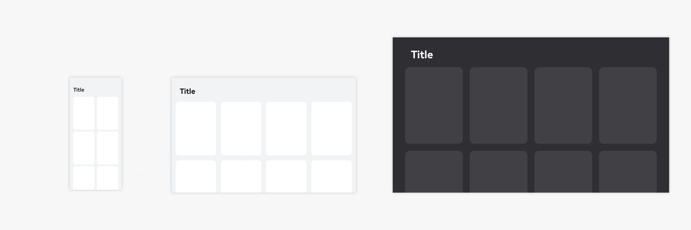
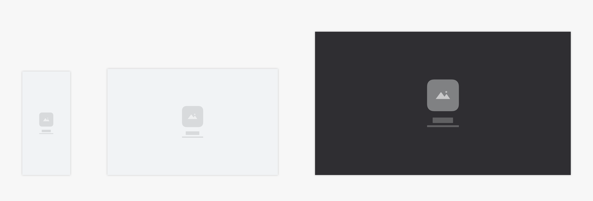
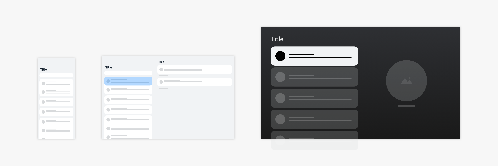
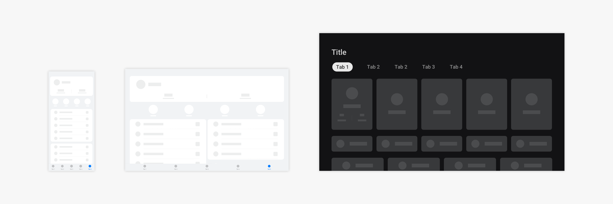
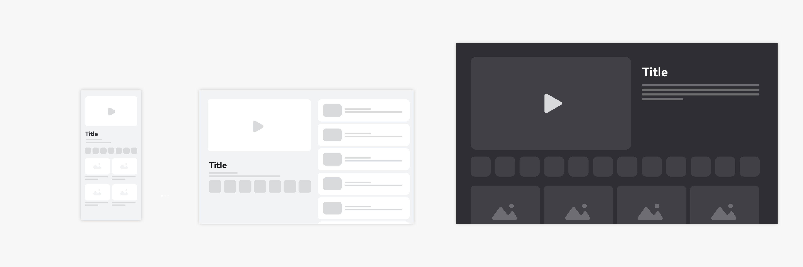
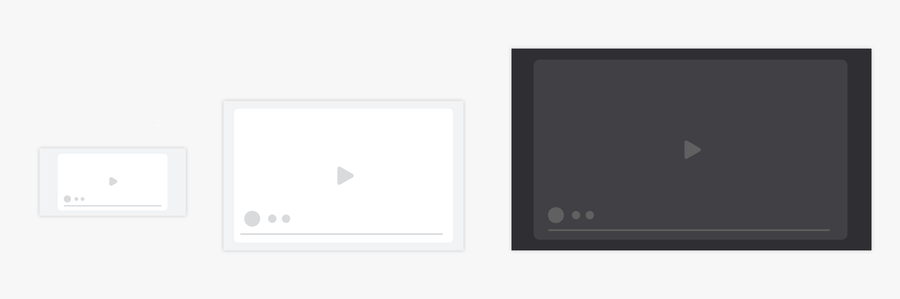
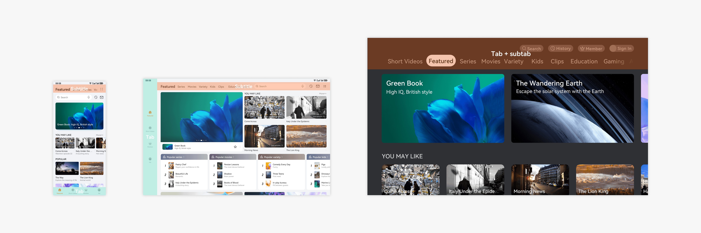

# Application Page Structure Design

## Common Page Structure

An application consists of multiple pages. The following describes common application pages and their structures.

**Launch Page**

For a content-oriented application, it may take a period of time to obtain the content of the application's home page. In this case, the launch page is a good choice when users are waiting for page loading. Generally, the launch page displays the brand image of the application or ads. The launch page is not needed for applications that do not load content from the Internet.

Users always expect to see the application content in the first place. Therefore, you should display the content in a timely manner once page loading is complete.

When an application is loaded from the background, the launch page should not be displayed. When an application is switched to the background and then loaded from the background, the launch page should not be displayed either. The application should retain its status so that users can continue browsing the application when it is restored from the background.

**List Content Page**

A list content page usually displays text and data.

Data in a list should be sorted based on certain logic to facilitate user browsing and operations. For example, data can be sorted in alphabetical or time order.

A list should be a collection of items of the same type, and the data in the list should be presented in a consistent layout style. Common lists are single-line, double-line, and three-line lists.

The content to be displayed in a list must be hierarchically clear so that users can get important information and operations at a glance.

**Grid Content Page**

A grid content page usually displays images or videos.

A grid content page displays items of the same importance level with a unified layout.

A grid content page primarily organizes content by image. For example, the Gallery application displays images in a grid view.

Grid views can be supplemented with texts and operations. For example, in the application market, a grid is used to display application icons, brief description, and download buttons.

Consider the responsive layout for a grid content page. When switching between landscape and portrait views, a grid content page should be able to scale to fit the screen width.

**Multi-choice Page**

A multi-choice page enables users to select multiple data items and process them in batches. It is used when multiple choices can be selected for a list or grid.

**Details Page**

A details page displays detailed description and operations of an application.

**Blank Page**

Use a blank page if there is no data on the page.

**Settings Page**

A **Settings** page usually contains all settings of a module.

**My Page**

For content-oriented applications, the **My** page is used to carry user information and asset content.

**About Page**

The **About** page displays the basic information about the application, including the contact information and legal terms.

## Vertical Page Structure

Vertical provides specific services for specific people. It is a subdivision category of applications. For example, HUAWEI Music and NetEase Music belong to the music category, HUAWEI Video and Youku belong to the video category, and Kuaishou and TikTok belong to the live streaming category. Vertical page structures are widely accepted and understood by users in a specific field.

Some examples are provided below:

Music applications have music playlists, music albums, and music playback pages.

Video applications have video details and video playback pages.

Live streaming applications have masonry layout–based recommendation and live streaming pages.

Common vertical page structures are as follows:

- Music playback page

- Album details page

- Video details page

- Video playback page

**Music Playback Page**

A music playback page of a music application usually has functions such as music control (play, pause, previous, and next). It also shows the lyric.

**Album Details Page**

An album details page of a music application provides functions such as introduction to an album and songs in the album.

**Video Details Page**

A video details page of a video application usually has functions such as a video player, video episode, and video introduction.

**Video Playback Page**

A video playback page of a video application usually has functions such as video image preview and playback control.

## Special Page Structure

Some application pages may fail to be adapted by means of adaptive or responsive layout when switching between devices with great differences. If users also expect a different application architecture, special adaptation is required.

For example, for a page that has both bottom tabs and subtabs, the bottom tabs can be placed on the top toolbar or integrated with the subtabs on the large screen.

