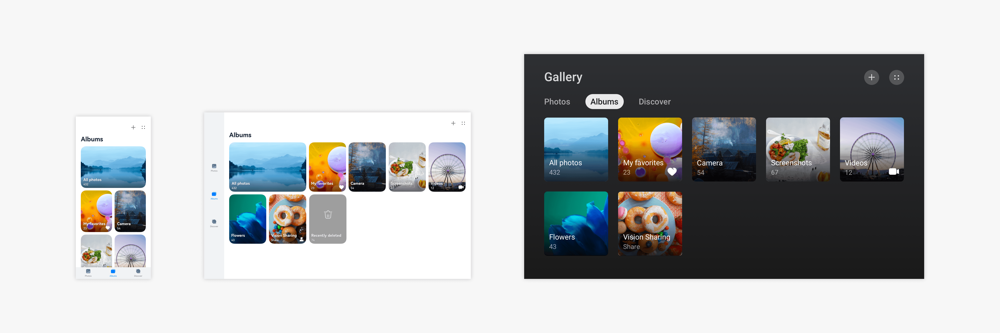
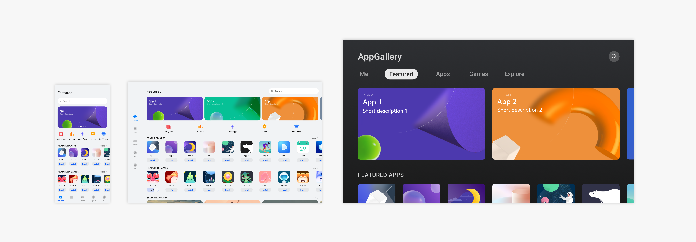
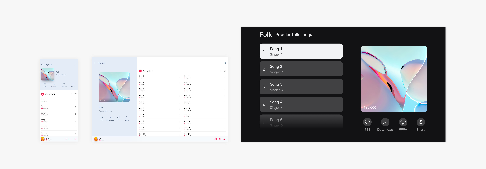
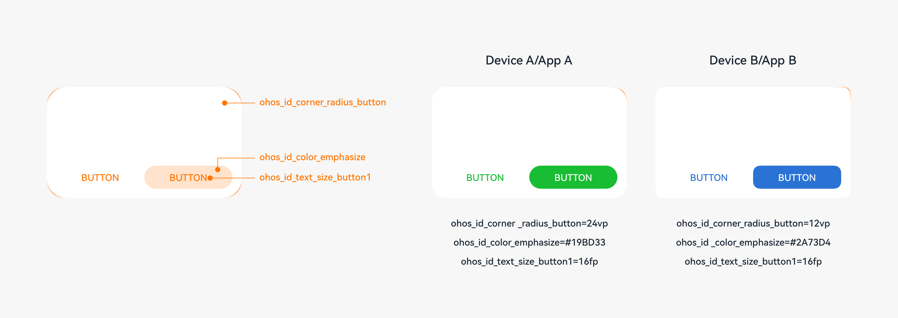

# Application UX Design Principles

## Overall Design Principles

When designing an application for different device forms, comply with the following principles:

**Differentiation**

Fully understand the types of devices to support, including the screen size, interaction mode, use scenarios, and user groups, and carry out design based on the device characteristics.

**Consistency**

Consider the generalities of these devices. Use universal design that covers device differences and provides global consistency. This practice helps reduce the learning difficulty for users and lower the application development cost.

**Flexibility**

For devices with similar hardware capabilities, interaction modes, and use scenarios, consider the adjustment of the layout, content width, and horizontal component quantity. Try to avoid improper blankness, blurring, deformation, and truncation of UI elements caused by device orientation or screen size changes.

**Compatibility**

For devices with great differences in hardware capabilities, interaction modes, and use scenarios, consider the support for various input modes and the adjustment of the function architecture, in addition to the layout, content width, and horizontal component quantity. Try to avoid problems such as input identification failure, function unavailability, and usage inconvenience.

## Key Design Points

For most users, multi-device experience focuses on or extends from the default device. Therefore, the OpenHarmony UX design that targets all-scenario experience should preferentially ensure that users have similar experience on the default device and other devices. It should also fully leverage the devices to optimize user experience.

When designing a multi-device application, maximize the following OpenHarmony features:

### Adaptive Architecture

The adaptive architecture ensures that users access the application with the best navigation form on different devices. OpenHarmony provides an easy-to-use SDK, so you can easily develop an application through simple configuration, without starting from scratch.

For example, you can use a bottom tab on the default device, a sidebar tab on the tablet, and a top tab on the large screen.

For details, see [Application Architecture](app-navigation-structure-design.md).

### Responsive Layout

In different use scenarios, such as landscape/portrait mode and split-screen mode, the UI size and aspect ratio change. To ensure the optimal display effect in these scenarios, you can use the responsive layout.

OpenHarmony provides a wealth of layout capabilities. You can combine them as required to better meet service requirements and user expectations.

For example, you can use a scrolling banner on the default device, more banners on the tablet, and two large banners on the large screen.

Diverse screen sizes and proportions from different types of devices and various user habits make the design more complex. You may need to use the split-view layout, repetition layout, orientation layout, and indentation layout for better content display.

For example, you can arrange a large image and lists up and down on the default device, but arrange them left and right on a device with a larger aspect ratio.

For details, see [UI Layout](ui-layout-overview.md).

### Interaction Normalization

OpenHarmony defines interaction rules for applications on touchscreens and other typical input modes (mouse devices, touchpads, and keyboards) in multiple interaction tasks. You should ensure that the application responds according to the interaction rules correctly and in compliance with user habits in the specified input mode. OpenHarmony provides typical interaction methods. You only need to call them correctly. If your operations are special, consider the normalization of interactions on multiple devices to deliver a consistent user experience.

For details, see [Human-Machine Interaction](human-machine-interaction-basis.md).

### Visual Parameterization

By setting parameters, you can easily adjust the visual effect for each type of device, thereby guaranteeing their unique style. In OpenHarmony, margins, rounded corners, shadows, and font sizes can be adjusted through parameters.

For details, see [Visual Style](visual-basis.md).

### Polymorphic Components

An application can run on multiple forms of devices, and the devices can be used in different interaction modes. As the basis of an application, components need to support different device forms and have the visual effects, interaction, and animations adjusted for these devices to achieve the optimal experience. A component that can be displayed in different forms on different devices is a polymorphic component.

OpenHarmony provides polymorphic components. You can directly use these components and customize their states. For example, if your application running on a tablet supports text editing via a connected Bluetooth keyboard and mouse, the related components must support the interaction from the keyboard and mouse, such as the focused state and hover state.

### Targeted Optimization

In addition to the preceding design points, you are advised to perform special operations and layout optimization for a specific device form to meet user habits.

For example, on a UI manipulated by using a keyboard and mouse, provide additional design to ensure consistency of user habits.

| **Mainly Touch Control**| **Mainly Keyboard and Mouse Operations**|
| -------- | -------- |
| Pull down to refresh.| Provide the **Refresh** icon on the UI or adapt to the shortcut key for F5.|
| Swipe to select multiple options.| Use the mouse pointer to select multiple options.|
| Pull down to close.| Provide the **Close** icon on the UI.|
| Long press and drag an element.| Use the mouse pointer to drag an element.|
