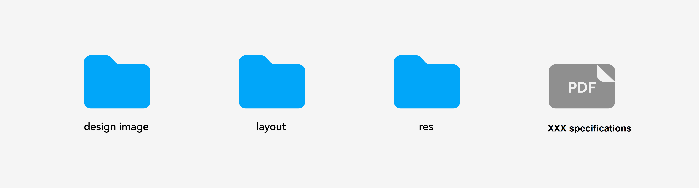

# Design Deliverable Overview

To ensure that your UX design is implemented accurately and in detail, provide necessary design deliverables for developers, including but not limited to: design specifications, interaction process, visual effect, visual annotation, visual specifications, sliced images, animation parameter resources, and sound effect resources.

The UX design deliverables for multi-device applications aim to completely describe the UI layout and visual design. The deliverables must include at least effect drawings, annotated drawings, design specifications, and sliced images.

The following sections describe the usage and specifications of these deliverables.

Standard design deliverable examples are provided for your reference. For details, see [Resources](design-resources.md).
