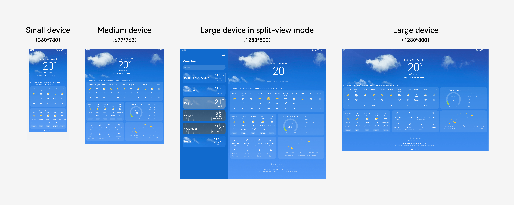

# Effect Drawings

Effect drawings are used to intuitively present the static effect of a target UI. They serve as the implementation and acceptance basis for developers and test engineers. Generally, effect drawings are in JPG or PNG format.

Excellent design deliverables should contain effect drawings for each UI involved in every interaction process under different prerequisites. For a large number of repeatedly used component elements, such as dialogs and instant tips, you can describe them with the specifications in a unified manner. There is no need to provide duplicate drawings.

In multi-device scenarios, you also need to provide standard effect drawings for key UIs of different sizes to clearly express the design effect. The key UIs include but are not limited to:

- Home page of the application

- Level-2 pages that can be directly accessed from the home page

- UIs involved in the core usage process

- UIs that can typically reflect the adaptive and responsive specifications of most screens

You must provide effect drawings for different device forms, at least for small, medium, and large devices. Based on the device characteristics involved, you can also provide effect drawings for ultra-small devices and the landscape/portrait orientations. You must fully verify and optimize the differences, consistency, flexibility, and compatibility of your UX design.

The table below lists the recommended dimensions of drawing boards for effect drawings on different device screens.

| Device Type| Screen Width| Canvas Size (vp)|
| -------- | -------- | -------- |
| Ultra-small device| [0,&nbsp;320) | 240\*320 |
| Small device| [320,&nbsp;520) | 360\*780 |
| Medium device| [520,&nbsp;840) | 677\*763 |
| Large device| [840,&nbsp;+) | 1280\*800 |

Multi-device effect drawings

> **NOTE**
> - The drawing board size is the screen size of a typical device of different widths. You can select a drawing board size based on service requirements.
> 
> - The drawing board size is provided in the unit of vp. You can set the size of all drawing boards in the design document to one or more times of px based on the precision required by the actual design.
> 
> - If an effect drawing needs to be displayed on more than one screen, for example, an extremely long list, it is recommended that the drawing board width remain unchanged and the height be increased to accommodate more content.