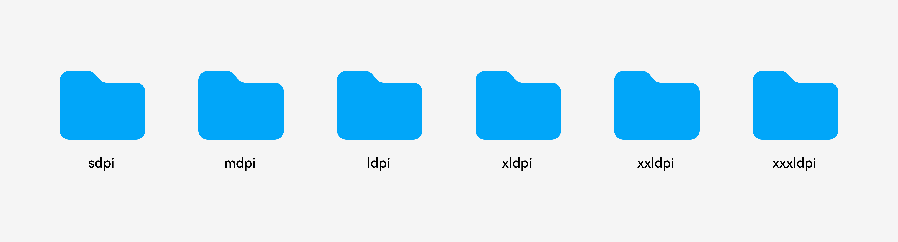
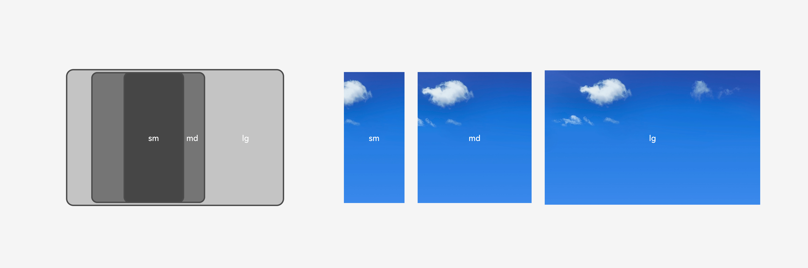

# Sliced Images

You should output materials included in your design, such as icons, images, and sequence frames, in a proper format and provide them to developers so that developers can use them in the actual application UI.·

To better display clear images on a device based on its DPI, an excellent application must contain multiple sets of sliced images with the same name stored in the **mdpi**, **ldpi**, **xldpi**, and **xxldpi** folders. They will be stored in the corresponding path in the application resource package.

Folders with multiple sets of sliced images of the same name

Icon resources can be in .png, .jpg, .webp, or .svg format. You are advised to use .svg icon resources in multi-device design, because vector images are small in size, can be freely scaled without aliasing, and can be colored in real time based on color parameters.

Image resources can be reused for multiple devices or delivered separately for different devices based on the design effect.

One image about night for different devices 

Multiple images about a sunny day for different devices

