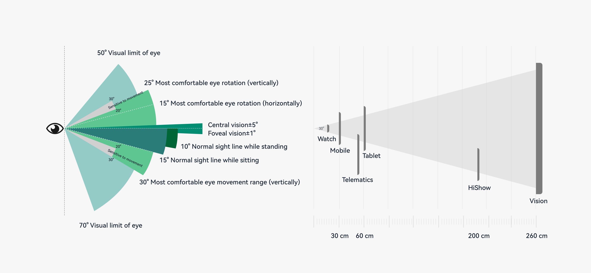

# Human-Machine Interaction Basis

In every digital experience scenario, various types of smart devices are widely used. Interactive UI is an irreplaceable part for devices such as the default device, tablet, PC, smart wearable, smart TV, telematics device, virtual reality (VR) device, and augmented reality (AR) device. An application may run on multiple types of devices and may be manipulated by users in diverse input modes or at different distances even on a single device. Therefore, the UI must be able to identify and support all these interaction scenarios so that users can interact with the application with ease.

## Input Modes

There are three typical input modes: direct interaction by tapping touchscreens with fingers or styluses; indirect interaction by using mouse devices, touchpads, keyboards, watch crowns, remote controls, vehicle-mounted joysticks/knobs, handles, or through air gestures; and voice interaction.

Users may interact with applications in more than one way. Therefore, when designing and developing an application, you must ensure that the application can respond correctly and interact with users in accordance with user habits.

## Interaction Distances

A typical device interaction distance includes but is not limited to 15 cm (smart wearable), 30 cm (default device), 60 cm (desktop device), and 260 cm (large screen). The actual distance in use may be different.

Users may interact with applications at multiple distances. Therefore, when designing and developing an application, you must ensure that the size of UI components and the density of information displayed meet users' expectations.

