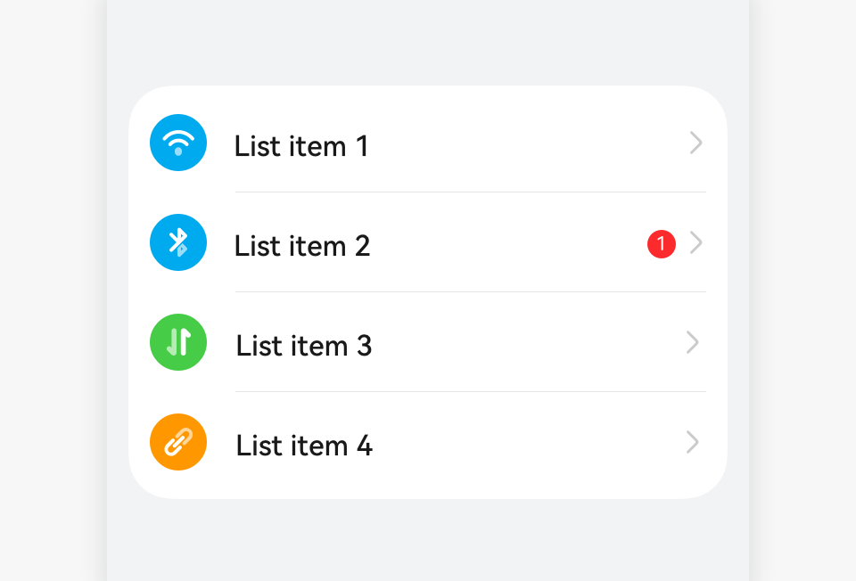
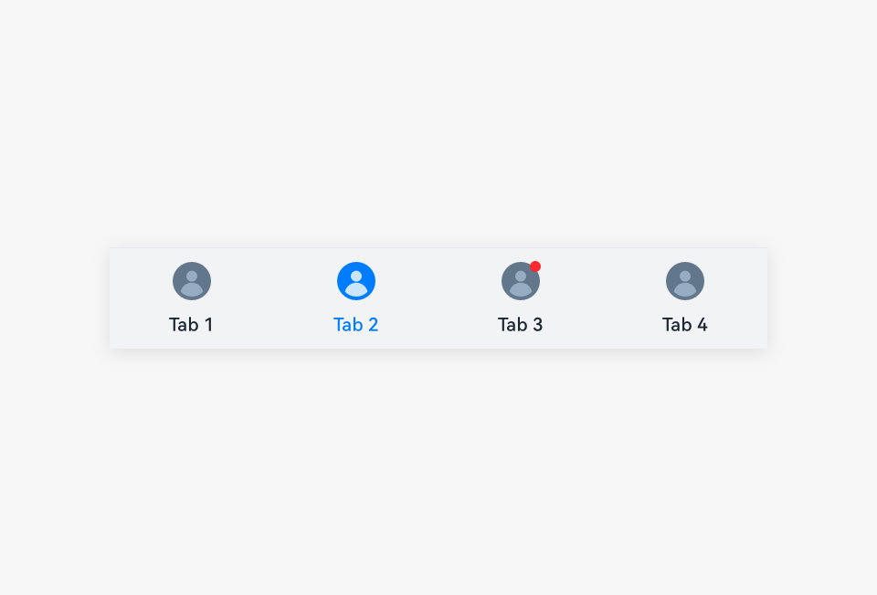
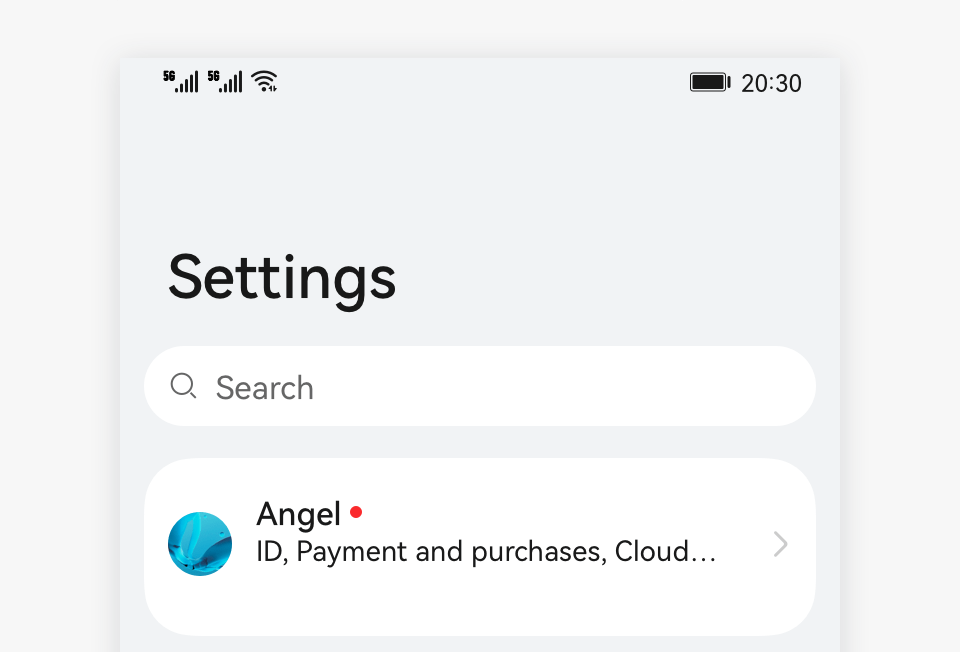
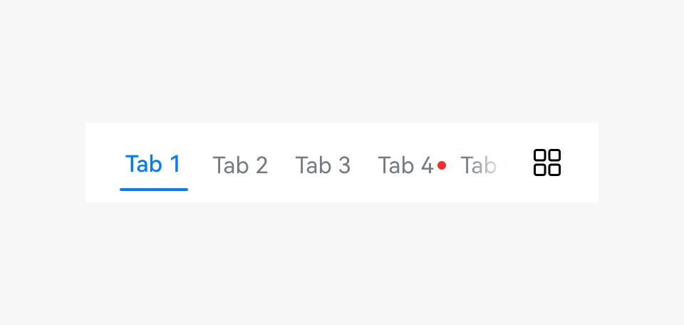
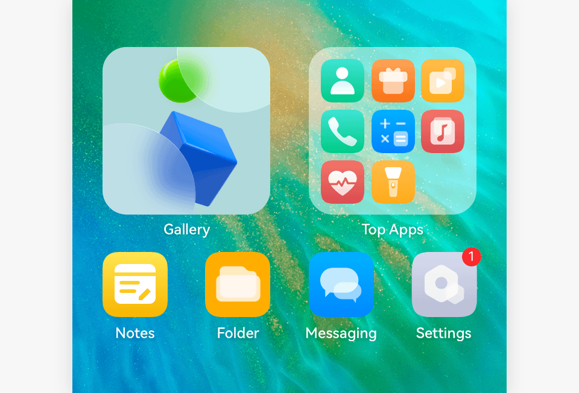
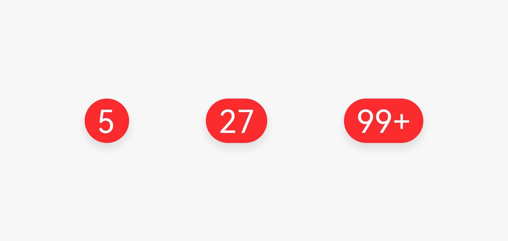

# Badge

A budge reminds users that the application has a request to be processed.

## How to Use

- Use badges on components such as bottom tabs, list items, toolbar icons, category icons in the content area, and avatars.

- Use badges to mark new events that require users' attention in the application.

- Do not abuse badges. If a user touches a marked item and the content is not as user expected, the user will lose interest in badges, resulting in a drop in the click-through rate.

## Category

- Dots

- Numbers
    |  |   |
  | -------- | -------- |
  | Dots| Numbers|

### Dots

- Dots mark minor events in applications and are usually displayed on bottom tabs, list items, toolbar icons, category icons in the content area, and avatars. A dot disappears after being touched.

- When an event expires, the dot disappears.

- When there is only text, the red dot is placed on the right of the text.

- When there are an icon and text, the red dot is placed in the upper right corner of the icon.
    | | | |
  | -------- | -------- | -------- |
  | Dot on an icon| Dot in a list| Dot on a subtab|

### Numbers

- Numbers mark only major events in the applications. For example, if there are multiple types of events such as application update (major event) and promotional events in the application market, a number indicates the application update is displayed on the application icon on the home screen.

- The number for System update in **Settings** corresponds to the number displayed on the Settings icon on the home screen. 
    | | |
  | -------- | -------- |
  | Number on an icon on the home screen| Number in a list|

- The dot width is adaptive to the text width. The maximum number is 99+.

  

## Resources

For details about the development guide related to the badge, see [Badge](../../application-dev/reference/arkui-ts/ts-container-badge.md).
