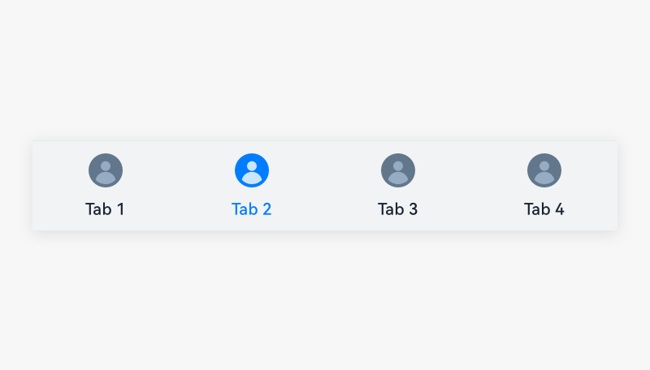
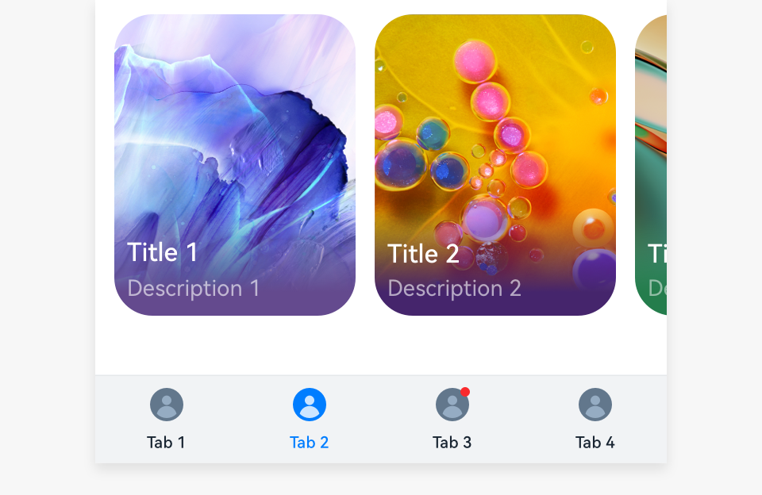

# Bottom Tab

Bottom tabs, as a common navigation component, allow users to quickly access different functions of an application.

## How to Use

- Use bottom tabs only on level-1 screens to provide quick switch between different tab pages.

- Place bottom tabs at the bottom of the screen to reflect the level-1 categories of an application. These categories are presented in an equal manner. This practice allows users to perform actions with one hand.

- Use the combination of an icon and a text for each bottom tab. When users touch a tab, the tab is activated and highlighted.

- Use a siderbar rather than bottom tables on tablets in landscape mode so that your users can perform actions with both hands.

- Use concise text on each bottom tab.

- Use two to five bottom tabs to avoid an overwhelming layout.

- Use badges on bottom tabs to notify users of new unread information. For details, see [Badges](multimodal-badge.md).

## Resources

For details about the development guide related to the bottom tab, see [Tabs](../../application-dev/reference/arkui-ts/ts-container-tabs.md) and [TabContent](../../application-dev/reference/arkui-ts/ts-container-tabcontent.md).
