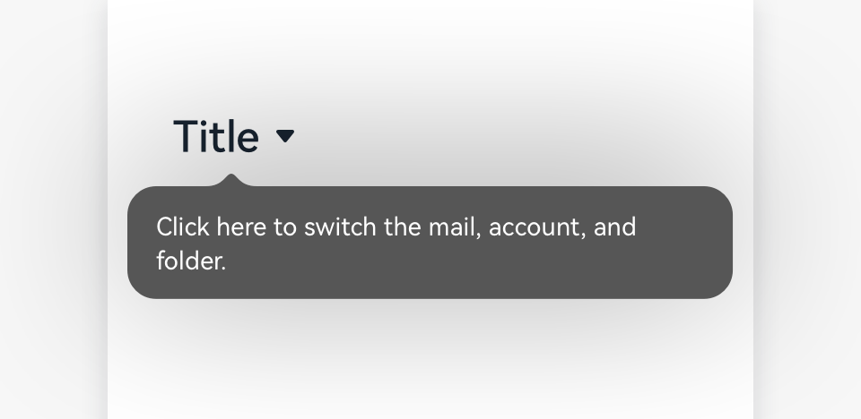
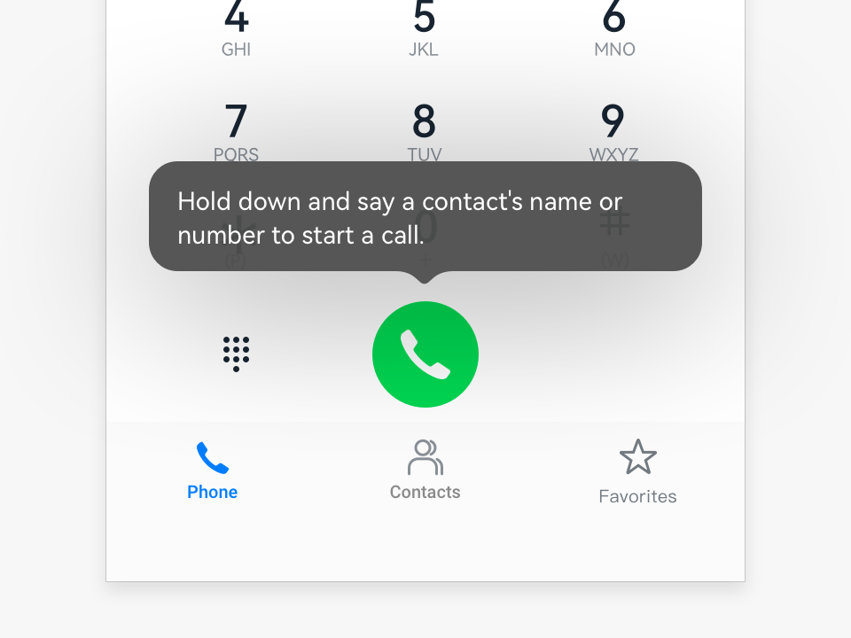
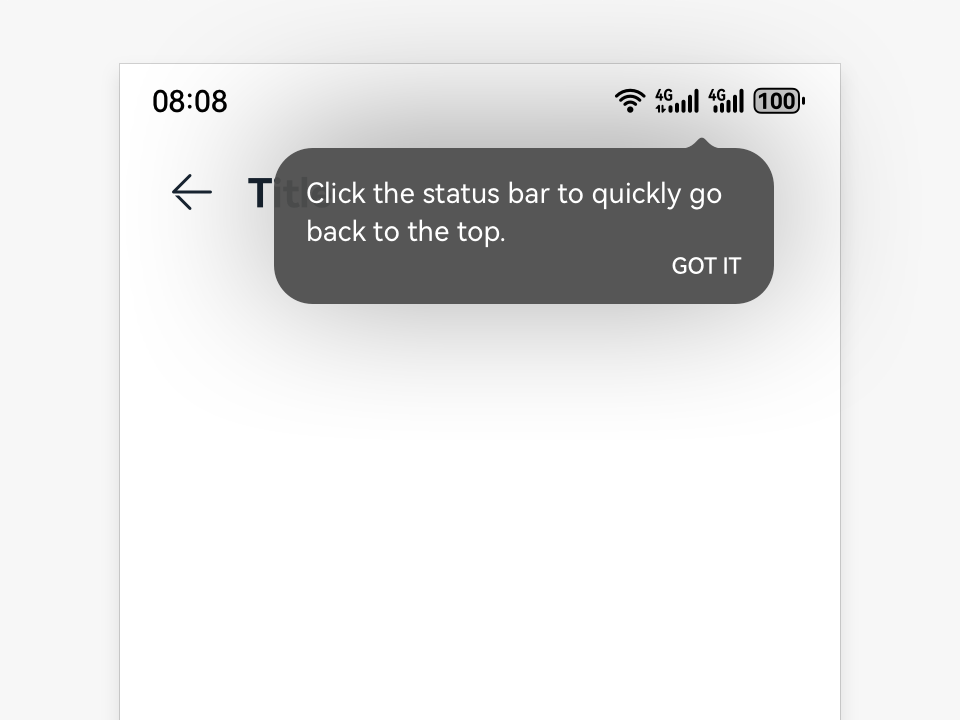

# Bubble

Bubbles are lightweight tips that prompt users how to perform an operation. Generally, they do not affect user operations.

## How to Use

- Use bubbles when users access a screen for the first time. A bubble points to an element or area that is closely related and tells the user how to use a function.

- Show bubbles immediately upon user access.

## Category

- Bubbles not requiring user interactions

- Bubbles requiring user interactions

### Bubbles Not Requiring User Interactions

- Only up or down arrows can be used.

- The prompt text must be concise and clear to avoid troubles.

- A bubble disappears when users touch the bubble or any area on the screen.

- No bubble appears when users access the screen not for the first time.

### Bubbles Requiring User Interactions

- Only up or down arrows can be used.

- The prompt text must be concise and clear to avoid troubles.

- A bubble disappears when users touch the bubble or any area on the screen.

- No bubble appears when users access the screen not for the first time.

## Resources

For details about the development guide related to bubbles, see [Popup Control](../../application-dev/reference/arkui-ts/ts-universal-attributes-popup.md).
