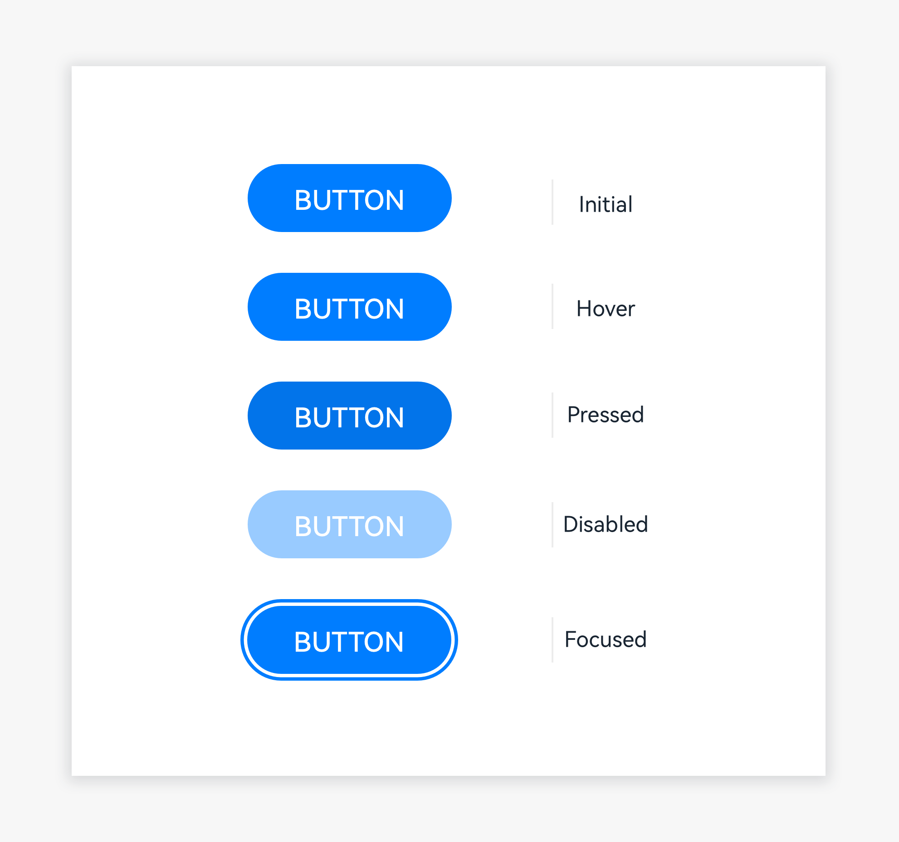
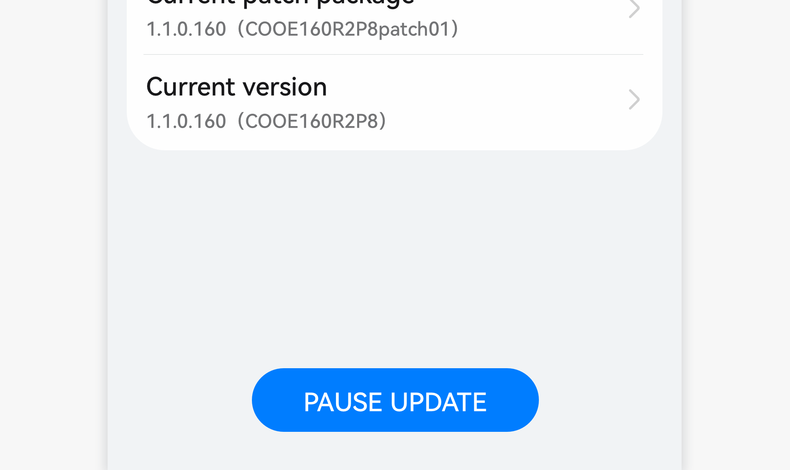

# Button

Buttons are bridges between the system and user behaviors.

## How to Use

- Use buttons when your user needs to trigger an operation.

  

- Emphasize buttons on the screen through color filling.

|  |   |
|  --------  |  --------  |

Place the button text in the center, not on the left or right. Do not wrap the text.

## Writing Instructions

Display button text in a single line.

## Resources

For details about the development guide related to buttons, see [Button](../../application-dev/reference/arkui-ts/ts-basic-components-button.md).
