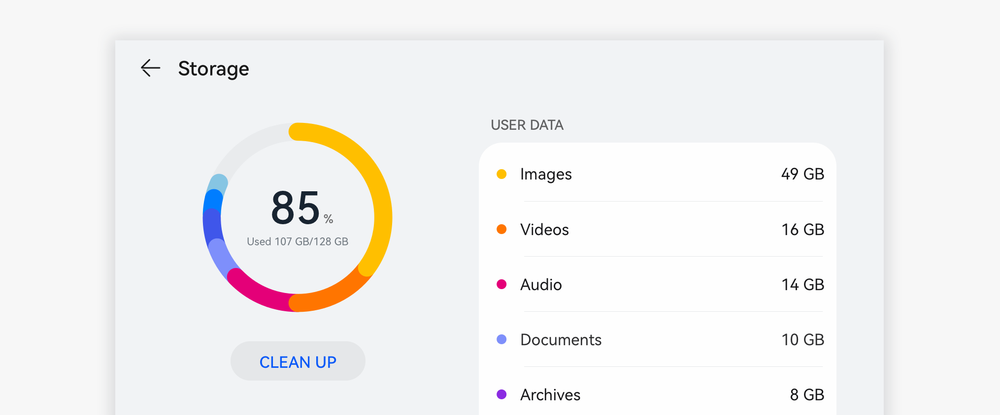

# Data Panel

A data panel visualizes traditional data into graphs that present information hidden in the data to users in a more intuitive and friendly manner, thereby helping users instantly get what they need to know.

## How to Use

- Use data panels for data-related pages.

- Select a type of data panel based on the functions and requirements of your application.

- The proportion type suits the scenarios where statistics of multiple data categories are summed up. In this way, the share of each data category is clearly shown.

## Resources

For details about the development guide related to the data panel, see [DataPanel](../../application-dev/reference/arkui-ts/ts-basic-components-datapanel.md).
