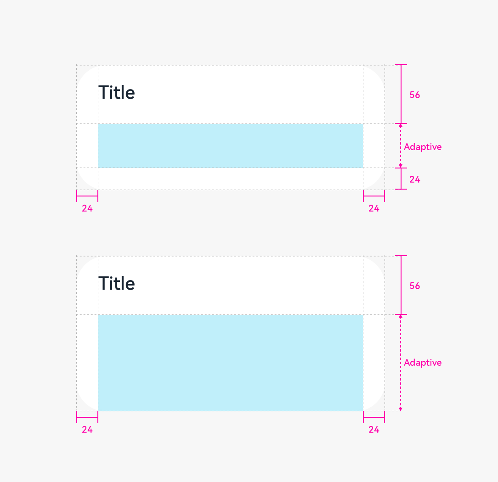
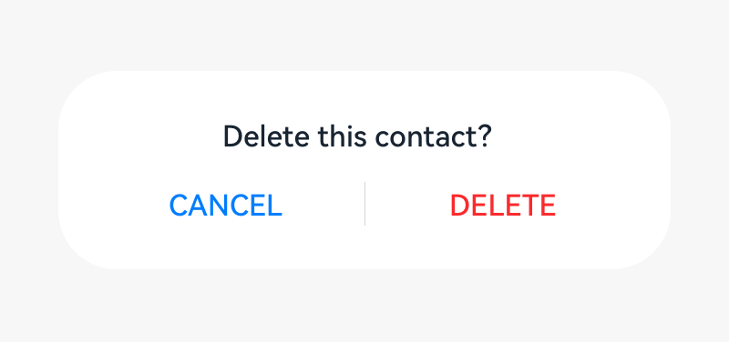
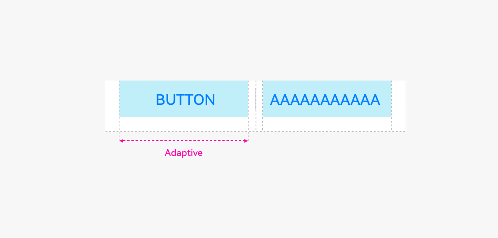
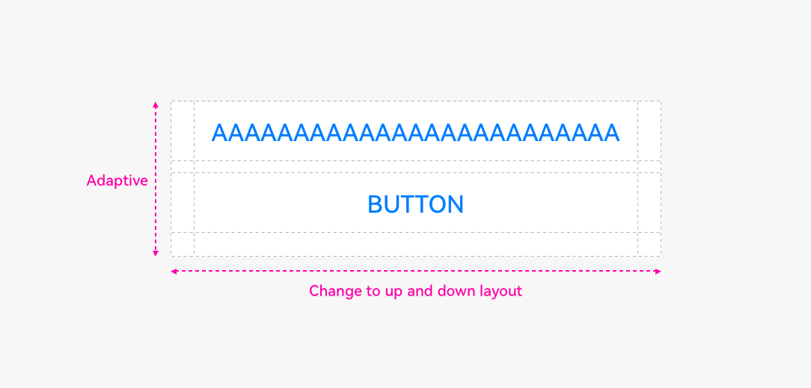
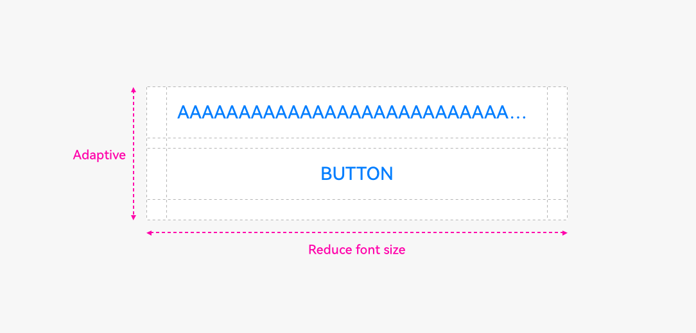

# Dialog

A dialog is a modal window. Before it disappears, users cannot perform any operation.

## How to Use

- Use a dialog to display information or operations that users need or must pay attention to. In other cases, use a non-modal window such as a notification window. 

- Include a combination of different components, for example, text (in different formats, such as indentation, link, or bold), list, text box, grid, icon, and image, in a dialog. It is generally used to select or confirm information.

## Category

- Dialog without a title

- Dialog with a title

- Dialog with text only

### Dialog Without a Title

A dialog does not have a title.

If the content is not displayed in a list, leave a margin of 24 vp both above and below the content.

  |  |  |
| -------- | -------- |
| Content only| Content and button| 

### Dialog with a Title

In the title area, there can be a pure title in one or two lines. Alternatively, there can be a title followed by an operation icon.

  |   |
| -------- |
| Title and content| 

If the content is not displayed in a list, leave a margin of 24 vp both above and below the content.

### Dialog with Text Only

If there is only a title, the title is centered.

## Height and Position

The height and location of a dialog differs in portrait and landscape orientations.

### Portrait

Maximum height of a dialog = 0.8 x (Screen height – Status bar height – Navigation bar height)

Position: Always above the navigation bar (even if the navigation bar is hidden)

### Landscape

Maximum height of a dialog = 0.9 x (Screen height – Status bar) Position: Center aligned the screen height excluding the status bar

## Writing Instructions

### Dialog for Operation Confirmation

**Title**

- Short and complete. No period is required if a statement is used.

- Exclamation marks and question marks are required for exclamatory and interrogative sentences, respectively.

- Concise and clear. Titles can be a phrase (verb + noun).

**Content text**

- Describe the content that needs to be confirmed by users. The content can be questions or statements. Try not to provide additional information. If necessary, avoid repeating the title.

**Button**

- Buttons allow the user to choose whether to proceed with the next action. Use operation content for buttons.

- Button contents are usually the same as the verbs in the title. Do not use "Yes" or "No".

### Dialog for Information Confirmation

**Content text**

- Use statements to describe the specific items that need to be notified to users. For example, no updates available.

**Button**

- Use **OK**.  

## Rules for Handling Ultra-Long UI Strings
### Title in a Dialog

- Decrease the font size to 15 fp level by level.

  

- Wrap lines if the length exceeds the upper limit.

- If the text still cannot fit in, use "..." for truncation.

### Button in a Dialog

- Do not wrap lines for button texts.

- Change the buttons from horizontal alignment to vertical alignment.

- Reduce the font size level by level until the minimum font size 9 fp is reached.

- If the text still cannot fit in, use "..." for truncation.

  

## Resources

For details about the dialog box, see the [API Reference](../application-dev/reference/apis/js-apis-promptAction.md).
