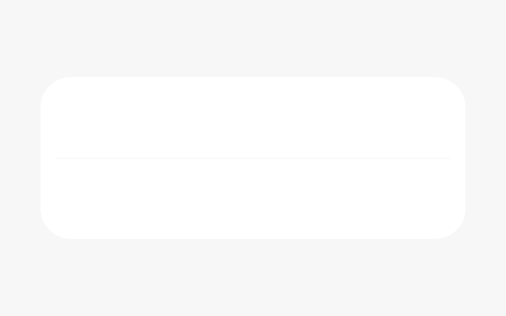
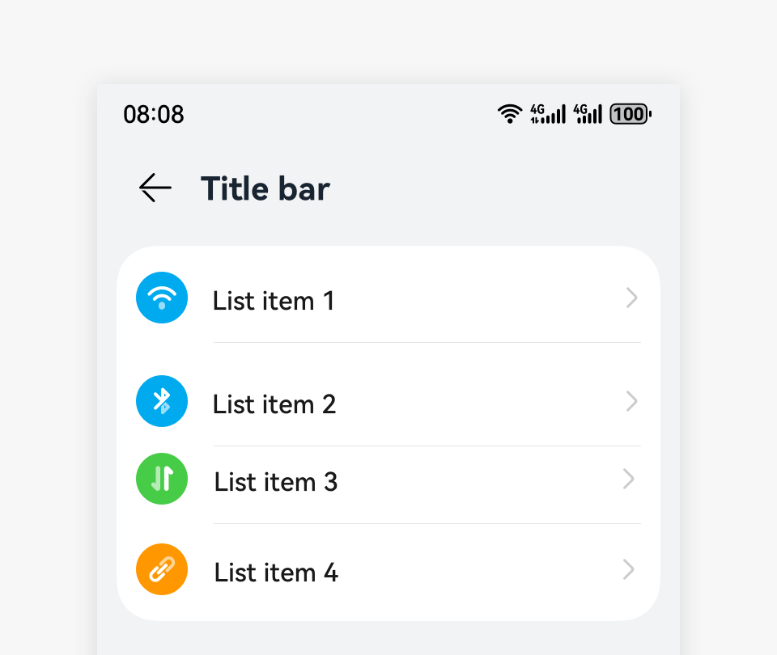

# Divider

A divider is used to separate UI elements so that an element can be easily identified.

## How to Use

- Use dividers in a list or UI layout.

- Add a divider between every two list items.

- Do not add a divider above the first list item or below the last item.

- Start the divider from what followed by an icon, since icons themselves are clearly separated.

## Resources

For details about the development guide related to the divider, see [Divider](../../application-dev/reference/arkui-ts/ts-basic-components-divider.md).
