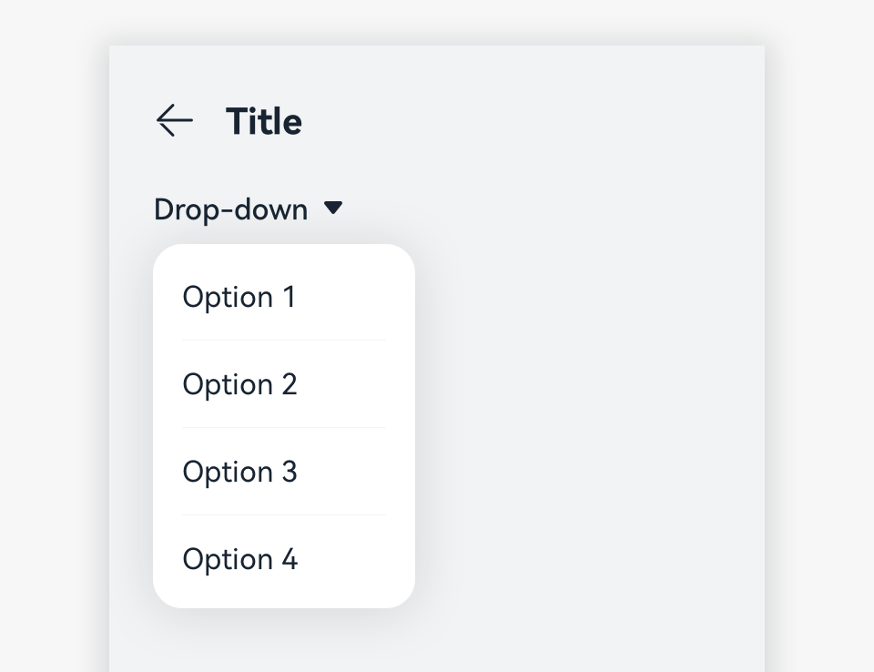

# Drop-Down List

A drop-down list allows users to select among multiple options.

## How to Use

- User a drop-down list to filter content on the current page or switch the type or option.

- On a drop-down list, mark the current option with a different color, and keep the arrow direction unchanged. When users touch one of the options, close the drop-down list and display the selected option on the list.

## Writing Instructions

- Use phrases for the text displayed in the list. Nouns or noun phrases are recommended. There should be no spaces between texts. Do not use multiple phrases. Do not add punctuations at the end of each phrase.

- Use a consistent sentence pattern of phrases.

## Resources

For details about the development guide related to the drop-down menu, see [Select](../../application-dev/reference/arkui-ts/ts-basic-components-select.md).
