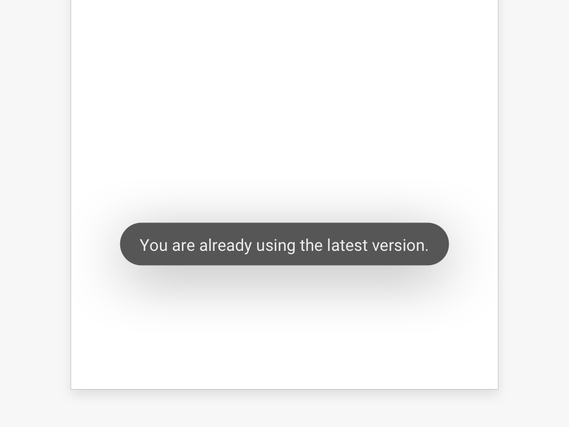
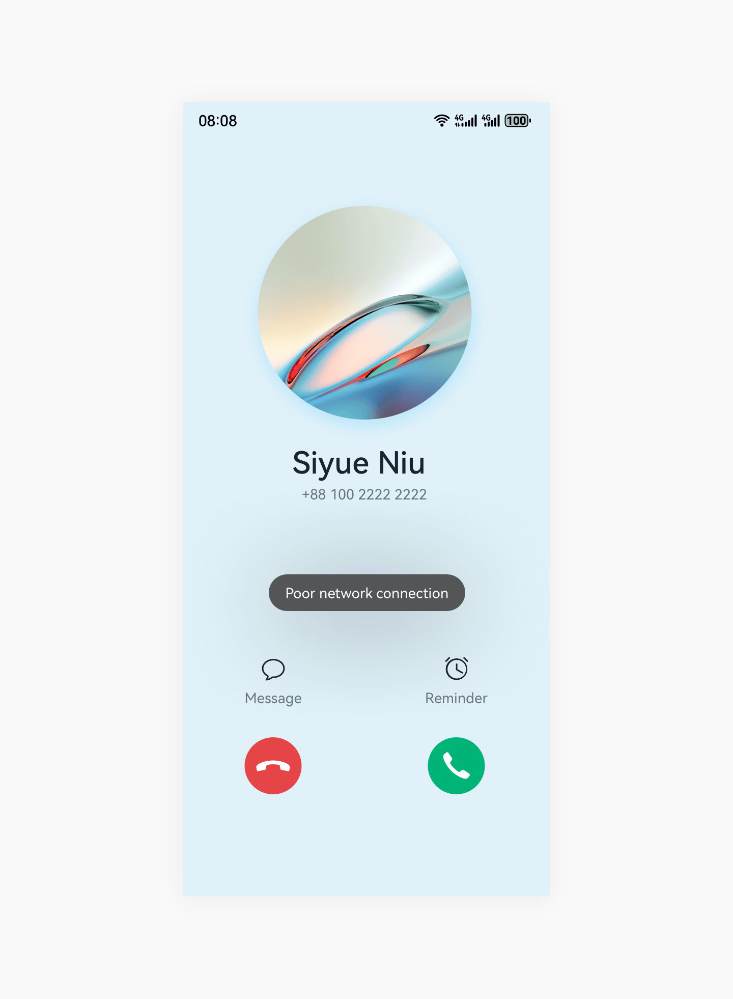

# Instant Tip

An instant tip is used to display lightweight feedback of the current operation or environment at the bottom or in the middle of the screen.

## How to Use

- Use an instant tip to ensure that your users can view certain information.

- Do not show instant tips for every operation.

- Ensure that other operations on the UI are not affected by the instant tip.

- Set the instant tip to disappear automatically after a specified time. Ensure that the instant tip does not disappear when a user touches or swipes on the screen within the specified time.

- Do not display more than one instant tip on the screen. A new instant tip can show only after any previous one disappears.

