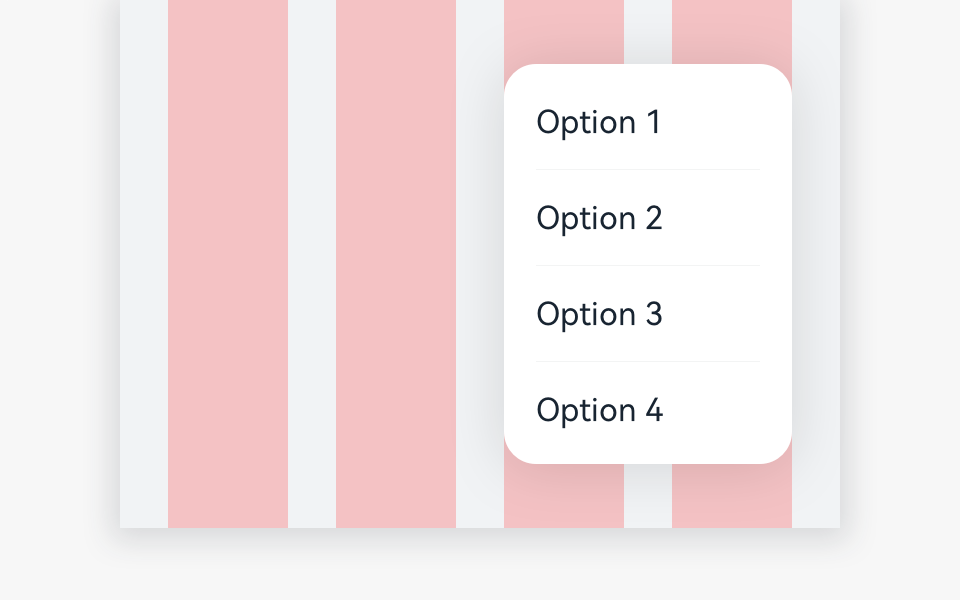
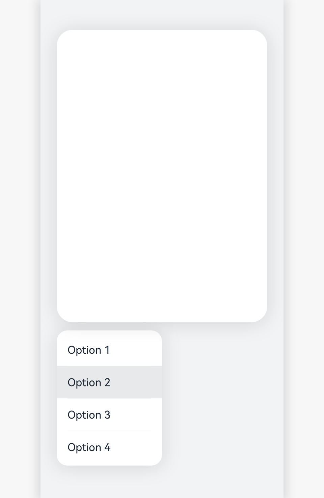

# Menu

A menu is a temporary pop-up window used to display operations that users can perform.

## How to Use

- Use a menu to show more options and information when users touch **More** on the toolbar or title bar.

- Do not include menu items irrelevant to the current content.

- Put the most frequently used menu items on the top of the menu.

- Make the options left-aligned.

- Make a menu disappear when users touch the back button or a blank area, or select a menu item.

## Category

- General menu

- Long-press menu

### General Menu

This type of menu is displayed when users touch the **More** button on the toolbar or title bar.

### Long-Press Menu

This type of menu is displayed when users long press a certain object.

## Resources

For details about the development guide related to the menu, see [Menu](../../application-dev/reference/arkui-ts/ts-basic-components-menu.md).
