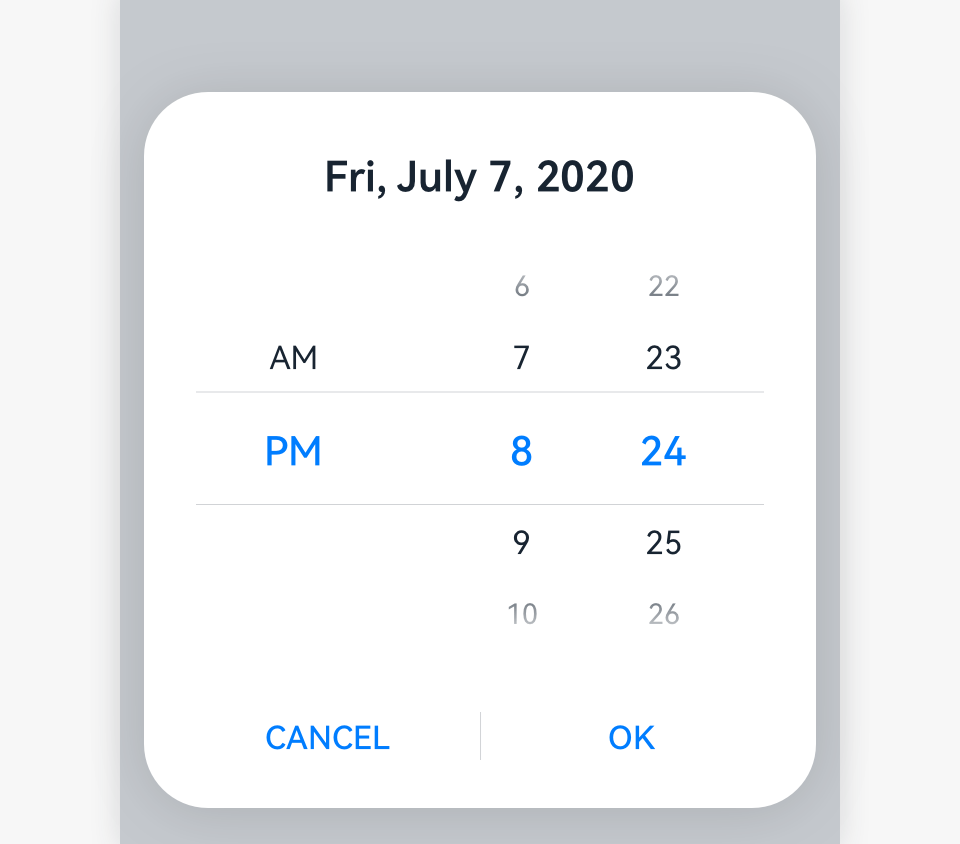
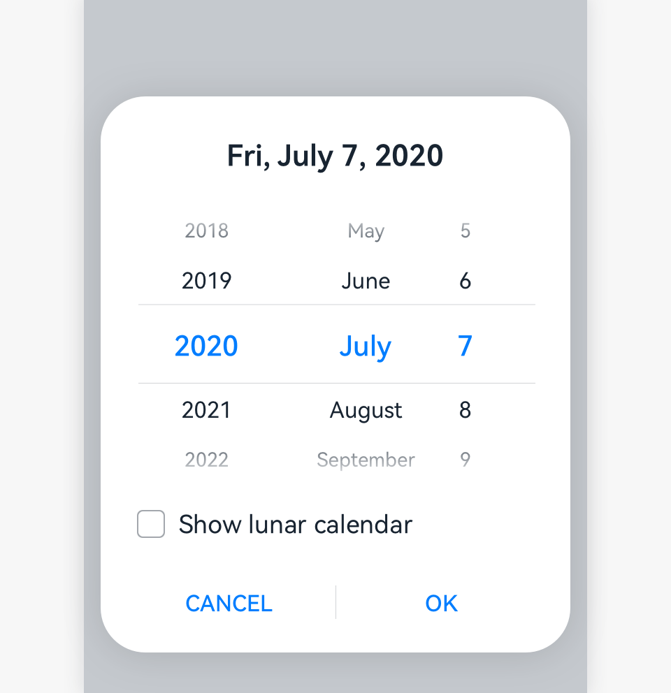

# Picker

A picker allows users to select a single option or a combination of options from one or more dimensions.

## How to Use

- Use a picker for users to select the year, month, date, weekday, hour, or minute, or any of their combinations.

- Use a picker for users to select a specific time.

- Use a dialog box or embedded component to show a time picker for users to select a time (in the format of hour:minute:second) on a mobile device. Users can set the time format, for example, 12-hour or 24-hour time format.

## Time Picker

- Content area: The hour and minute are displayed. Time is displayed in 12-hour or 24-hour time format, depending on user settings.

- Operation area: **CANCEL** and **OK** buttons
    | |
  | -------- |
  |  |

For the software implementation of the time picker, see [Time Picker](../../application-dev/reference/arkui-ts/ts-basic-components-timepicker.md).

## Date Selector

- Title: The year, month, date, and weekday can be displayed, depending on actual scenarios.

- Content area: This area can display all the years, or only this year and earlier years. Two hyphens (--) indicate no year is specified. The year is optional if users are setting birthdays. The lunar calendar switch is optional. If a picker has the switch and the switch is turned on, the lunar calendar date is displayed. If the switch is turned off, the Gregorian calendar date is displayed. If a picker does not have the lunar calendar switch, you can define whether the picker displays the Gregorian calendar or lunar calendar.

- Operation area: **CANCEL** and **OK** buttons

For the software implementation of the date picker, see [Date Picker](../../application-dev/reference/arkui-ts/ts-basic-components-datepicker.md).

## Resources

For details about the development guide related to the picker, see [TextPicker](../../application-dev/reference/arkui-ts/ts-basic-components-textpicker.md), [TimePicker](../../application-dev/reference/arkui-ts/ts-basic-components-timepicker.md), and [DatePicker](../../application-dev/reference/arkui-ts/ts-basic-components-datepicker.md).
