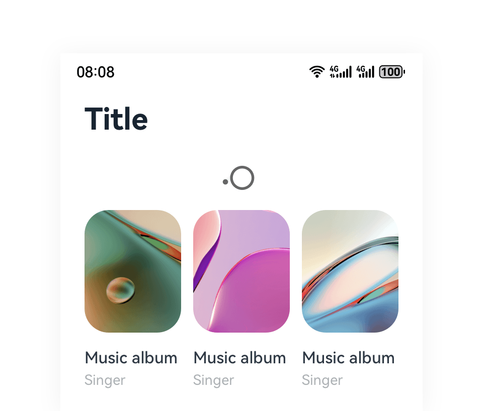

# Pull to Refresh

The pull-to-refresh component enables users to quickly obtain the latest content through a pull-down gesture.

 

## How to Use

- Use the pull-to-refresh component when the content changes quickly and users need to refresh screens continuously to update the content.

- The loading animation is displayed during the pull-down process.

- When the minimum pull-down distance is not reached, the page directly bounces back after users lift their fingers.

- When the minimum pull-down distance is reached, the refresh animation is triggered after users lift their fingers. Only the loading animation is displayed, and no text is displayed.

## Resources

For details about the development guide related to the pull-to-refresh button, see [Refresh](../../application-dev/reference/arkui-ts/ts-container-refresh.md).
