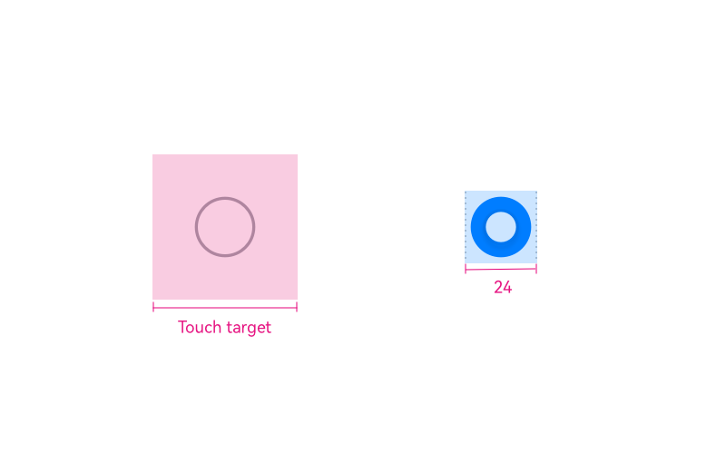

# Radio Button

Radio buttons allow users to choose one option from multiple mutually exclusive options. Only the selected option takes effect.

## How to Use

- Use radio buttons in a list with multiple options, where users can choose only one of them.

- Do not use a single radio button. Instead, use a group of radio buttons. All the radio buttons in the group are equal.

- You are advised to have the recommended option selected by default.

- In case a radio button is selected as the recommended option, it can be cleared only when users select another radio button in the group.

- Avoid using a radio button group for on/off options. Use a toggle instead.

- After an option is selected, another option is deselected.

## Resources

For details about the development guide related to radio buttons, see [Radio](../../application-dev/reference/arkui-ts/ts-basic-components-radio.md).
