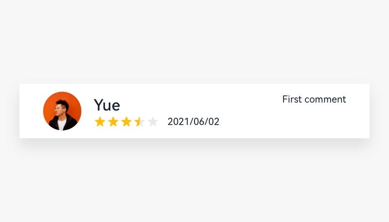

# Rating Bar

A rating bar is used to evaluate content, offerings, or objects. It uses stars to reflect user experience. The rating ranges from one to five stars, with one star being the worst and five stars being the best.

## How to Use

- Use a rating bar when your user needs to evaluate an offering or a service. The comment corresponding to each star is displayed below the rating bar. The comment changes as the rating changes.

- You can choose either of the following operation modes for a rating bar: touch or swipe. Specifically, your user can touch one or more star icons or swipe horizontally in the star icon group to evaluate the content.

## Resources

For details about the development guide related to the rating bar, see [Rating](../../application-dev/reference/arkui-ts/ts-basic-components-rating.md).
