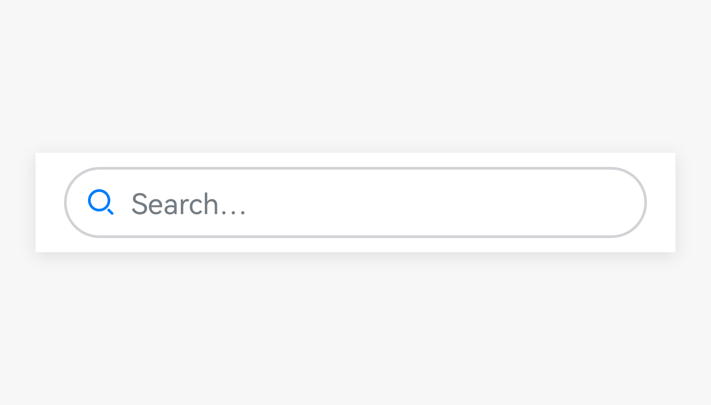

# Search Box

A search box provides an area for users to input a keyword and find the desired content.

## How to Use

- Use the search box if the search function needs to be highlighted on a screen. User a search icon otherwise.

- Use the search box with the search history, autocomplete, and voice input functions for better search experience.

- Enable users to clear the input in the search box by touching the **Clear** button in the search box.

## Writing Instructions

Use hint text to describe what users can search.

In applications that do not have content promotion requirements, the hint text can be "Search for XXX, XXX, XXX..." or "Search for XXX".

In applications that have content promotion requirements, such as the application market, video, and reading applications, use copywriting text as hint text. In this case, the hint text is directly used as the keyword for search.

## Resources

For details about the development guide related to the search box, see [Search](../../application-dev/reference/arkui-ts/ts-basic-components-search.md).
