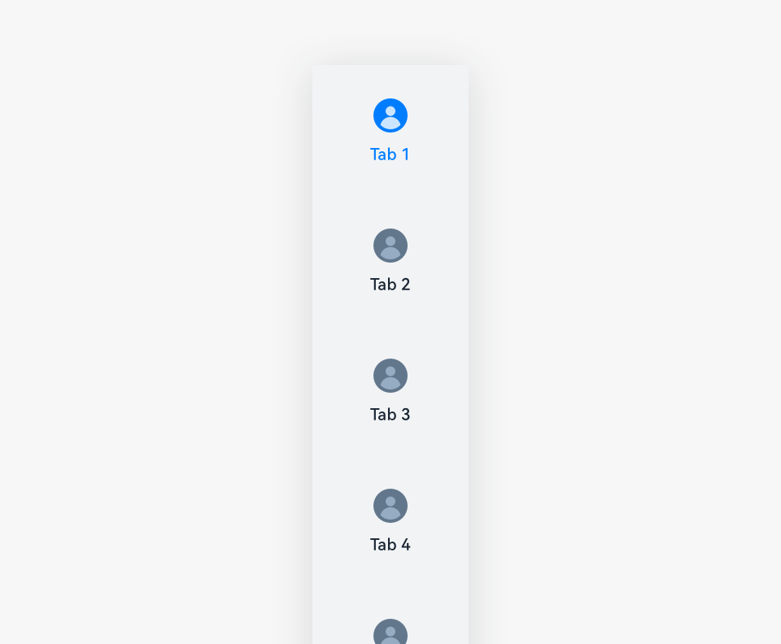
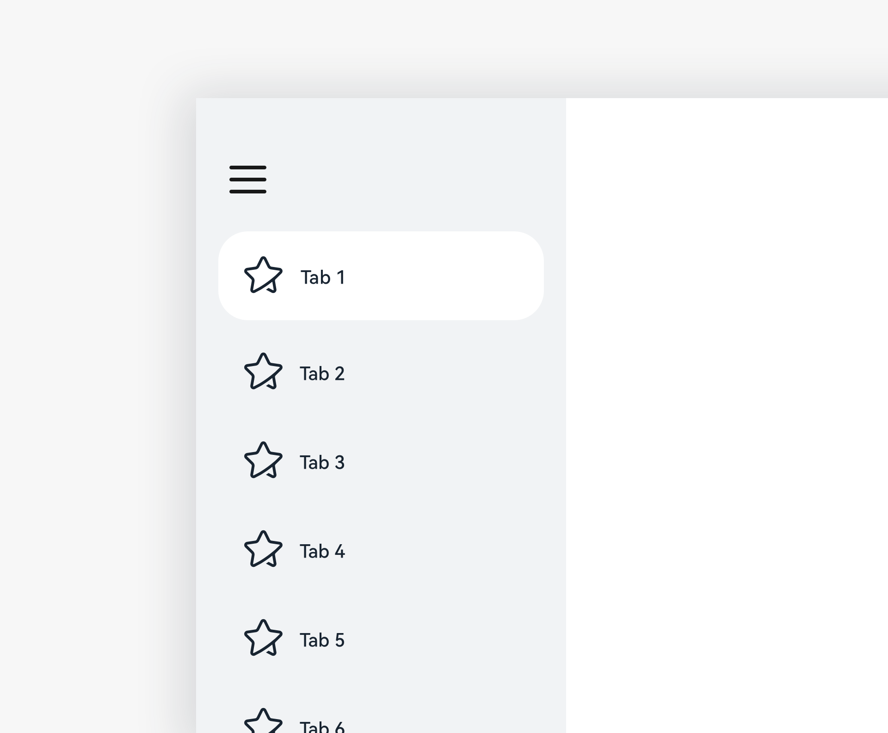
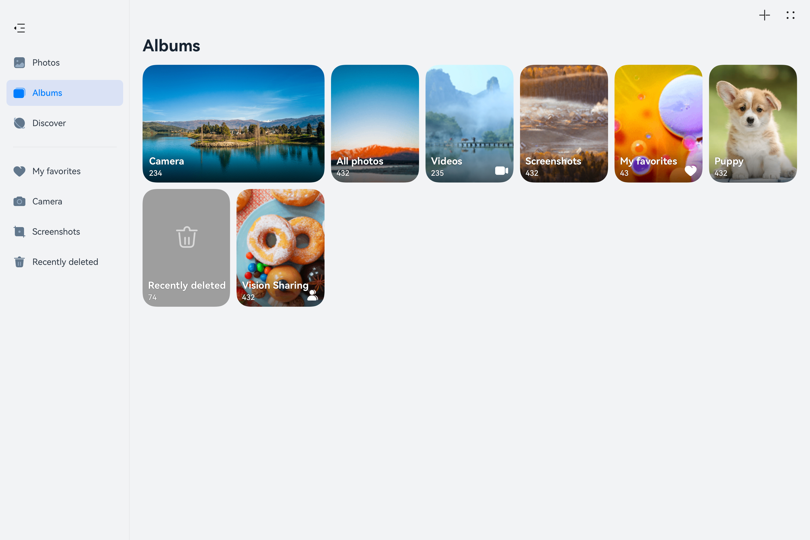

# Sidebar

A sidebar provides navigation within an application on a tablet in landscape mode. It provides efficient entry operations or tab switch on landscape screens. 

## How to Use

- Use sidebars on level-1 screens.

- Use a proper sidebar style based on product requirements.

## Categories

- Tab navigation

- List navigation
    |  | |
  | -------- | -------- |
  | Tab navigation| List navigation|

### Tab Navigation

Generally, tab navigation provides quick switch between level-1 screens in an application.

### List Navigation

Generally, list navigation is used to navigate between level-1 screens of an application. It is applicable to efficiency-sensitive applications.

- Navigation lists make quick navigation at deeper levels possible.

- Users can customize a navigation list.

- Users can delete and reorder the list items.

- Users can also drag low-level content to the list for quick access.

- Users can touch the **Hide** icon to hide the navigation list. Users can touch the **Show** icon to show the navigation list.

## Resources

For details about the development guide related to the sidebar, see [Tabs](../../application-dev/reference/arkui-ts/ts-container-tabs.md), [TabContent](../../application-dev/reference/arkui-ts/ts-container-tabcontent.md), and [SideBarContainer](../../application-dev/reference/arkui-ts/ts-container-sidebarcontainer.md).
