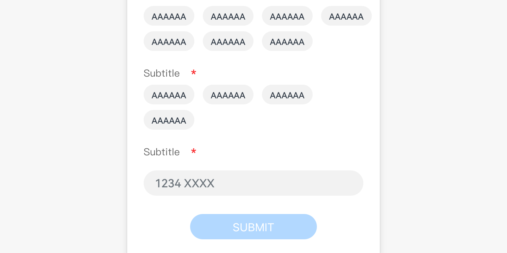
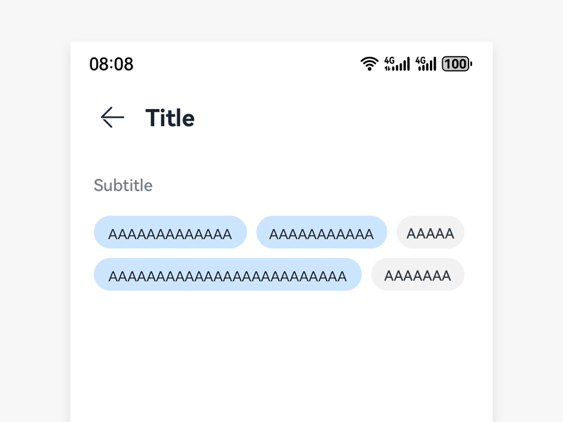

# State Button

State buttons allow users to select from a group of options and may display the selection result in real time. Generally, the option group consists of many state buttons.

## How to Use

- Use state buttons when your users need to select one or more options from a group of options. The selected options are displayed in real time on the screen or submitted as the selection result.

- State buttons can be either checked or unchecked.

- Multiple state buttons are used together to specify a group of options.

- State buttons can be used for single selection. In this case, only one option can be selected. The selected option can be changed, but only one will be in the checked state.

- State buttons can be used for multiple selections. In this case, every state button can be simultaneously in the checked state.

## Writing Instructions

Use noun phrases for the text of each state button, with no punctuation included.

## Resources

For details about the development guide related to the state button, see [Toggle](../../application-dev/reference/arkui-ts/ts-basic-components-toggle.md).
