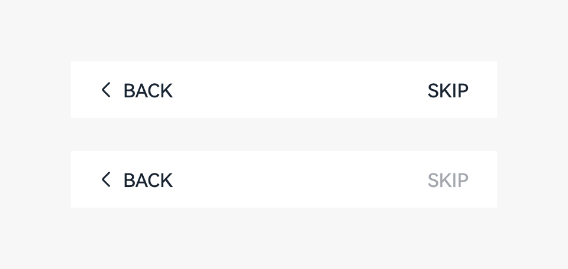
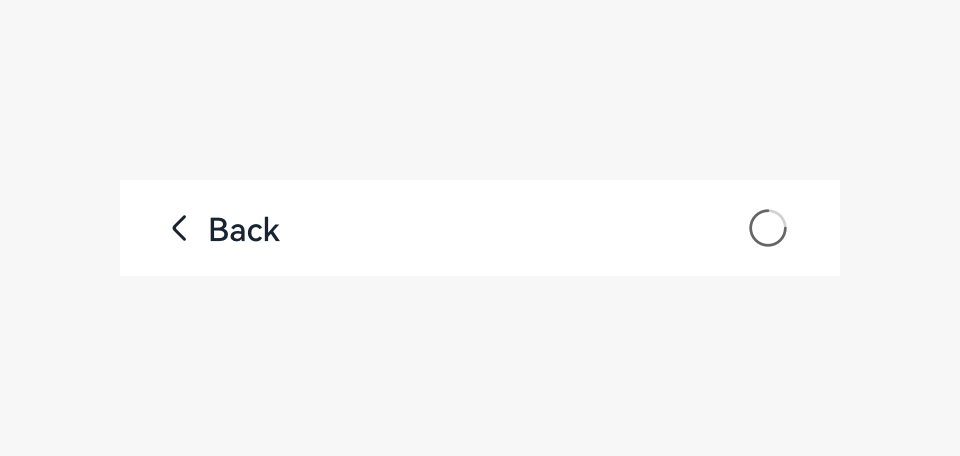

# Stepper

If multiple steps are required to complete a task, you can use the stepper to navigate your users through the entire process.

## How to Use

- Use the stepper when a task is complex and needs to be divided into multiple logical steps.

- Focus on a specific small task for each step, and display the name of the step as the screen title.

- Ensure that each step is easy to understand and all the steps have the consistent layout. Use a concise name for each step.

- Place buttons at the bottom of a screen to avoid overlaying the content.

- When a keyboard needs to be displayed, you can place buttons above the keyboard.

- Use the combination of a text button and an arrow icon for the operation area at the bottom. Make the text button clickable. 

- If your users cannot return to the previous screen, do not add an arrow to the left of the text button on the current screen.

- If your users cannot return to the current page after touching the text button, do not add an arrow to the right of the text button, and name the button **Skip** or **Start**.

  

- If any operation is time-consuming, use a wait button rather than a wait dialog box.

  

## Resources

For details about the development guide related to the stepper, see [Stepper](../../application-dev/reference/arkui-ts/ts-basic-components-stepper.md).