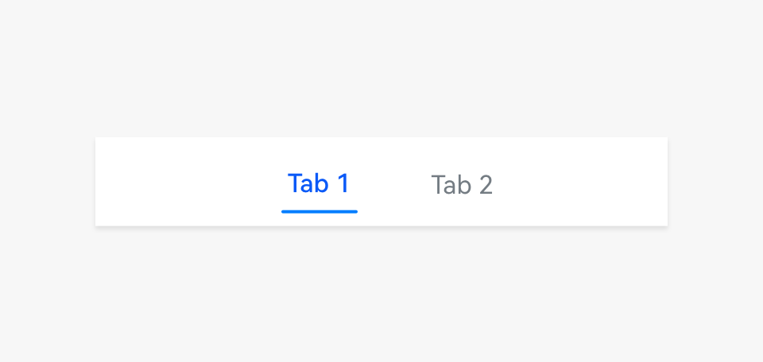

# Subtab

A subtab is used to display content of a specific category. It helps users quickly access content of different categories at the same level.

## How to Use

- Use subtabs to display content of different categories at the same level and navigate between them.

- Place subtabs above the content area.

- Use concise and clear subtab names.

- Use two to five subtabs to avoid an overwhelming layout.

- Use badges on subtabs to notify users of new unread information. For details, see [Badges](multimodal-badge.md).

  

## Writing Instructions

The text on each subtab is in the form of phrases (nouns or noun phrases) that can briefly and clearly describe the page content. No punctuation is used.

## Resources

For details about the development guide related to the subtab, see [TabContent](../../application-dev/reference/arkui-ts/ts-container-tabcontent.md) and [Tabs](../../application-dev/reference/arkui-ts/ts-container-tabs.md).
