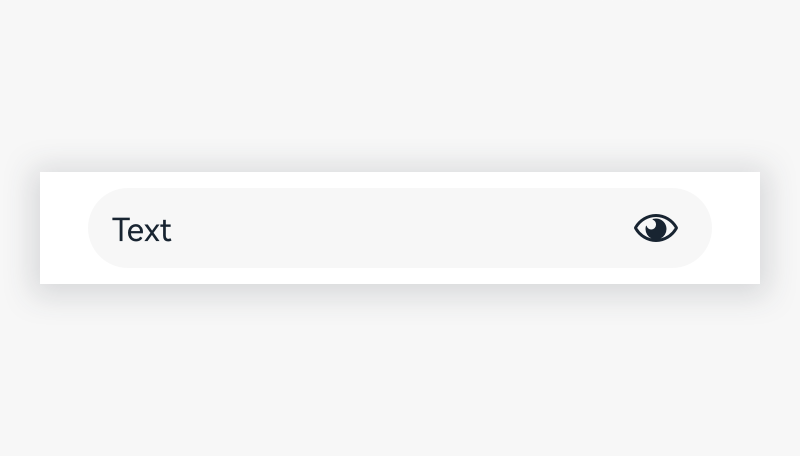
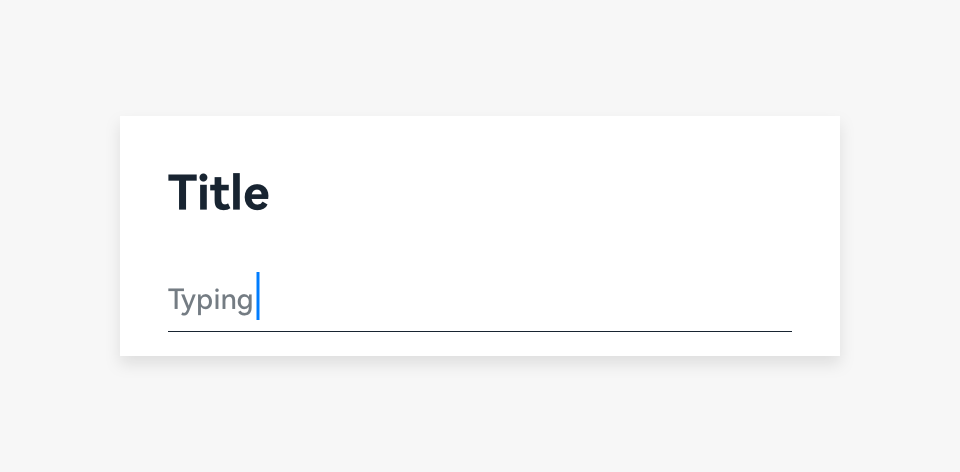
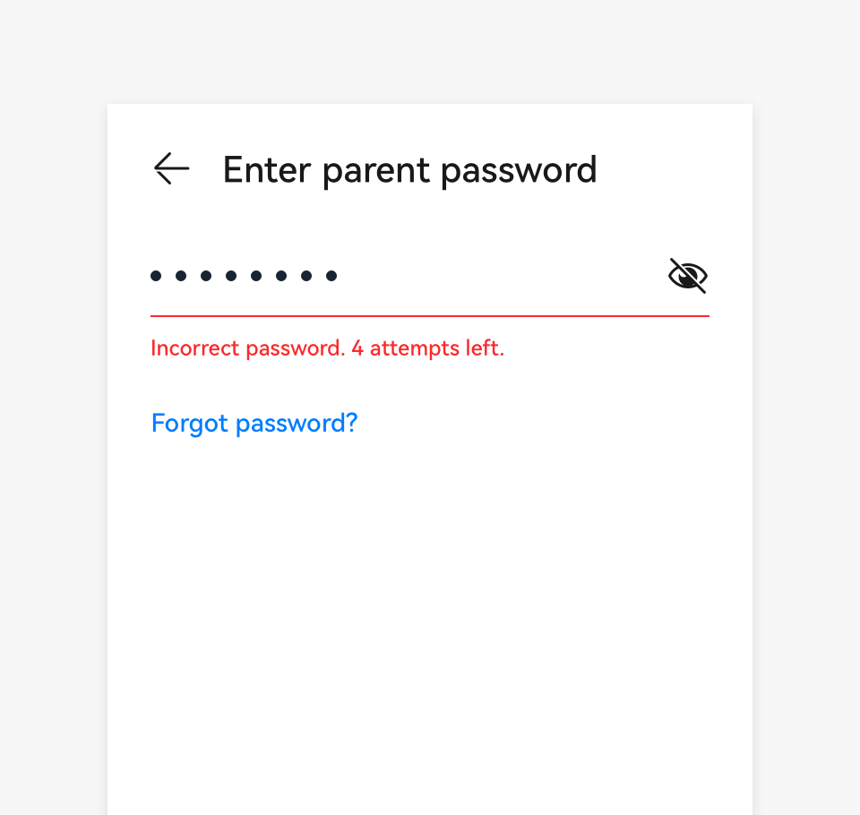
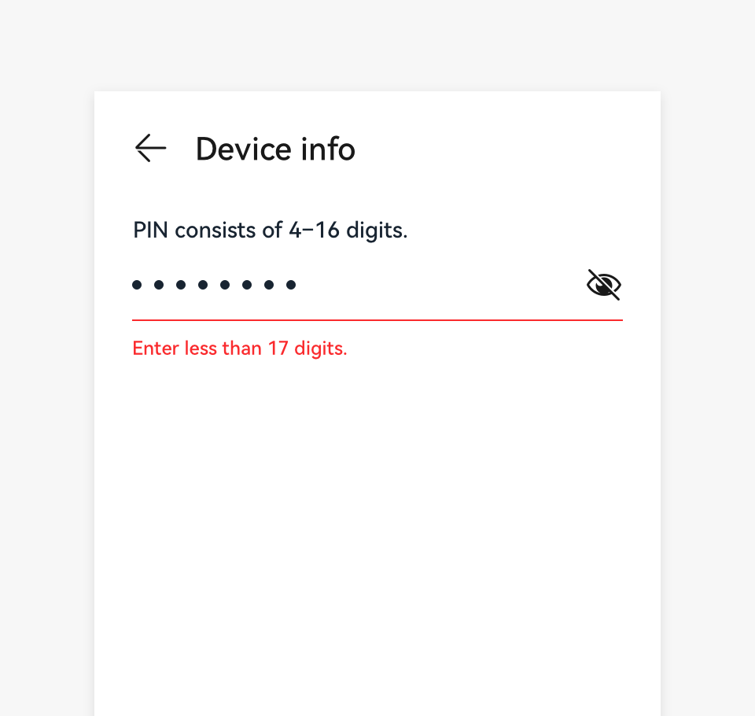

# Text Box

A text box allows users to enter or select text (including numbers).

## How to Use

- A single-line text box is used to enter few texts. The following styles are supported: icon, unit, mandatory items marked with numbers, automatic recommendation, help text, error information, character counter, and formatted input.

- In single-line text fields, as the text cursor reaches the right field edge, text longer than the input line automatically scrolls left.

- When the text length exceeds the width of the text box, users can slide the text horizontally in the text box without the cursor.

- A text contained in a text field is selected by default, so that the text can be deleted at one tap when users perform operations with default recommended texts (such as creating a folder, saving as, and renaming a folder) Display an error message to inidcate duplicate names when users directly save the default name contained in a text field.

- Use a prompt to show instructions when text input is not accepted.

| | |
|  --------  |  --------  |
|Incorrect password. |Too  long password.    |

Forbid the submission if text input is not accepted. If a prompt cannot be displayed in real time for a text input error, display an error message after the content is submitted. When text input is not accepted, use an error message to display instructions below the text field on how to fix it.

## Resources

For details about the development guide related to the text box, see [TextInput](../../application-dev/reference/arkui-ts/ts-basic-components-textinput.md) and [TextArea](../../application-dev/reference/arkui-ts/ts-basic-components-textarea.md).
