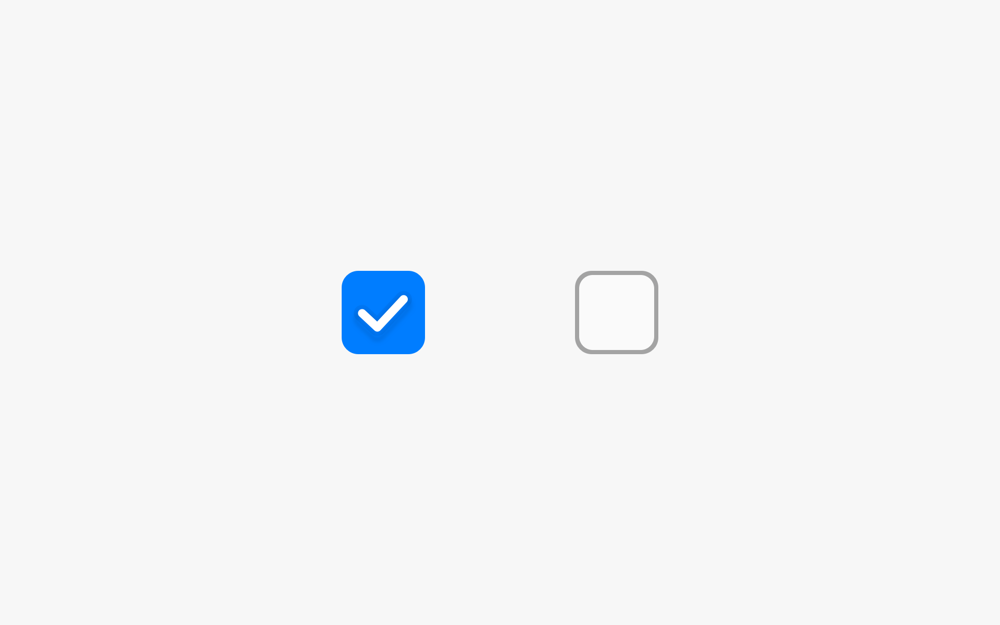
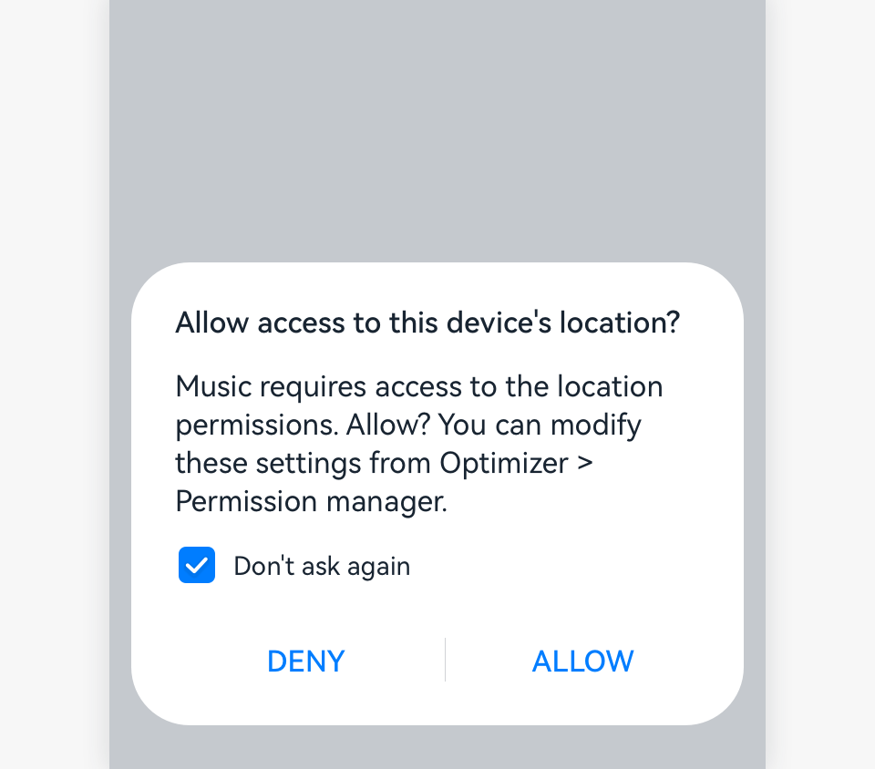

# Tick Box

A tick box is used to specify whether users agree to the description of an item.

## How to Use

- Generally, use a tick box for **Do not remind again** in USB connection scenarios or **Do not ask me again** in scenarios for obtaining location information.

  

- Determine whether to start with a selected tick box by considering the impact on users. A selected tick box should not bring negative impact on users.

- Ensure that the tick box is an additional option of the main content or action on the screen.

- Do not start with a selected tick box to induce the enabling or disabling of a function. Otherwise, users may feel deception.

## Resources

For details about the development guide related to the tick box, see [Checkbox](../../application-dev/reference/arkui-ts/ts-basic-components-checkbox.md).
