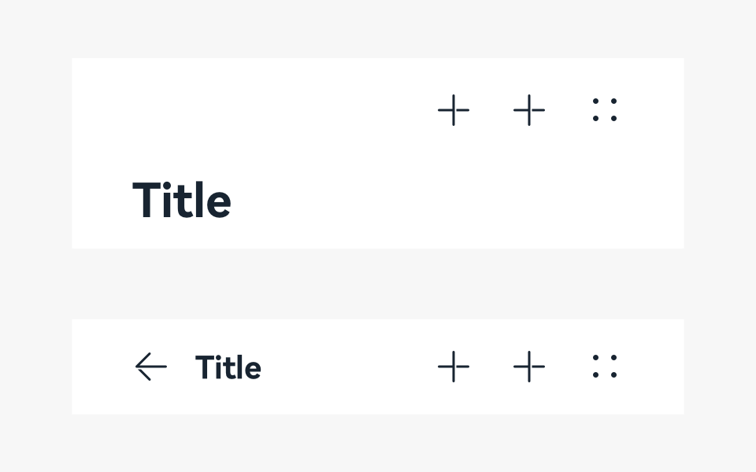
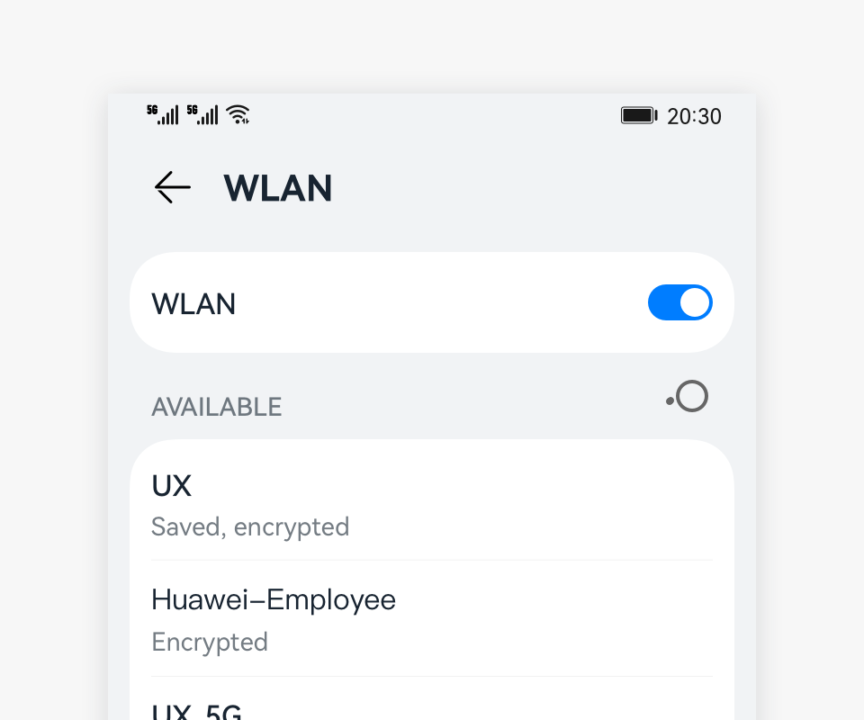

# Title Bar

The title bar is used to display the name and operation entry of a screen.

## How to Use

- Use the title bar mainly on a tool screen or content-oriented screen.

- Place the title bar on the top of the screen. You do not need to highlight the title if the function or content needs to be highlighted.

### Regular Title Bars

- A regular title bar is used when the title does not need to be highlighted.

- The title bar may have icons that show common actions, usually on the right side. Users can touch an icon to perform a particular action.

- Title bars are needed on all screens, except for immersive screens.
  

### Title Bars on Non-level-1 Screens

- The title of a non-level-1 screen is the name of the screen.
- Place a maximum of three icons on the right. Alternatively, you can choose not to place any icon.
- The main title and subtitle are optional. In the case of a two-line title, the title of the second line provides auxiliary description for the title of the first line.
- [Not recommended] If there are multiple views but all other views except the default view are seldom used, you can use the drop-down menu title. However, this practice hides the content in the drop-down menu title and reduces their usage. Therefore, it is not recommended.
  
  

## Writing Instructions

- Keep the text on a title bar short and clear.

- Keep the title consistent with the entry name of the previous screen.

- Use noun phrases without punctuations.

## Resources

For details about the development guide related to the title bar, see [Navigation](../../application-dev/reference/arkui-ts/ts-basic-components-navigation.md).