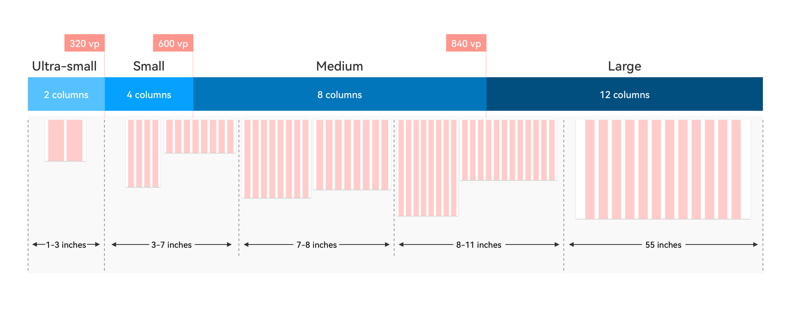

# Responsive Layouts

When adaptive layouts cannot meet the experience requirements of different screens, you can set the relationship between containers and grids based on the screen features to implement a responsive layout. Generally, a responsive layout changes step by step according to breakpoint changes.

## Breakpoint System

OpenHarmony provides a breakpoint system that covers four screen types: ultra-small, small, medium, and large. It also provides the default number of columns for each screen type based on the grid system. Different devices display different numbers of columns based on their screen widths within different breakpoint ranges. You can also customize grids for a specific screen.

The breakpoint system corresponds to actual device types. Ultra-small corresponds to a wearable, small corresponds to the default device, medium corresponds to a tablet, and large corresponds to a smart TV or PC. You can perform adaptation for the screen type as required.

The increase of smart device types brings different interaction capabilities for the screen types, for example, an action camera (small) that supports touch, a portable PTZ (small or medium) that supports joysticks, and an immovable smart desk lamp (medium or large). Therefore, you also need to carry out design based on device interaction.

## Indentation Layout

This layout reveals different indentation effects on devices with different screen widths.

The indentation layout is applicable if over 50% of the screen is blank after stretching or if there are more than 30 characters in each line while hierarchical UIs are unavailable or not suitable for simultaneous display.

The default implementation indents a grid with 8 or 12 columns to a grid with 6 or 8 columns.

## Orientation Layout

This layout changes the content orientation from top/bottom to left/right and vice versa.

For example, the image and text arranged up and down in the portrait mode are arranged left and right in the landscape mode.

The orientation layout is applicable to device orientation changes and the scenario that requires content integrity while the aspect ratio changes significantly (greater than 200%).

## Repetition Layout

This layout allows you to place components with the same attributes horizontally in parallel on a wide screen.

The repetition layout applies to images and their combinations that are sensitive to the aspect ratio when the original image is scaled by more than 150%.

The default implementation repeatedly lays out a grid with 4 columns when there are 8 or 12 columns.

The responsive layouts correspond to the breakpoint system and media query capability of OpenHarmony.
