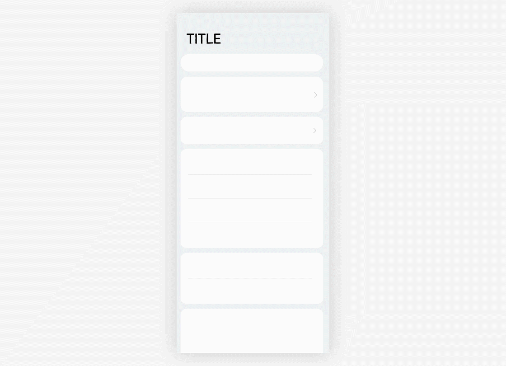

# Transition Animations

Transition animations between screens or between elements help users understand their logical relationships. Example transition animations include the animations that display when you open an application or switch a schedule. The transition animations account for more than 60% of the system animations. The system adopts a "one-shot film" approach during the design of transition animations. This helps deliver a smooth visual experience and improves the quality of the animations.

## Hierarchy

Hierarchy is defined by the system architecture and application architecture. It determines the interactive purposes of transition animations. Different transition designs imply different hierarchical relationships. Inappropriate animation effects may mislead users, leading to poor user experience. When designing transition animations, you must correctly understand the relationships between the applications and screen elements, and use the right methods to design appropriate animations.

### Same Level

The screen or element after transition is at the same level of hierarchy as the current screen or element.

Scenarios: A user edits some components or elements, switches between tab pages, or changes the landscape/portrait mode.

Editing operations

### Upper and Lower Levels

The screen or element after transition sits at the lower or upper level of the current screen or element.

Scenarios: A user switches between upper- and lower-level screens, creates an entity, unlocks a screen, or performs a search.

|  |  |  |
| ------------------------------------------------------------ | ------------------------------------------------------------ | ------------------------------------------------------------ |
| In the case of a parent-child transition within an application, the child element is brought up on touch and fills the screen. | Create an entity.                                            | The application exits to an icon on the home screen, showing the position of the application icon on the home screen. |

### Cross-Level

One example of cross-layer transitions is transition between different applications.

Scenarios: A user switches from one application to another.

## Motion Orchestration

In the process of a transition, different elements are classified and motions are coordinated to make the entire process seamless and properly guide the user's attention.

### Different Elements

A transition is a UI change triggered by user behavior. You must analyze the meanings of different elements that occur during a transition, categorize them as appropriate, and then determine the graphical representations of these elements, which may change over time, as well as their durations.

- **Incoming elements**

  New elements that will show on the screen after the transition.

- **Outgoing elements**

  Elements that will disappear after the transition. They are usually elements on the previous screen.

- **Persistent elements**

  Elements that are displayed throughout the transition. They may change positions on the screen during the transition, or they may be some kind of continuous animation effects that last throughout the transition.

- **Static elements**

  Elements that remain static during the transition.

  

  1. Incoming element; 2. Outgoing element; 3. Continuous element; 4. Static element

## One-Shot Film

One-shot film is an orchestration approach that ensures a seamless transition experience by leveraging shared elements. It helps users navigate between the UIs and enhances user experience. It is a recommended technique for transition design.

- Shared elements

- Shared containers

- Shared motions

### Shared Elements

Shared elements, which are persistent elements described earlier, are elements that are displayed before, during, and after a transition. They are elements you would want your users to focus on throughout the transition. They enhance a sense of continuity during the transition.

.gif)

In this example, the search box is a shared element.

### Shared Containers

During a transition, if a group of elements have clear boundaries, you can apply a container to these elements to create a sense of continuity. The container uses attributes such as sizes, heights, and rounded corners to smooth the transition by means of tweening. Elements in the container are eased in or out, or shared elements may be used.

A shared container groups elements before and after the transition, creating a sense of continuity.

### Shared Motions

There are no intermediate attributes, so there is no way to use tweening to create a seamless transition. You must extract and leverage shared motions to ease the transition. Common shared motion attributes include displacement, scaling, and rotation.

|  |  |
| -------- | -------- |
| Shared scaling motion| Shared rotation motion (large screen demo)|

## Ease-In and Ease-Out

Ease-in and ease-out is a technique that creates a smooth transition experience by changing the transparency of elements in an orderly fashion. It can be applied when components or elements have not intermediate attributes. The following methods may be used:

### One-way Ease-In and Ease-Out

On a screen of overlaying images, only foreground elements are eased in or out, while the background elements remain unchanged.

### Cross Ease-In and Ease-Out

Ease-in and ease-out are applied to incoming and outgoing elements, respectively, and according to their graphical characteristics. Generally, if incoming and outgoing elements use the same or similar styles, you may allow the ease-in and ease-out to happen at the same time. If the incoming and outgoing elements use different visual styles, ensure that the ease-in and ease-out happen at different times, avoiding visual confusion caused by overlapping images.

 <!--no_check--> 