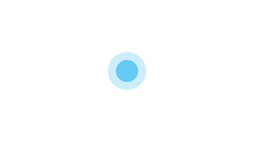

# Typical Input Modes

## Interaction Types

**Touch-based Interaction**

Many devices have a screen that supports user interaction with fingers or styluses. Their touch status, touch quantity, and motion behavior are identified as touch gestures. They support a variety of interaction functions such as touch, scroll, zoom in/out, and rotation. In most cases, touch-based interaction should be used as the primary interaction manner.

The table below describes the basic gestures.

| **Gesture**| **Description**| **Illustration**|
| -------- | -------- | -------- |
| Touch| Touch an element to trigger a function or open a page.|  |
| Long press| Long press an element to trigger a menu or a specific mode, or enter a page. This gesture is not easy to recognize. Do not use it to trigger basic functions. Scenarios: - Long press to display a pop-up menu. For example, long press a contact in the contacts list. - Long press to display a shortcut menu. For example, long press an icon on the home screen. - Long press to trigger multi-choice, generally on a list or grid page. For example, long press the message list of Messaging or the grid page of Gallery. - Long press to enter editing or sortable mode, with device vibration. For example, long press the list page of Alarm or a blank area on the home screen. - Long press to trigger text selection. For example, long press the text entered in the text box. - Long press an icon to access the function details page. For example, long press a function icon on the notification panel.|  |
| Scroll| Scroll a list vertically or swipe the screen horizontally. Scenarios: - Scroll a list. - Switch between pages in the content area by scrolling. - Swipe around the map by scrolling.|  |
| Drag| Move an element from one position to another.|  |
| Double-touch| Quickly touch twice to zoom in or zoom out, select text, or trigger a specific function.|  |
| Pinch| Pinch open or close with two fingers to zoom in or zoom out. Scenarios: - Zoom in or zoom out on an image. For example, pinch an image on Gallery. - Zoom in or zoom out on the content. For example, pinch a browsing page or camera viewfinder interface. |  |

**Cursor-based Interaction**

When users interact with an application using a pointing device (such as a mouse, a touchpad, an AR/VR handle, or an air gesture), an object to which the cursor points and the cursor itself must be visually appropriate to deliver the interactivity of the object and the accuracy of arrival. In addition, the cursor must support refined operations and hover state to improve application productivity, simplify interactive tasks, and optimize information display.

The cursor-based interaction design can be extended to spatial interaction scenarios such as AR/VR handles and air gestures.

**Focus-based Interaction**

When users interact with an application by using a non-pointing device (such as a keyboard, a remote control, or a vehicle-mounted joystick/knob), focus-based interaction is an important input means.

## Typical Input Devices

**Mouse**

A mouse is a typical cursor-based pointing device with pixel-level precision. It is most suitable for productivity applications and high-density UIs that require high precision for user interaction.

Generally, the mouse consists of the left button, right button, and scroll wheel. Its interaction must comply with the industry standards and user habits. The mouse can be used together with the keyboard to provide shortcut operations.

**Touchpad**

A touchpad has both a multi-finger touch gesture input (touchscreen) feature and a refined pointing input (mouse) feature. It is applicable to UIs that support touch-based interaction and productivity applications that have relatively high requirements on pointing precision.

**Keyboard**

A keyboard is an important productivity input device. An excellent keyboard usage experience allows users to quickly and accurately enter text, navigate within the system and applications without leaving the keyboard, access all functions, and enjoy accessibility experience.

**Stylus**

A stylus is an extension of refined finger operations on touchscreens and is a pointing device with pixel-level precision. It provides a direct and natural way to write, draw, and annotate digital content.

**Air Gesture**

As a new manner of interaction, air gestures (non-touch gestures) allow users to conveniently interact with devices without holding or touching them. Air gestures apply to devices such as the default device, tablet, telematics device, smart TV, speaker, and AR/VR device. Air gestures should conform to the intuition and cultural habits of users and be easy to use.
