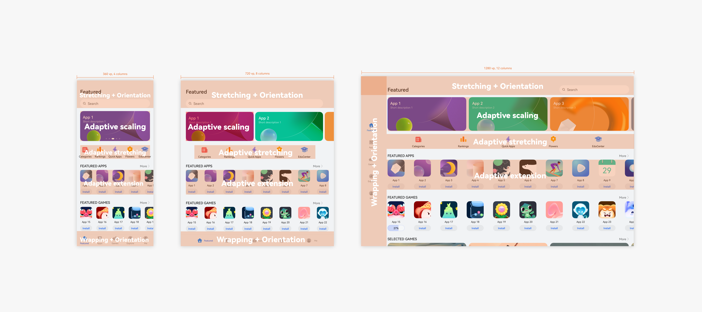
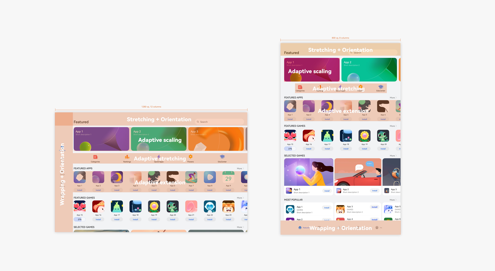
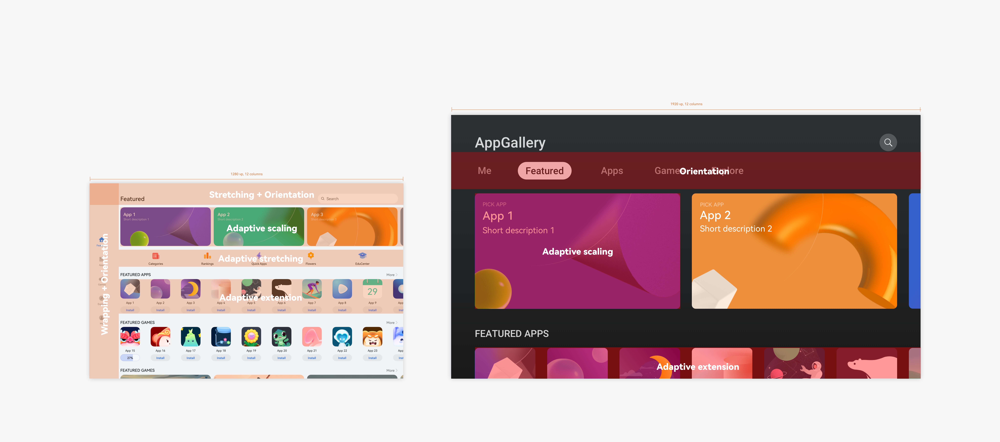
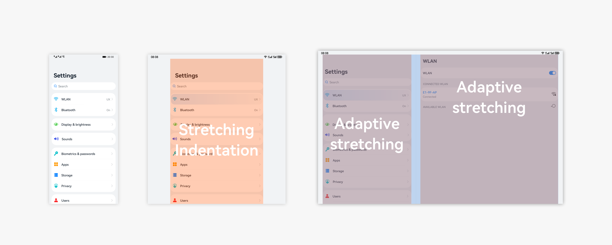
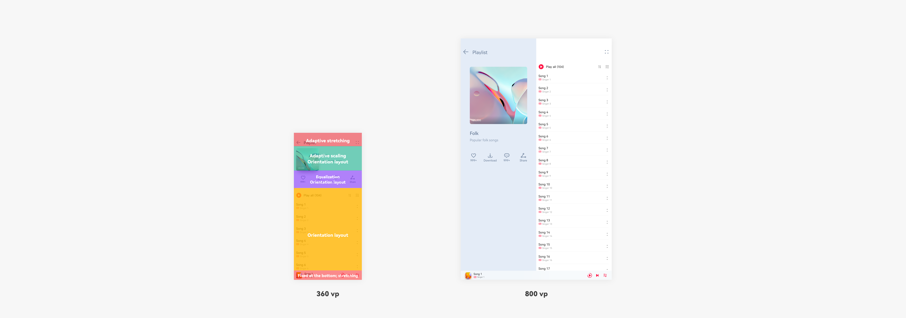
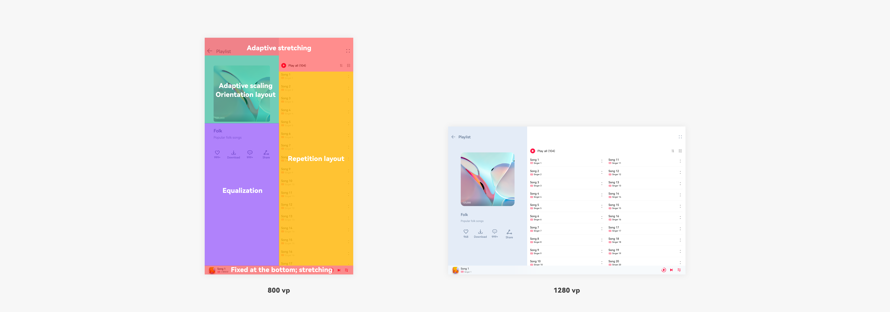
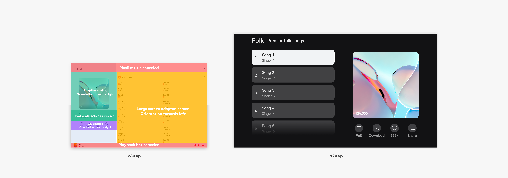

# Layout Use Cases

## Composite Grid View of Flat Navigation

The composite grid view of flat navigation is often used to display different contents on the same page.

For example, the application market, which uses typical flat navigation, employs a handful of layout capabilities on the home page.

- Title bar and search bar: There are limited components fixed on the top. Therefore, adaptive stretching is used. In addition, vertical arrangement is changed to horizontal arrangement on a large screen, making full use of the top area.

- Banner: Adaptive scaling is used. By default, multiple images are displayed in rotation mode on a small-sized device. On a medium-sized page, multiple images are displayed side by side through the repetition layout.

- Icon grid: There are a fixed number of grids with the same priority. Therefore, equalization is used to ensure the full display of grids. If the number of grids is flexible, adaptive extension can be used to display more grids on a larger screen.

- Navigation bar at the bottom: Equalization and wrapping are used for the layout of navigation components. When the screen width changes, navigation components with the same width are arranged side by side. On a larger screen, they are displayed on the left sidebar. This makes the tabs closer to each other and complies with the visual direction.

Consistent layout capabilities are used during device orientation changes. This implements the switching between large and medium sizes.

On a smart TV, the search bar is replaced by an icon entry and the navigation bar is moved to the upper part of the screen. This complies with the device style and remote control interaction rules.

## List View of Hierarchical Navigation

The list view of hierarchical navigation is often used to display multiple types of simple information in parallel or multiple service entries.

For example, the **Settings** page, which uses typical hierarchical navigation, employs adaptive stretching for its components.

On a medium-sized device, the indentation layout is used to avoid too large blank space in the middle. On a large-sized device, the grid system is used to display multiple columns and stretching is used for the list components in their respective areas to make full use of the horizontal space.

## Album Details Page

An album details page can be used to display the music content, videos, short videos, radios, and books.

For example, as a typical content vertical page, the playlist page consists of the title bar, playlist information, playlist operation, playlist, and playback bar.

- Title bar: Adaptive stretching is used.

- Playlist information: Adaptive scaling is used, and the indentation layout is used on a medium-sized device for better content display.

- Playlist operation: Equalization is used. On a small-sized device, the buttons fully utilize the vertical space. On a medium-sized device, they are moved to the right of the playlist cover.

- Playlist: Stretching is used, and the indentation layout is used on a medium-sized device.

- Playback bar: It is fixed at the bottom of the screen and stretching is used.

Consistent layout capabilities are used during device orientation changes. This implements the switching between large and medium sizes. When the orientation layout is used for the playlist, the repetition layout is used for the components inside it.

The playlist information and playlist operation areas, because of their small aspect ratio, are horizontally arranged.

On a smart TV, some playlist information replaces the original title bar and the playback bar is removed. This delivers immersive and simple device information and complies with remote control interaction rules. In addition, the playlist is displayed on the left, facilitating selection using the remote control.

