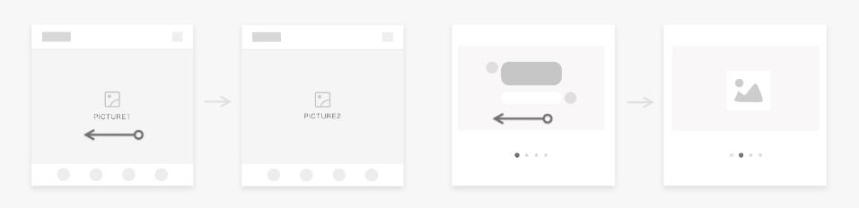

# Unified Interaction Events

This topic describes the interaction rules for an application using typical input devices (such as touchscreens, mouse devices, touchpads, and keyboards) in multiple interaction tasks. **You should ensure that your application responds according to the interaction rules correctly and in compliance with user habits in the specified input mode (or device).**

## Hover

**Use Scenarios**

Preview more information or functions by hovering over an element.

| **Input Device/Mode**| **Interaction Behavior** |
| -------- | -------- |
| Touchscreen| N/A |
| Mouse| Move the cursor to an element.|
| Touchpad| Move the cursor to an element.|
| Keyboard| N/A |

To support hover interaction, the stylus hardware must support the hover capability.
## Touch

**Use Scenarios**

Activate an element, access a new page, or change the element status by touch.

| **Input Device/Mode**| **Interaction Behavior** |
| -------- | -------- |
| Touchscreen| Touch an element with one finger.|
| Mouse| Press the left mouse button.|
| Touchpad| Touch or press with one finger.|
| Keyboard| In the out-of-focus mode, move focus to an element and press the space bar.|

Generally, the press and release operations using a finger on the touchscreen corresponds to those using a mouse.

In some special scenarios, for example, to open a desktop application or a file on a PC, users may double-click or double-touch. This requires special processing from the application. In addition, the application cannot use both touch and double-touch to trigger the same function.

## Double-Touch

**Use Scenarios**

Trigger a shortcut operation, for example, to zoom in on an image or give a like, by double-touch.

| **Input Device/Mode**| **Interaction Behavior** |
| -------- | -------- |
| Touchscreen| Touch twice with one finger.|
| Mouse| Click the left mouse button twice.|
| Touchpad| Touch twice or press twice with one finger.|
| Keyboard| In the out-of-focus mode, move focus to an element and press the space bar twice.|

## Long Press
**Use Scenarios**

Trigger a shortcut operation, for example, to play a video at a rate that is a multiple of the normal rate, by long press.

| **Input Device/Mode**| **Interaction Behavior** |
| -------- | -------- |
| Touchscreen| Long press an element with one finger.|
| Mouse| Long press the left mouse button.|
| Touchpad| Long press an element with one finger.|
| Keyboard| In the out-of-focus mode, move focus to an element and long press the space bar.|

## Context Menu
**Use Scenarios**

Perform an operation to display a pop-up menu or shortcut menu.

| **Input Device/Mode**| **Interaction Behavior**|
| -------- | -------- |
| Touchscreen| Long press an element with one finger. |
| Mouse| Click the right mouse button.|
| Touchpad| Touch or press an element with two fingers (same as that on the PC).  Touch or long press with one finger (to retain user habits on the touchscreen).|
| Keyboard| Press **Shift+F10** or **Logo+M**.|

The menu herein refers to a temporary pop-up window used to display an operation that can be performed by users.

Any menu displayed by long press on the touchscreen must support right-click using a mouse and touch with two fingers on a touchpad.

## Drag

**Use Scenarios**

Move an element to another position or move an element for sending.

| **Input Device/Mode**| **Interaction Behavior**|
| -------- | -------- |
| Touchscreen| Long press an element, and then move it.|
| Mouse| Press the left mouse button and move the mouse (no need to hold down and wait).|
| Touchpad| Press the left button and move.|
| Keyboard| N/A |

## Scroll/Swipe
**Use Scenarios**

Scroll a list or swipe a page.

| **Input Device/Mode**| **Interaction Behavior** |
| -------- | -------- |
| Touchscreen| Touch the screen with a finger and scroll.|
| Mouse| Scroll up and down the scroll wheel or press **Shift** while scrolling up and down the scroll wheel. The mouse pointer does not move. If there is an element that can scroll up and down, press **Shift** while scrolling up and down the wheel to implement horizontal scroll. If there is no element that can scroll up and down, scroll up and down the wheel to implement horizontal scroll. In the case of natural scrolling: When the wheel scrolls up, the screen scrolls up. When the wheel scrolls down, the screen scrolls down. Each time the scroll wheel scrolls a notch, the screen scrolls for a certain distance, 64 VP by default. The distance can be customized.|
| Touchpad| In the case of natural scrolling, the scroll behavior with two fingers on the touchpad is the same as that with one finger on the touchscreen. When you scroll up with two fingers, the screen scrolls down. When you scroll down with two fingers, the screen scrolls up. When you scroll with two fingers, the screen scrolls finely and continuously. When you lift your fingers from the touchpad, screen scrolling slows down and finally stops. In the case of a horizontal list, scroll left with two fingers to scroll the screen rightwards, and scroll right with two fingers to scroll the screen leftwards.|
| Keyboard| N/A |

For a scroll using the mouse or touchpad, the UI elements change, and the mouse pointer does not move.

## Fling
**Use Scenarios**

Switch to another page or quickly scroll the page by a fling.

| **Input Device/Mode**| **Interaction Behavior** |
| -------- | -------- |
| Touchscreen| 	Fling with one finger.|
| Mouse| Scroll the mouse wheel.|
| Touchpad| Move two fingers quickly.|
| Keyboard| N/A|

For a fling using the mouse or touchpad, the UI elements change, and the mouse pointer does not move.

## Zoom In or Out
**Use Scenarios**

Adjust the object size when viewing an image or browsing a page.

| **Input Device/Mode**| **Interaction Behavior** |
| -------- | -------- |
| Touchscreen  | 	Pinch open with two fingers to zoom in, and pinch close with two fingers to zoom out.|
| Mouse| Press **Ctrl** and scroll the mouse wheel to zoom in or zoom out the content based on the cursor position. - Each time the scroll wheel scrolls up a notch, the objects centered at the cursor position are zoomed in by N%. - Each time the scroll wheel scrolls down a notch, the objects centered at the cursor position are zoomed out by N%. |
| Touchpad| The two-finger pinch behavior on the touchpad is the same as that on the touchscreen. After the cursor is moved to an element: - When you pinch open, the element zooms in. - When you pinch close, the element zooms out. Optimize the display-control ratio so that your users can easily and accurately get the desired size. |
| Keyboard|When you press **Ctrl** and the plus sign (+), the objects centered at the cursor position are zoomed in by N%. When you press **Ctrl** and the minus sign (-), the objects centered at the cursor position are zoomed out by N%.|

## Rotation
**Use Scenarios**

Rotate an image when editing it.

| **Input Device/Mode**| **Interaction Behavior** |
| -------- | -------- |
| Touchscreen  | 	Rotate an element on the screen with two fingers. The element rotates accordingly.|
| Mouse| N/A |
| Touchpad| The two-finger rotation behavior on the touchpad is the same as that on the touchscreen. After the cursor is moved to an element: - When you rotate clockwise with two fingers on the touchpad, the element rotates clockwise with your fingers. - When you rotate counterclockwise with two fingers on the touchpad, the element rotates counterclockwise with your fingers. |
| Keyboard|	N/A|

In some scenarios, users can simultaneously zoom in/out and rotate (for example, browsing image or maps) with two fingers manipulating the touchscreen. The touchpad must support this scenario.

## APIs for Unified Interaction Events
To ensure consistent user experience on different devices and reduce the adaptation workload for output devices, you are advised to use the unified interaction event APIs. These APIs cover basic interaction tasks and comply with the user habits on devices such as touchscreens, mouse devices, and touchpads.
