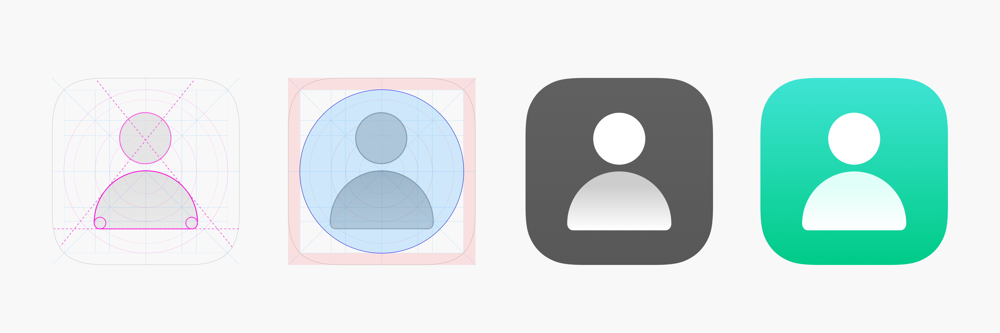
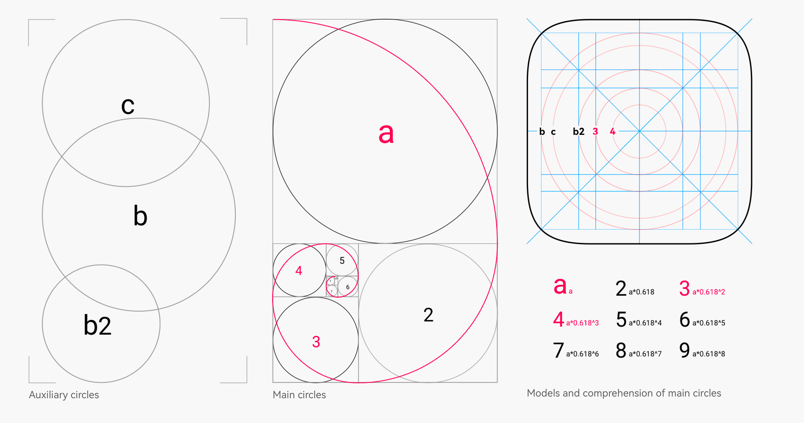
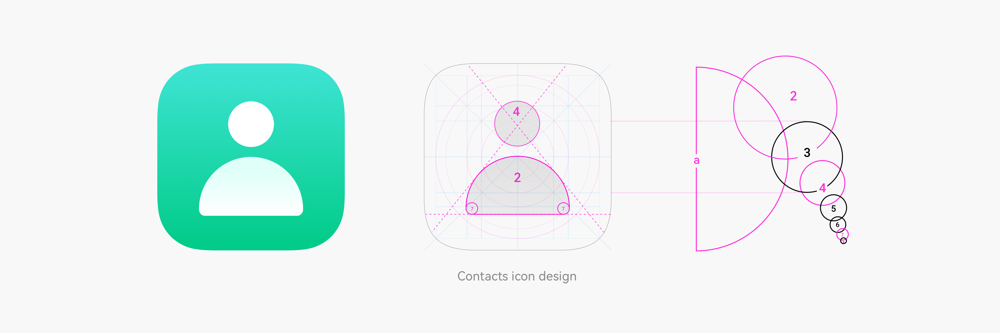
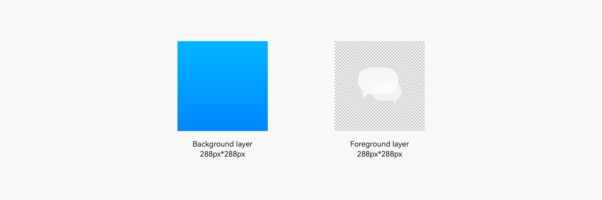
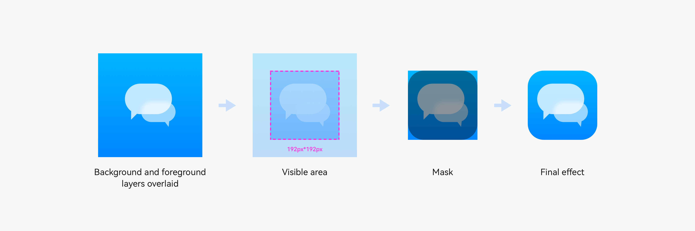
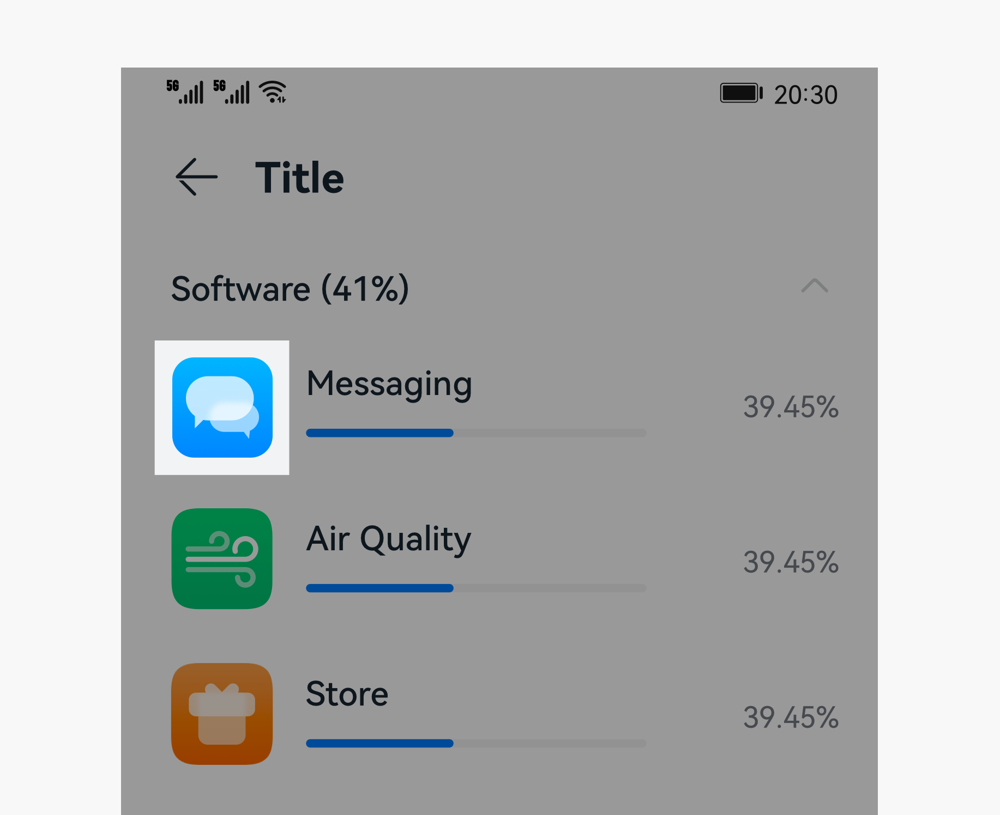

# Application Icons

An application icon should artistically and accurately signal the purpose, functionality, and brand identity of the application.

Example OpenHarmony application icons 

## Design Principles

Comply with the following principles when designing OpenHarmony application icons:

||| |
| -------- | -------- | -------- |
| **Elegantly simple** Add to your application icon elegance accented by simple elements and clean lines.| **Instantly recognizable** Make sure your application icon accurately conveys what it represents: the purpose, functionality, and brand identity. Strive for high legibility and recognizability.| **Emotionally engaging** Carefully use graphics and colors for your application icon to effectively communicate ideas and your brand's visual identity. |

## Graphics Design

Comply with the basic principles and design methods described below when designing an application icon.

### Basic Principles

Your application icon should be dominated by a single element, a metaphorical illustration that fully represents the purpose and functionality of the application. Use smooth lines, neat proportions, and well-thought-out colors.

### Design Methods

To maximize consistency and harmony of icon graphics, OpenHarmony theme icons follow the golden ratio.

#### Derivation of the Golden Ratio

#### Use of the Golden Ratio

The figure below illustrates the golden ratio used in the application icon design.

## Icon Deliverables

The OpenHarmony application icons are delivered using adaptive icons. The table below lists the icon deliverables that should be provided.

| Attribute| Description|
| -------- | -------- |
| Format| png |
| Size| 288px\*288px |
| Content| One foreground layer + One background layer|

Square image resources are required, as shown below.

### Implementing an Adaptive Icon

After the correct image resources are provided, the system uses an adaptive mask to process the icon to ensure that all icons are displayed consistently on the home screen, as shown below.

- Visible area: After the foreground layer and background layer are overlaid, the 2/3 area in the middle is displayed. The size of the visible area is 192 px x 192 px.

- Mask: The mask area is used.

To ensure that your icon can maintain the optimal display effect in different use scenarios, test the display effect as shown below.

|  | |
| -------- | -------- |
| Settings icons| Notification icons|

| UI| Icon Size|
| -------- | -------- |
| Settings| 40 vp \* 40 vp (120 px \* 120 px)|
| Notification| 16 vp \* 16 vp (48 px \* 48 px)|

For details about the default application icon design template provided by OpenHarmony, see [Resources](design-resources.md).
