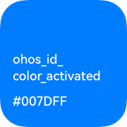
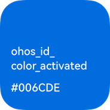
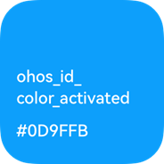
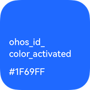

# Colors

Colors impart vitality to UIs and provide users with visual continuity between different applications across devices. Proper use of colors can convey key status information, provide instant status feedback to users, and present data visualization solutions.

Blue is the default dominant color of OpenHarmony. According to human factors research, blue is the color with the highest acceptance rate in both male and female groups. In the world geographic dimension, blue is also the most popular color. More importantly, blue is recognizable for most people with color impairments.

**Color Values and Use Scenarios**

In terms of color design, OpenHarmony uses the unified color language and makes adjustment based on use scenarios across devices, delivering a custom user experience.

For example, the value of **ohos_id_color_activated** varies according to the device and color mode.

  |  **Used in the light theme on the default device**|  Used in the dark theme on the default device|  Used in the dark theme on smart TVs|  Used in the dark theme on wearables| 
| -------- | -------- | -------- | -------- |

OpenHarmony will support dark mode, light mode, and theme switching.

For details about the layered parameters related to colors provided by OpenHarmony, see [Resources](design-resources.md).
