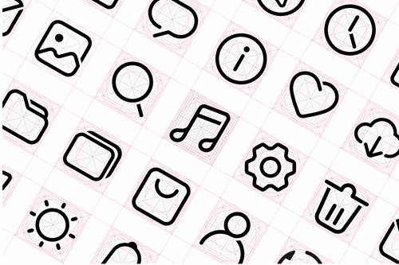
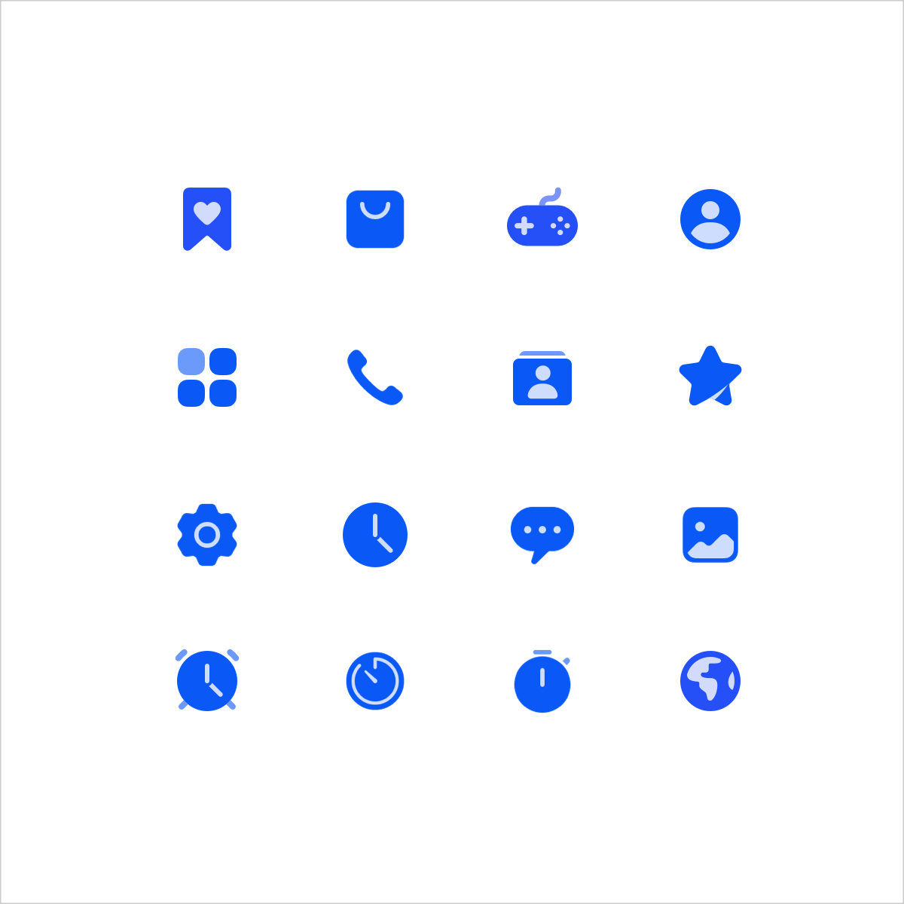
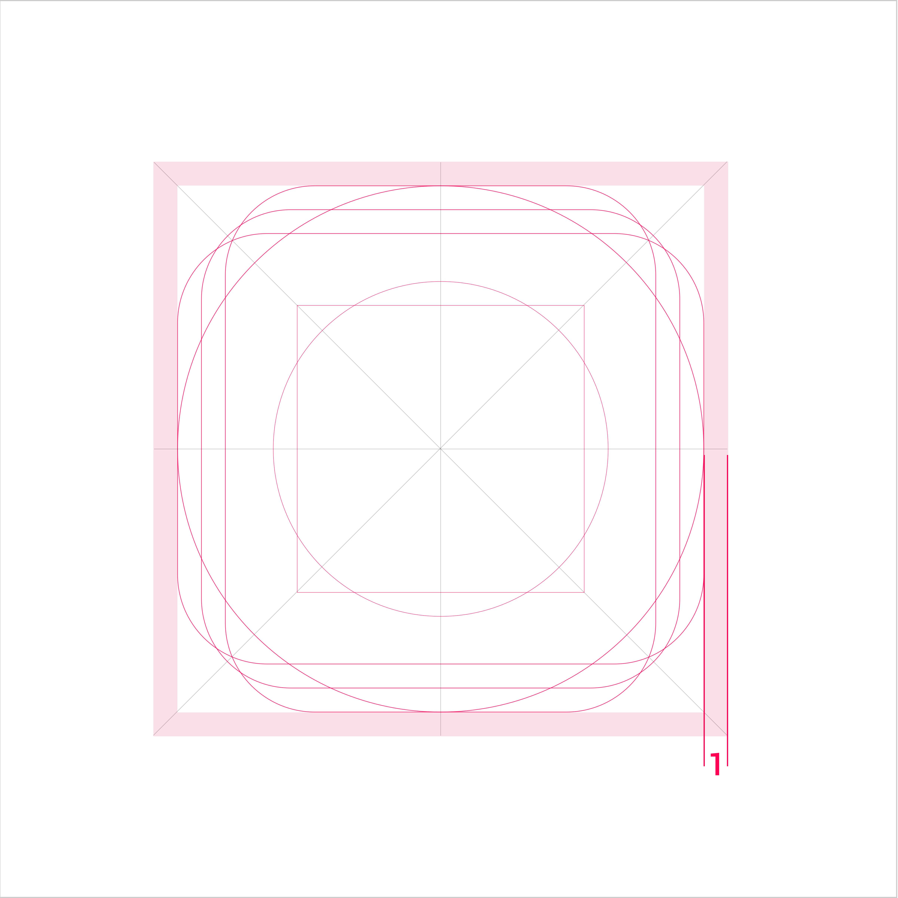
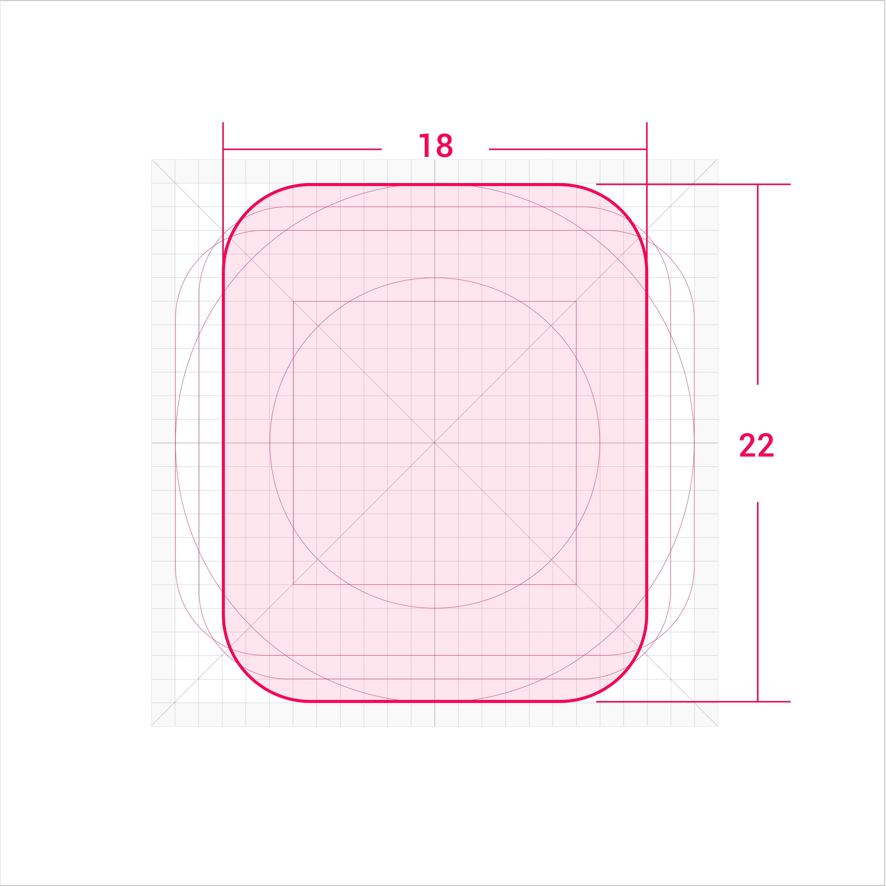
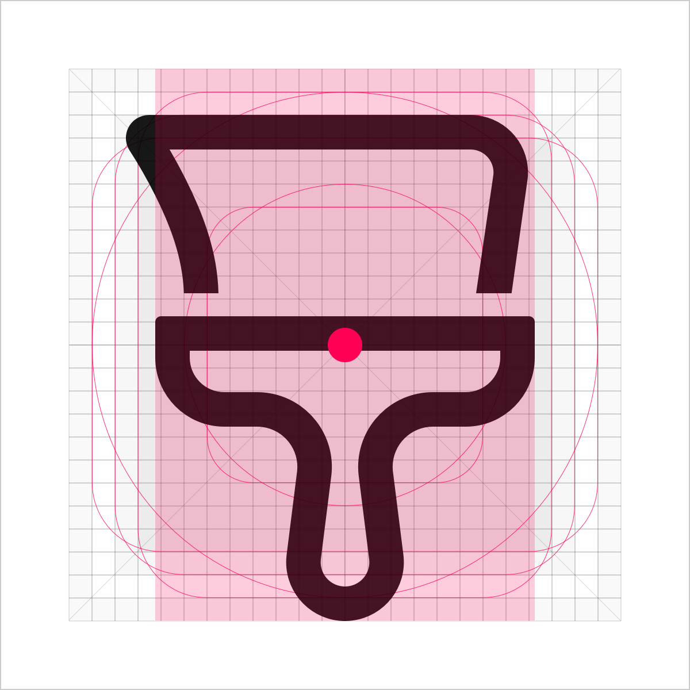
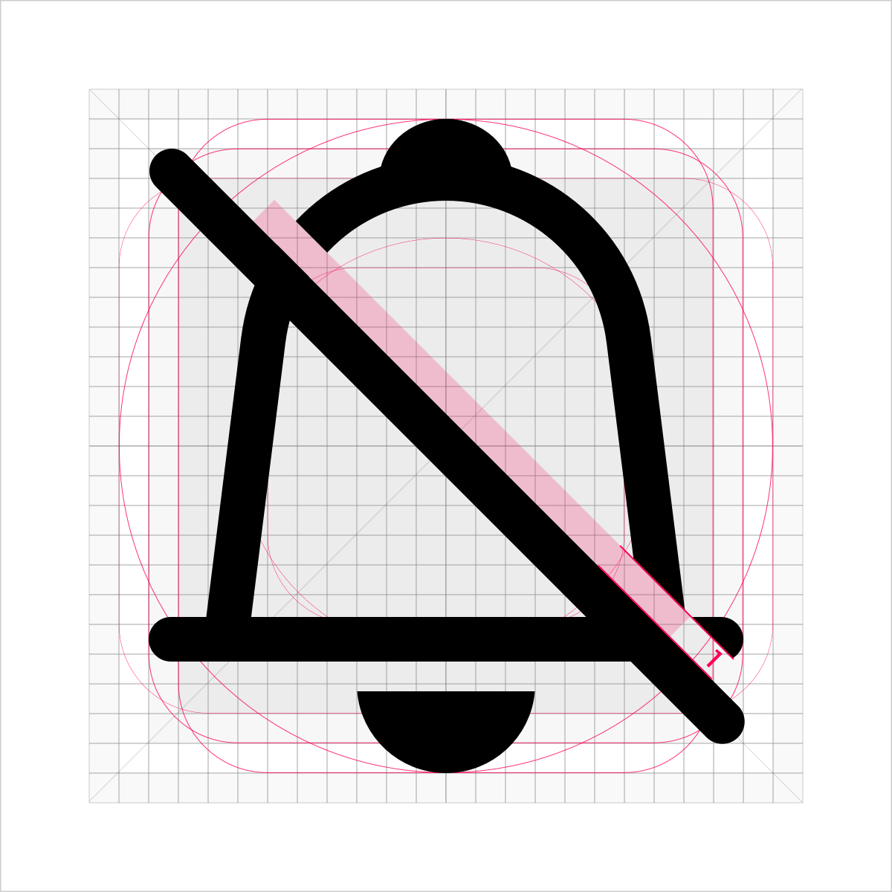
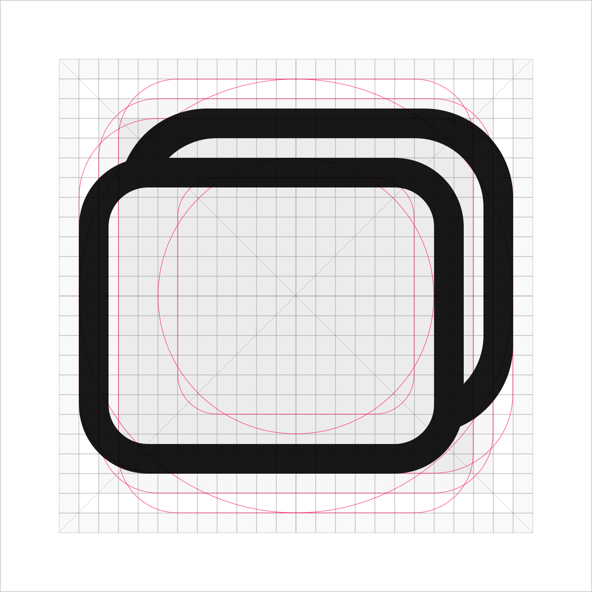
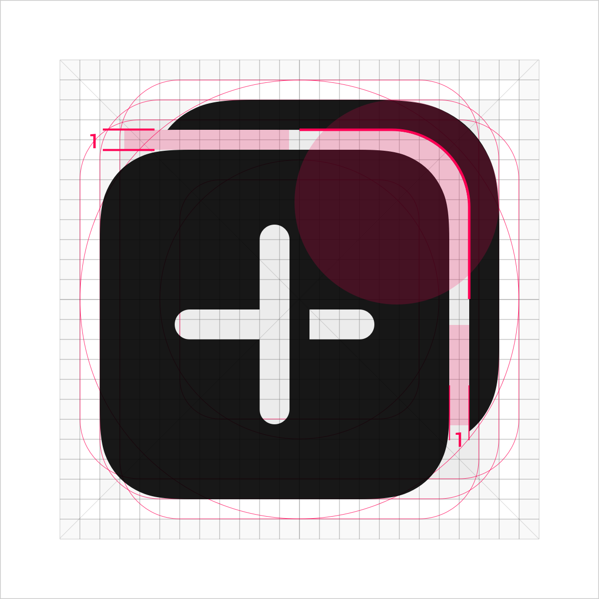

# System Icons

Icons are one of the key visual elements for the operating system and UI. They must help users easily identify the key information and semantics they represent. To ensure consistent visual experience across devices, the icon elements should be consistent and match the background against different devices in various scenarios. In addition, the color rules of human factors must be followed to provide a comfortable reading experience and a harmonious UI display for users. The system's design rules also must be followed for area charts and line charts, which use the same graphic structure to reduce the reading difficulty.

## Design Principles

OpenHarmony system icons pursue the design principles of exquisiteness, simplicity, and particularity. They mainly use geometry to shape graphics, simplify the structure of lines, and accurately grasp the proportion relationship. Up-to-date design languages are added to the style to make it look more fashionable. Sharp right angles are avoided to ensure that the style looks friendly and inviting.

| 
Exquisiteness and simplicity
| 
Particularity
|
|  --------  |  --------  |
| Born from geometric shapes, simple lines, and precise control of proportions and structural positions.| Opening details show the intercalation and folding relationships, and the negative space conveys the shadow and a sense of space.   |
|  |      |

## Icon Styles

The system icon has two styles: outlined icon and filled icon. The two styles use the same structure to ensure consistent visual experience.  Icons are classified into single-color icons and dual-color icons based on use scenarios. Single-color icons are used to assist in expressing basic functions on the UI.
|  |  |
| -------- | -------- |
| Outlined icons|Filled icons|

A dual-color icon expresses the colorful dual-color effect based on the filled style. This type of icon is mainly used in scenarios where functions need to be highlighted.
|   |  |
| -------- | -------- |
| Status icon - off| Status icon - on |
|  |  |
|Functional entry icons| Operational entry icons|

## Icon Size and Layout

The standard size of a system icon is 24 vp. The size of an icon in the main drawing area is 22 vp, with 1 vp of space reserved around the drawing area.

|  ||
| -------- | -------- |
|Drawing area|Space area|

**Key Shapes**

Key shapes are the foundation of the grid. Using these core shapes as a guide ensures a visually consistent scale and volume in the icons related to the product.

|  | |
| -------- | -------- |
|Square Width and height: 20 vp| Circle Diameter: 22 vp|
|  |  |
|Horizontal rectangle Width: 22 vp Height: 18 vp|Vertical rectangle Width: 18 vp Height: 22 vp|

**Extra Visual Weight**

If the icon shape is special, extra visual weight needs to be added to balance the overall icon volume. The drawing area can be extended into the space area, but the overall icon size remains within 24 vp.

  | |  |
| -------- | -------- |

**Gravity Center of Icons**
Ensure that the gravity center of an icon is in the center of the icon area. Given that the gravity center of the icon is stable, the icon can extend beyond the drawing area to the space area.
|  | |
| -------- | -------- |
| Recommended| Not recommended|

## Shape Characteristics

1. Line thickness: 1.5 vp

2. End point style: round head

3. Outer rounded corner: 4 vp; inner rounded corner: 2.5 vp

4. Opening width: 1 vp

| | |
| -------- | -------- |
|  | **Cut-off** 1. Leave a margin in the upper part for the cut-off line and retain the connection line in the lower part. 2. Opening width: 1 vp 3. The cutting surface should be flat and straight.  4. The oblique line is 45 degrees from the upper left corner to the lower right corner. |

**Graphics Overlay**

Two icons are used together to demonstrate the concepts of clusters, groups, and sets.
Leave a margin of 1 vp between shapes.
|  |  |
| -------- | -------- |
|  Recommended|  Not recommended|

 Add the inner rounded corner of 3.5 vp to the corner of the icon gap.

|   |    |
|  --------  |  --------  |
|  Recommended  | Not recommended  |

## Icon Resource Naming Rules

**Naming example: *ic_Module_Function_Location_Color_Status_Number***

*ic_Module_Function* is mandatory, and *Location_Color_Status_Number* is optional.

Note: All resource names must be in lowercase. Long fields can be abbreviated. The name cannot contain spaces. Different fields are separated by underscores (_).

For details about the default icon library provided by OpenHarmony, see [Resources](design-resources.md).
