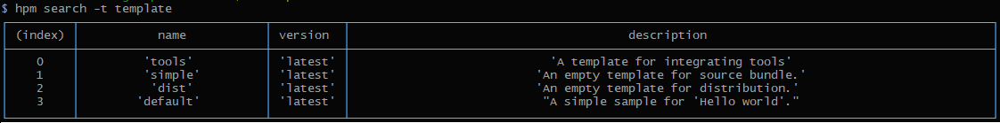

# Developing Bundles<a name="EN-US_TOPIC_0000001051690861"></a>

You can use any of the following methods to develop OpenHarmony bundles:

-   Create a new bundle from scratch.
-   Define an existing source code project as a bundle.

## Creating a Bundle<a name="section717481119145"></a>

Generally, you can find commonly used bundles on the  [HPM](https://hpm.harmonyos.com/#/en/home)  website. If they cannot meet your requirements, you can develop a bundle on your own.

You can publish bundles in the HPM repository if you like, so that your peers have an option to use them.

Assume that you are planning to create a new bundle  **my-bundle**  in  **D:/source**. Run the  **hpm init**  command to create the scaffold code for this bundle. For example, you can go to  **D:/source**  and run the following command:

```
hpm init -t default  -d demo mybundle
```

The  **'default'**  template will be used to create a bundle named  **mybundle**  in the  **demo**  directory in  **D:/source**.

```
demo
├── headers            # Header file (example)
│   └── main.h
└── src                # Source code (example)
│    └─ main.c
├── bundle.json        # Metadata declaration file
└── LICENSE            # License agreement
└── Makefile           # Compilation description file (example)
└── README.md          # Readme file

```

Then, complete your coding based on service requirements and generate the build script. Finally, use  **git**  to commit your code \(including the  **bundle.json**  file\) to the code hosting repository, such as gitee.

> **NOTE:** 
>```
>hpm init -t {templatename} -d {dir} {name}
>```
>-   **-t \{templatename\}**  indicates the template name.
>-   **-d \{dir\}**  indicates the path for storing the bundle to be created.
>-   **name**  indicates the name of the bundle to be created.

The hpm provides a few default templates. More templates are available on the HPM server. You can run the  **hpm search -t template**  command to search for a template stored on the server.



## Defining an Existing Project as a Bundle<a name="section102861955201410"></a>

If you have a code project and need to distribute it on the HPM platform, run the following command in the current project directory, for example,  **mybundle2**:

```
hpm init
```

1.  Enter a bundle name \(**mybundle2**  as an example\) and press  **Enter**.
2.  Enter the version and description. A  **bundle.json**  file will be generated in the current directory.
3.  Open the** bundle.json**  file as you like.

    ```
    $ hpm init
    Your bundle will be created in directory ~\demo\mybundle2
    ? bundle name mybundel2
    ? version 1.0.0
    ...
    Initialization finished.
    ```


1.  Modify other information \(such as the author, code repository, code directory, command script, and dependent bundles\) in  **bundle.json**. An example is shown below:

    ```
    {
    "name": "mybundle2",
    "version": "1.0.0",
    "publishAs": "code-segment",
    "dirs":{
        ".":["README.md"],
        "src":["test.c"],
        "header":["header/test.h" ],    
        "src/common":["src/common/foobar.txt"]
      },
    "scripts": {
        "build": "make -${args}"
      },
    "dependencies": {
        "@ohos/cjson": "^1.0.0",
        "@ohos/foobar": "^1.2.0"
      }
    }
    ```


## Releasing the Bundle on the HPM Platform<a name="section1318574233211"></a>

To release a bundle on the HPM platform, you need to obtain an account and create an organization \(or join an existing organization\). For details, see the online help on the  [HPM](https://hpm.harmonyos.com/#/en/home)  website.

After that, generate a public key on the local PC based on your invitation code \(which can be obtained on the  **My profile**  page on the HPM website\), and configure the public key on the  **My profile**  page.

```
hpm config set loginUser {your-invitation-code}
hpm gen-keys
```

The generated file will be stored in  **\~\\Users\\yourname\\.hpm\\key**. Copy the content in the public key file  **publicKey\_your-account.pem**  to the SSH public key on your  **My profile**  page.

After finishing the preceding operations, you then have the permission to release bundles in your organization.

In the directory where the bundle is located, run the following command to package and release the bundle:

```
hpm publish
```

> **NOTE:** 
>-   To avoid bundle name conflicts, name a released bundle in the format of  **@org\_name/bundle\_name**.
>-   Your account must also be a member of  **org\_name**  so that you can release or update bundles in the organization.
>-   The released bundles take effect only after security and content reviews.

## Referencing a Bundle<a name="section19311124115315"></a>

Generally, when developing a project, you may need to reference other bundles in order to accelerate development of specific functions. Installing dependencies could be a good way.

Go to the HPM website, search for bundles that meet your service requirements by keywords, and then introduce the bundles to your project.

Run the following command in your bundle project. Make sure that the project directory contains the  **bundle.json**  file.

```
$ hpm install @scope/the_bundle
```

The referenced bundle will be installed under  **ohos\_bundle**  in the directory where your project is located. The directory structure is as follows:

```
project
├── ohos_bundle            
│   └── scope
│    └─ the_bundle     # <--- Referenced bundle
└── src                
│    └─ main.c
├── bundle.json        # Metadata declaration file
└── LICENSE            
└── Makefile           
└── README.md          
```

Open the  **bundle.json**  file. You will see that the bundle has been introduced to the dependencies of your project.

```
{
"dependencies": {
    "@scope/the_bundle": "^1.0.0"
  }
}
```

You can also edit the dependencies of multiple bundles in this file at a time.

```
{
"dependencies": {
    "@scope/the_bundle1": "^1.0.0",
    "@scope/the_bundle2": "^2.0.0",
    "@scope/the_bundle3": "^3.0.0",
    "@scope/the_bundle4": "^1.1.0"
  }
}
```

Run the  **hpm install**  command again to download and install all bundles that have not been installed.

## Installing a Bundle Globally<a name="section165131927192120"></a>

If the referenced bundle is one shared by multiple projects, for example, the compiler toolchain, you can install it globally.

Run the following command in your bundle project. Make sure that the project directory contains the  **bundle.json**  file.

```
$ hpm install -g @scope/the_tool
```

The referenced bundle will be installed in the directory specified by the  **globalRepo**  parameter of the  **hpm config**  command.

```
~\.hpm\global            
│   └── scope
│    └─ the_tool     # <--- Referenced bundle
```

> **NOTE:** 
>-   For a bundle installed in a project, you can reference it using the environment variable  **DEP\_SCOPE\_bundle\_name**  when running the hpm compilation command. 
>For example, after you run  **hpm i @opensource/gn**  to install a bundle, you can edit the build script in the  **bundle.json**  file as follows:
>```
>"scripts": {
>    "build": "${DEP_OPENSOURCE_gn}/gn  --version"
>  },
>```
>Then, you can run the  **hpm build**  command to call GN functions.
>-   For a globally installed bundle, you can directly call the bundle using an environment variable or reference the bundle using the  **$\{key\}/tool\_name**  parameter when running the  **hpm config set key value**  command. For example:
>```
>hpm i -g @ohos/opensource/gn
>hpm config BUILD_SYS_GN ~/.hpm/global/ohos_bundles/opensource/gn
>```
>You can edit the build script in the  **bundle.json**  file as follows:
>```
>"scripts": {
>    "build": "${BUILD_SYS_GN}/gn  --version"
>  },
>```
>Then, you can run the  **hpm build**  command to call GN functions.

## Compiling a Bundle<a name="section136732148541"></a>

If the bundle code can be independently compiled once you finish coding, you can configure build tools and scripts to generate binary files.

The hpm supports command integration so that you can select any build tool \(such as  **make**,  **gcc**, and  **gn**\) suitable for your project. You only need to define the  **build**  command in the  **scripts**  in the  **bundle.json**  file of your project, and then you run the hpm command  **build**  to perform building.

## Defining the Build Script<a name="section10274147111610"></a>

This section uses how to build an executable file  **helloworld**  in the  **app**  directory as an example.

```
app
├── BUILD.gn
├── include
│   └── helloworld.h
└── src
    └── helloworld.c
```

Create a  **BUILD.gn**  file in the same directory as  **helloworld.c**.

```
touch BUILD.gn
vim BUILD.gn
```

The following is an example of  **BUILD.gn**  for your reference:

```
executable("hello_world") {
    sources = [
        "src/helloworld.c"
    ]

    include_dirs = [
        "include"
    ]
}
```

> **NOTE:** 
>-   **executable**  is a built-in template of  **gn**. You can run the  **gn help executable**  command to view how to use this template.
>-   **sources**  represents the source code path, and  **include\_dirs**  represents the header file path.

## Executing the Build Script<a name="section879301916172"></a>

Run the following command:

```
hpm build
```

After all building operations are complete, the message "build succeed" is displayed. You need to check the building result.


## Defining a Distribution<a name="section413216495619"></a>

This process states the dependent bundles and how to compile and link the bundles to generate image files.

This section uses the hb compilation framework as an example.

## Defining Scripts<a name="section11503171219190"></a>

An example definition in the  **bundle.json**  file is as follows:

\{

"name": "@your/dist\_name",

"version": "2.2.0",

"publishAs": "distribution",

"description": "describe it",

"scripts": \{

"config\_hb": "hb set -root $DEP\_BUNDLE\_BASE",

"dist": "PATH=/root/.local/bin:$\{DEP\_OHOS\_gn\}:$\{DEP\_OHOS\_ninja\}/ninja:$\{DEP\_OHOS\_llvm\}/llvm/bin:$\{DEP\_OHOS\_hc\_gen\}/hc-gen:$\{PATH\} && ./scripts/dist.sh"

\},

"envs": \{

"debug": false

\},

"dirs": \{

"scripts": "scripts/\*"

\},

"dependencies": \{

"@ohos/build\_lite": "2.2.0",

"@ohos/gn": "1.1.1",

"@ohos/llvm": "1.1.1",

"@ohos/hc\_gen": "1.1.0",

"@ohos/ninja": "1.1.0",

...

\},

"ohos": \{

"os": "2.2-Beta",

"board": "hi3516",

"kernel": "liteos-a"

\},

"keywords": \[ "hispark", "hi3516"   \],

"repository": "https://gitee.com/openharmony/your-project",

"license": "Apache V2"

\}

## Building a Distribution<a name="section4694125521912"></a>

Run the following command in the root directory of the current distribution:

```
hpm dist
```

The  **hpm-cli**  tool automatically starts compilation. After the compilation is complete, an image file will be generated, as shown below:

```
out
|-xxdist.img
|-xx.file
```

Burning

The build result of the distribution can be burnt into devices, for example, by using the  **hiburn**  tool. You need to configure burning parameters in the  **bundle.json**  file of the distribution.

```
"scripts": {
   "flash": "{$DEP_HIBURN}/hiburn"
},
```

Set the path of the  **hiburn**  tool and set burning parameters. For details, see the  **hiburn**  tool guide.

```
hpm config set DEP_HIBURN {hiburn_path}
hpm run flash
```

> **NOTE:** 
>The preceding example describes only how to define the  **bundle.json**  file. The burning tool is subject to the actual development board.

