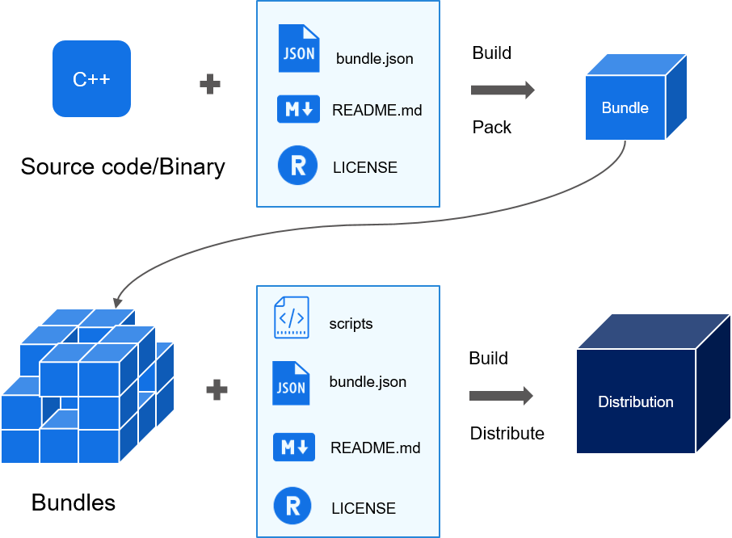

# Bundle Development<a name="EN-US_TOPIC_0000001051452100"></a>

-   [Overview](#section112136415486)
-   [Preparations](#section12731192104816)
    -   [Hardware Requirements](#section71851750144814)
    -   [Installing Node.js and the hpm-cli Tool](#section675199493)
    -   [\(Optional\) Modifying HPM Configurations](#section1940205015499)
    -   [Downloading OpenHarmony Code](#section42591118155217)
    -   [Installing Dependent Bundles](#section644212530524)

-   [Bundle Development](#section15640113715318)

## Overview<a name="section112136415486"></a>

This document describes how to develop OpenHarmony bundles and distributions, and how to create, develop, and build code, as well as burn and debug devices by using a command line tool.

-   A bundle usually maps onto a code repository, which is a code archive with the  **bundle.json**,  **README**, and  **LICENSE**  files.
-   A distribution consists of multiple bundles. Each distribution integrates various bundles of a comprehensive system, such as the driver, kernel, framework, and applications. These bundles can be used for device burning.

**Table  1**  Differences between a bundle and a distribution

<a name="table6287133615412"></a>
<table><thead align="left"><tr id="row17288183614415"><th class="cellrowborder" valign="top" width="16.24162416241624%" id="mcps1.2.4.1.1"><p id="p528818361545"><a name="p528818361545"></a><a name="p528818361545"></a>Aspect</p>
</th>
<th class="cellrowborder" valign="top" width="33.31333133313331%" id="mcps1.2.4.1.2"><p id="p1288836247"><a name="p1288836247"></a><a name="p1288836247"></a>Bundle</p>
</th>
<th class="cellrowborder" valign="top" width="50.44504450445044%" id="mcps1.2.4.1.3"><p id="p112885362418"><a name="p112885362418"></a><a name="p112885362418"></a>Distribution</p>
</th>
</tr>
</thead>
<tbody><tr id="row1728813361848"><td class="cellrowborder" valign="top" width="16.24162416241624%" headers="mcps1.2.4.1.1 "><p id="p2010613564815"><a name="p2010613564815"></a><a name="p2010613564815"></a>Application scenario</p>
</td>
<td class="cellrowborder" valign="top" width="33.31333133313331%" headers="mcps1.2.4.1.2 "><p id="p1910555184818"><a name="p1910555184818"></a><a name="p1910555184818"></a>Feature-oriented</p>
</td>
<td class="cellrowborder" valign="top" width="50.44504450445044%" headers="mcps1.2.4.1.3 "><p id="p13871955484"><a name="p13871955484"></a><a name="p13871955484"></a>System-oriented</p>
</td>
</tr>
<tr id="row676745614472"><td class="cellrowborder" valign="top" width="16.24162416241624%" headers="mcps1.2.4.1.1 "><p id="p1028816365414"><a name="p1028816365414"></a><a name="p1028816365414"></a>Content</p>
</td>
<td class="cellrowborder" valign="top" width="33.31333133313331%" headers="mcps1.2.4.1.2 "><p id="p428812361042"><a name="p428812361042"></a><a name="p428812361042"></a>Codes or a binary library for implementing features</p>
</td>
<td class="cellrowborder" valign="top" width="50.44504450445044%" headers="mcps1.2.4.1.3 "><p id="p328817366417"><a name="p328817366417"></a><a name="p328817366417"></a>List of dependent bundles as well as their compiling and building scripts</p>
</td>
</tr>
<tr id="row95114356"><td class="cellrowborder" valign="top" width="16.24162416241624%" headers="mcps1.2.4.1.1 "><p id="p184894513517"><a name="p184894513517"></a><a name="p184894513517"></a>Integrity</p>
</td>
<td class="cellrowborder" valign="top" width="33.31333133313331%" headers="mcps1.2.4.1.2 "><p id="p1951741155"><a name="p1951741155"></a><a name="p1951741155"></a>A part of the operating system</p>
</td>
<td class="cellrowborder" valign="top" width="50.44504450445044%" headers="mcps1.2.4.1.3 "><p id="p20521542512"><a name="p20521542512"></a><a name="p20521542512"></a>An entire operating system</p>
</td>
</tr>
<tr id="row13581419518"><td class="cellrowborder" valign="top" width="16.24162416241624%" headers="mcps1.2.4.1.1 "><p id="p859171059"><a name="p859171059"></a><a name="p859171059"></a>Compilation result</p>
</td>
<td class="cellrowborder" valign="top" width="33.31333133313331%" headers="mcps1.2.4.1.2 "><p id="p259201355"><a name="p259201355"></a><a name="p259201355"></a>Bundles</p>
</td>
<td class="cellrowborder" valign="top" width="50.44504450445044%" headers="mcps1.2.4.1.3 "><p id="p459414519"><a name="p459414519"></a><a name="p459414519"></a>System image</p>
</td>
</tr>
</tbody>
</table>

**Figure  1**  Composition of bundles and distributions<a name="fig85033524124"></a>  




## Preparations<a name="section12731192104816"></a>

### Hardware Requirements<a name="section71851750144814"></a>

-   Development boards \(examples: Hi3861, Hi3516D V300, and Hi3518E V300\)
-   Host computer \(Windows workstation\)
-   Linux server

**Figure  2**  Hardware connections<a name="fig113816181847"></a>  


### Installing  **Node.js**  and the  **hpm-cli**  Tool<a name="section675199493"></a>

1.  Install  **Node.js**.

    Download  **Node.js**  from its official website and install it on your local PC.

    You are advised to install  [Node.js](https://nodejs.org/)  12.x \(including npm 6.14.4\) or a later version \(12.13.0 or later is recommended\).

2.  Install the  **hpm-cli**  tool using  **npm**  delivered with  **Node.js**. Run the following command:

    ```
    npm install -g @ohos/hpm-cli
    ```

3.  Run the following command to check whether the installation is successful. If an HPM version is displayed, the installation is successful.

    ```
    hpm -V or hpm --version
    ```

4.  \(Optional\) Run the following command to upgrade the HPM version if needed:

    ```
    npm update -g @ohos/hpm-cli
    ```


### \(Optional\) Modifying HPM Configurations<a name="section1940205015499"></a>

After the  **hpm-cli**  tool is installed, run the following command to view HPM configurations:

```
hpm config
```

Default HPM configurations are displayed upon the command execution. You can modify the default configurations as required. The following lists common HPM configurations:

```
registry = https://hpm.harmonyos.com/hpm/registry/api              # Configure the address of the HPM registry (mandatory for downloading bundles).
login = https://hpm.harmonyos.com/hpm/auth/pk                      # Configure the address for HPM login (mandatory for publishing bundles).
loginUser = {your-account}                                         # Configure the account for HPM login (mandatory for publishing bundles).
shellPath = C:\WINDOWS\System32\cmd.exe                            # Configure the shell for running HPM commands.
globalRepo = C:\Users\yourname\.global                             # Configure the path for storing bundles that are installed globally.
http_proxy = http://your-proxy-server:port                         # Configure the HTTP proxy.
https_proxy = http://your-proxy-server:port                        # Configure the HTTPS proxy.
```

For details about  **hpm-cli**  commands, see  [HPM Commands](bundles-guide-overview.md).

### Downloading OpenHarmony Code<a name="section42591118155217"></a>

For details, see  [Source Code Acquisition](../get-code/sourcecode-acquire.md).

### Installing Dependent Bundles<a name="section644212530524"></a>

The HPM publishes commonly used development tools \(such as those for burning, compiling, and compression\) as bundles. You can run the following command to install these tools. After the command is executed, the system automatically downloads and installs the tools, which need to be installed globally only once.

```
hpm i -g @ohos/llvm
hpm i -g @ohos/ninja
hpm i -g @ohos/gn
hpm i -g @ohos/hc_gen
hpm i -g @ohos/sysroot
```

These are a set of development tools \(such as  **gn**  and  **ninja**\). With these tools, you can start your general bundle development based on source code.

## Bundle Development<a name="section15640113715318"></a>

