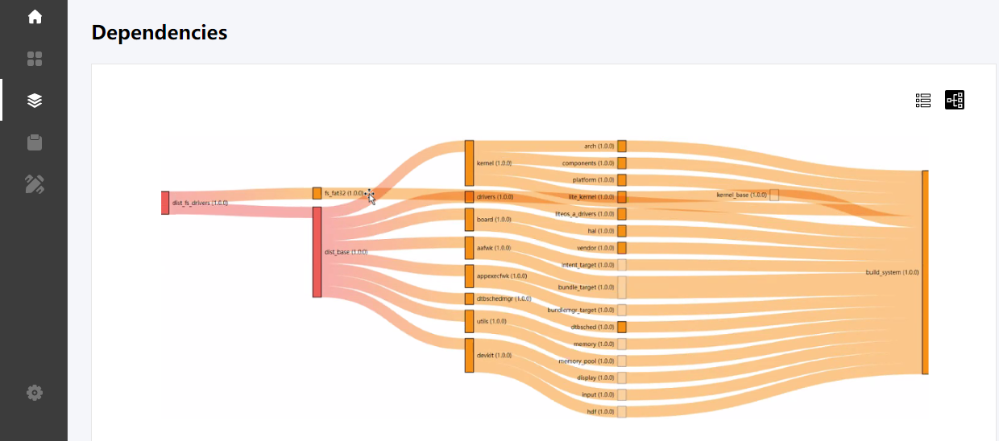

# Bundle Development Specifications<a name="EN-US_TOPIC_0000001051452141"></a>

## Overview<a name="section1725818533344"></a>

This document describes the basic concepts of a bundle and how to define it in compliance with specifications.

### Definition<a name="section4821219183514"></a>

OpenHarmony software is developed on a per-bundle basis. In terms of the operating system, all software running on OpenHarmony are bundles. Generally, bundles are classified into the following types based on their application scopes:

-   Board-level bundles: device hardware-specific bundles, such as  **board**,  **arch**, and  **mcu**
-   System-level bundles: a set of bundles with independent features, such as the kernel, file system, and framework
-   Application-level bundles: applications that provide services to users, such as  **wifi\_iot**  and  **ip\_camera**

Bundles are designed for reuse purposes. Any reusable modules can be defined as bundles. They are classified into the following types based on their forms:

-   Source code
-   Binary system
-   Code snippet
-   Distribution

### Bundle Division Rules<a name="section1089794263513"></a>

In principle, bundles should be grouped at a fine-grained granularity as much as possible to achieve maximum reuse. The following factors are taken into account regarding bundle division:

-   Independence: Bundles provide relatively independent features and can be independently built. Each bundle is capable of providing its own APIs and services for external systems.
-   Coupling: If a bundle must depend on another bundle to provide services, they can be coupled to one bundle.
-   Correlation: If a group of bundles jointly implement a feature, and if other bundles never depend on them, the group of bundles can be combined into one bundle.

### Bundle Dependency<a name="section25701647163710"></a>

A bundle dependency can be mandatory or optional.

-   Mandatory dependency: If bundle A must depend on bundle B to implement a feature \(the APIs or services specific to bundle B must be invoked\), bundle B is a mandatory dependency of bundle A.
-   Optional dependency: If bundle C or bundle D is required for bundle A to implement a feature and bundle C and bundle D are interchangeable, bundle C and bundle D are optional dependencies of bundle A.

## Bundle Composition<a name="section185538333914"></a>

A bundle contains the following:

-   **src**  directory for storing code files or code library of the bundle
-   **ohos\_bundles**  folder for storing dependent bundles \(It is automatically generated during bundle installation, without the need to submit to the code library.\)
-   **README.md**  file for describing the bundle
-   **bundle.json**  file for declaring metadata of the bundle
-   **LICENSE**  file for open-source code

    ```
    my-bundle
       |_ohos_bundles
       |_src
       |_bundle.json
       |_README.md
       |_LICENSE
    ```


### Code Files<a name="section8431268393"></a>

Bundle code files are the same as those in a common code directory. The only difference lies in the open APIs \(declared in header files\) of a bundle, which are likely to be referenced by other bundles and need to be declared in  **dirs**  of  **bundle.json**.

### README File<a name="section168121548173914"></a>

**README.md**  is a bundle self-description file using the markdown syntax. For details, see  [Syntax Reference](https://www.markdownguide.org/getting-started/).

To help you easily find and use the desired bundle on the HarmonyOS Package Manager \(HPM\) platform, a  **README**  file is provided in the root directory of each bundle.

The  **README**  file may include instructions on how to install, configure, and use the instance code in the bundle, as well as any other information helpful to you.

The  **README**  file is available in the bundle details page of the HPM platform.

### Metadata Description File<a name="section7107181819406"></a>

The  **bundle.json**  file describes the metadata of a bundle. Each bundle has its own  **bundle.json**  file.

```
{
  "name": "@myorg/demo-bundle",
  "version": "1.0.0",
  "license": "MIT",
  "description": "bundle description",
  "keywords": ["hos"],
  "tags": ["applications", "drivers"],
  "author": {"name":"","email":"","url":""},
  "contributors":[{"name":"","email":"","url":""},{"name":"","email":"","url":""}],
  "homepage": "http://www.foo.bar.com",
  "repository": "https://git@gitee.com:foo/bar.git",
  "publishAs": "code-segment",
  "segment":{
     "destPath":"/the/dest/path"
  },
  "dirs": {
    "src": ["src/**/*.c"],
    "headers": ["headers/**/*.h"],
    "bin": ["bin/**/*.o"]
  },
  "scripts": {
    "build": "make"
  },
  "envs": {},
  "ohos": {
    "os": "2.0.0",
    "board": "hi3516",
    "kernel": "liteos-a"
  },
 "rom": "10240",
 "ram": "1024",
 "dependencies": {
    "@myorg/net":"1.0.0"
 }
}
```

Each  **bundle.json**  file has the following fields:

-   **name**: a bundle name, which starts with @ and is separated by /, for example,  **@myorg/mybundle**

-   **version**: a bundle version number, for example, 1.0.0. The version number must comply with the Semantic Versioning Specification \(SemVer\) standards.

-   **description**: a brief description of a bundle
-   **dependencies**: bundles on which this bundle depends.

-   **envs**: parameters required for bundle compilation, including global parameters and dependency parameters.

-   **scripts**: commands executable to a bundle, such as commands for compiling, building, testing, and burning

-   **publishAs**: bundle publishing type, which can be  **source**,  **binary**,  **distribution**, or  **code-segment**

-   **segment**: destination path of the code-segment bundle. That is, the destination path of the files contained in the bundle package after the bundle is installed.
-   **dirs**: directory structure \(such as the header file\) generated for publishing

-   **ram&rom**: statistical information about the estimated read-only memory \(ROM\) and random access memory \(RAM\) usage
-   **ohos**: mappings among OpenHarmony versions, development boards, and kernels, separated by commas \(,\).
-   Extended information: author, home page, code repository, license, tags, and keywords
-   **base**  \(only for a distribution\): a base distribution which others inherit from.

## Bundle Management<a name="section32061634104110"></a>

### Dependency<a name="section791115242423"></a>

A basic  **bundle.json**  file needs to be enriched by bundle dependencies to implement more complex features. Bundle names and version numbers should be defined in the  **dependencies**  field of  **bundle.json**.

```
{
    "name": "my-bundle",
    "version": "1.0.0",
    "dependencies": {
        "net": "1.0.0"
    }
}
```

In the preceding example, the  **my-bundle**  bundle depends on the  **net 1.0.0**  bundle. After you globally install the hpm-cli tool, run the following command to obtain bundle dependencies from the remote repository:

```
hpm install 
```

Bundle dependencies are then stored in the  **ohos\_bundles**  folder in the root directory of the current bundle. A tree structure illustrating the bundle and its dependencies will be generated. You need to run the following command in the root directory of the bundle:

```
username@server MINGW64 /f/showcase/demo/demo
$ hpm list
+--demo@1.0.0
| +--@huawei/media@1.0.2
| +--@demo/sport_hi3518ev300_liteos_a@1.0.0
| | +--@demo/app@4.0.1
| | | +--@demo/build@4.0.1
| | | +--@demo/arm_harmonyeabi_gcc@4.0.0   
| | +--@demo/liteos_a@4.0.0
| | | +--@demo/third_party_fatfs@4.0.0     
| | | +--@demo/arm_harmonyeabi_gcc@4.0.0   
| | +--@demo/init@4.0.0
| | +--@demo/dist_tools@4.0.0
```

Alternatively, you can run the following command to view the dependencies of the current bundle in a visualized way:

```
hpm ui
```

A web service is started on the local host \(by default, the browser is open and the project page is displayed\). Click the project dependency icon on the sidebar. The list of dependent bundles is displayed. Click the button on the right to switch to the tree view. The bundle dependencies are displayed as shown in the following figure.

**Figure  1**  Bundle dependencies<a name="fig4306113315312"></a>  




### HPM Command Reference<a name="section1183205411429"></a>

You can use the hpm-cli tool to manage the lifecycle of a bundle. The following table describes available HPM commands. \(You can run the  **hpm -h**  command to get the command details\).

**Table  1**  HPM commands

<a name="table10510164515371"></a>
<table><thead align="left"><tr id="row125101745103718"><th class="cellrowborder" valign="top" width="20.95209520952095%" id="mcps1.2.4.1.1"><p id="p1451014454371"><a name="p1451014454371"></a><a name="p1451014454371"></a>Function</p>
</th>
<th class="cellrowborder" valign="top" width="30.623062306230626%" id="mcps1.2.4.1.2"><p id="p17510144553716"><a name="p17510144553716"></a><a name="p17510144553716"></a>Command Line</p>
</th>
<th class="cellrowborder" valign="top" width="48.42484248424842%" id="mcps1.2.4.1.3"><p id="p65102452371"><a name="p65102452371"></a><a name="p65102452371"></a>Description</p>
</th>
</tr>
</thead>
<tbody><tr id="row25106453375"><td class="cellrowborder" valign="top" width="20.95209520952095%" headers="mcps1.2.4.1.1 "><p id="p151044514378"><a name="p151044514378"></a><a name="p151044514378"></a>Querying version information</p>
</td>
<td class="cellrowborder" valign="top" width="30.623062306230626%" headers="mcps1.2.4.1.2 "><p id="p1653795113472"><a name="p1653795113472"></a><a name="p1653795113472"></a><strong id="b23722045105918"><a name="b23722045105918"></a><a name="b23722045105918"></a>hpm -V</strong> or <strong id="b1843564817597"><a name="b1843564817597"></a><a name="b1843564817597"></a>hpm --version</strong></p>
</td>
<td class="cellrowborder" valign="top" width="48.42484248424842%" headers="mcps1.2.4.1.3 "><p id="p399295684713"><a name="p399295684713"></a><a name="p399295684713"></a>Displays the <strong id="b10433453155910"><a name="b10433453155910"></a><a name="b10433453155910"></a>hpm-cli</strong> version number.</p>
</td>
</tr>
<tr id="row651017455374"><td class="cellrowborder" rowspan="2" align="left" valign="top" width="20.95209520952095%" headers="mcps1.2.4.1.1 "><p id="p551054516372"><a name="p551054516372"></a><a name="p551054516372"></a>Querying help information</p>
</td>
<td class="cellrowborder" valign="top" width="30.623062306230626%" headers="mcps1.2.4.1.2 "><p id="p18648167124812"><a name="p18648167124812"></a><a name="p18648167124812"></a><strong id="b14121331016"><a name="b14121331016"></a><a name="b14121331016"></a>hpm -h</strong> or <strong id="b78431961011"><a name="b78431961011"></a><a name="b78431961011"></a>hpm --version</strong></p>
</td>
<td class="cellrowborder" valign="top" width="48.42484248424842%" headers="mcps1.2.4.1.3 "><p id="p1464811794817"><a name="p1464811794817"></a><a name="p1464811794817"></a>Displays the command list and help information.</p>
</td>
</tr>
<tr id="row1751016452379"><td class="cellrowborder" valign="top" headers="mcps1.2.4.1.1 "><p id="p16778111111487"><a name="p16778111111487"></a><a name="p16778111111487"></a>hpm -h</p>
</td>
<td class="cellrowborder" valign="top" headers="mcps1.2.4.1.2 "><p id="p1877811154818"><a name="p1877811154818"></a><a name="p1877811154818"></a>Displays command help information.</p>
</td>
</tr>
<tr id="row2511945123715"><td class="cellrowborder" rowspan="2" valign="top" width="20.95209520952095%" headers="mcps1.2.4.1.1 "><p id="p3955174864810"><a name="p3955174864810"></a><a name="p3955174864810"></a>Creating a project</p>
<p id="p14511184518374"><a name="p14511184518374"></a><a name="p14511184518374"></a></p>
</td>
<td class="cellrowborder" valign="top" width="30.623062306230626%" headers="mcps1.2.4.1.2 "><p id="p2046811558481"><a name="p2046811558481"></a><a name="p2046811558481"></a>hpm init bundle</p>
</td>
<td class="cellrowborder" valign="top" width="48.42484248424842%" headers="mcps1.2.4.1.3 "><p id="p1646818557481"><a name="p1646818557481"></a><a name="p1646818557481"></a>Create a bundle project.</p>
</td>
</tr>
<tr id="row351184593713"><td class="cellrowborder" valign="top" headers="mcps1.2.4.1.1 "><p id="p18991313496"><a name="p18991313496"></a><a name="p18991313496"></a>hpm init -t template</p>
</td>
<td class="cellrowborder" valign="top" headers="mcps1.2.4.1.2 "><p id="p109912104911"><a name="p109912104911"></a><a name="p109912104911"></a>Creates a scaffolding project from a template.</p>
</td>
</tr>
<tr id="row1751164511374"><td class="cellrowborder" rowspan="2" valign="top" width="20.95209520952095%" headers="mcps1.2.4.1.1 "><p id="p1351111454374"><a name="p1351111454374"></a><a name="p1351111454374"></a>Installing bundles</p>
<p id="p251144513715"><a name="p251144513715"></a><a name="p251144513715"></a></p>
</td>
<td class="cellrowborder" valign="top" width="30.623062306230626%" headers="mcps1.2.4.1.2 "><p id="p8896182914913"><a name="p8896182914913"></a><a name="p8896182914913"></a><strong id="b4390361468"><a name="b4390361468"></a><a name="b4390361468"></a>hpm install</strong> or <strong id="b1214217411867"><a name="b1214217411867"></a><a name="b1214217411867"></a>hpm i</strong></p>
</td>
<td class="cellrowborder" valign="top" width="48.42484248424842%" headers="mcps1.2.4.1.3 "><p id="p1289692919493"><a name="p1289692919493"></a><a name="p1289692919493"></a>Installs dependent bundles in the <strong id="b10937442619"><a name="b10937442619"></a><a name="b10937442619"></a>bundle.json</strong> file.</p>
</td>
</tr>
<tr id="row15511194563712"><td class="cellrowborder" valign="top" headers="mcps1.2.4.1.1 "><p id="p17917436134911"><a name="p17917436134911"></a><a name="p17917436134911"></a>hpm install bundle@version</p>
</td>
<td class="cellrowborder" valign="top" headers="mcps1.2.4.1.2 "><p id="p1891723611494"><a name="p1891723611494"></a><a name="p1891723611494"></a>Installs bundles of a specified version.</p>
</td>
</tr>
<tr id="row21051110155011"><td class="cellrowborder" rowspan="2" valign="top" width="20.95209520952095%" headers="mcps1.2.4.1.1 "><p id="p1630384435010"><a name="p1630384435010"></a><a name="p1630384435010"></a>Uninstalling bundles</p>
<p id="p83417161509"><a name="p83417161509"></a><a name="p83417161509"></a></p>
</td>
<td class="cellrowborder" valign="top" width="30.623062306230626%" headers="mcps1.2.4.1.2 "><p id="p288195017502"><a name="p288195017502"></a><a name="p288195017502"></a>hpm uninstall bundle</p>
</td>
<td class="cellrowborder" valign="top" width="48.42484248424842%" headers="mcps1.2.4.1.3 "><p id="p2088450165014"><a name="p2088450165014"></a><a name="p2088450165014"></a>Uninstalls dependent bundles.</p>
</td>
</tr>
<tr id="row73341617507"><td class="cellrowborder" valign="top" headers="mcps1.2.4.1.1 "><p id="p934161613508"><a name="p934161613508"></a><a name="p934161613508"></a><strong id="b958269375"><a name="b958269375"></a><a name="b958269375"></a>hpm remove</strong> or <strong id="b32697125714"><a name="b32697125714"></a><a name="b32697125714"></a>hpm rm bundlename</strong></p>
</td>
<td class="cellrowborder" valign="top" headers="mcps1.2.4.1.2 "><p id="p234111685016"><a name="p234111685016"></a><a name="p234111685016"></a>Removes dependent bundles.</p>
</td>
</tr>
<tr id="row166449214501"><td class="cellrowborder" rowspan="2" valign="top" width="20.95209520952095%" headers="mcps1.2.4.1.1 "><p id="p8645421125016"><a name="p8645421125016"></a><a name="p8645421125016"></a>Viewing information</p>
<p id="p12645202115014"><a name="p12645202115014"></a><a name="p12645202115014"></a></p>
</td>
<td class="cellrowborder" valign="top" width="30.623062306230626%" headers="mcps1.2.4.1.2 "><p id="p679412535211"><a name="p679412535211"></a><a name="p679412535211"></a><strong id="b12958426476"><a name="b12958426476"></a><a name="b12958426476"></a>hpm list</strong> or <strong id="b168628296714"><a name="b168628296714"></a><a name="b168628296714"></a>hpm ls</strong></p>
</td>
<td class="cellrowborder" valign="top" width="48.42484248424842%" headers="mcps1.2.4.1.3 "><p id="p07941451526"><a name="p07941451526"></a><a name="p07941451526"></a>Displays the bundle tree of available bundles and distributions.</p>
</td>
</tr>
<tr id="row1764552105017"><td class="cellrowborder" valign="top" headers="mcps1.2.4.1.1 "><p id="p035818131525"><a name="p035818131525"></a><a name="p035818131525"></a>hpm dependencies</p>
</td>
<td class="cellrowborder" valign="top" headers="mcps1.2.4.1.2 "><p id="p19358413135217"><a name="p19358413135217"></a><a name="p19358413135217"></a>Generates the dependency relationship data of a bundle or distribution. (This command is also integrated in the HPM UI to display the bundle dependencies intuitively.)</p>
</td>
</tr>
<tr id="row1553428145020"><td class="cellrowborder" valign="top" width="20.95209520952095%" headers="mcps1.2.4.1.1 "><p id="p353202845014"><a name="p353202845014"></a><a name="p353202845014"></a>Searching for bundles</p>
</td>
<td class="cellrowborder" valign="top" width="30.623062306230626%" headers="mcps1.2.4.1.2 "><p id="p1423903005211"><a name="p1423903005211"></a><a name="p1423903005211"></a>hpm search name</p>
</td>
<td class="cellrowborder" valign="top" width="48.42484248424842%" headers="mcps1.2.4.1.3 "><p id="p17239163018524"><a name="p17239163018524"></a><a name="p17239163018524"></a>Searches for bundles. <strong id="b13869134316718"><a name="b13869134316718"></a><a name="b13869134316718"></a>--json</strong> is used to specify the search result in JSON format, and <strong id="b168767431673"><a name="b168767431673"></a><a name="b168767431673"></a>-type</strong> is used to set the target type, which can be <strong id="b1187754318710"><a name="b1187754318710"></a><a name="b1187754318710"></a>bundle</strong>, <strong id="b1877743570"><a name="b1877743570"></a><a name="b1877743570"></a>distribution</strong>, or <strong id="b787715431774"><a name="b787715431774"></a><a name="b787715431774"></a>code-segment</strong>.</p>
</td>
</tr>
<tr id="row135482855018"><td class="cellrowborder" rowspan="2" valign="top" width="20.95209520952095%" headers="mcps1.2.4.1.1 "><p id="p38201311174016"><a name="p38201311174016"></a><a name="p38201311174016"></a>Setting HPM configuration items</p>
</td>
<td class="cellrowborder" valign="top" width="30.623062306230626%" headers="mcps1.2.4.1.2 "><p id="p279915013522"><a name="p279915013522"></a><a name="p279915013522"></a>hpm config set key value</p>
</td>
<td class="cellrowborder" valign="top" width="48.42484248424842%" headers="mcps1.2.4.1.3 "><p id="p157991450205211"><a name="p157991450205211"></a><a name="p157991450205211"></a>Sets configuration items, such as the server address and network proxy.</p>
</td>
</tr>
<tr id="row454172810509"><td class="cellrowborder" valign="top" headers="mcps1.2.4.1.1 "><p id="p111125615215"><a name="p111125615215"></a><a name="p111125615215"></a>hpm config delete key</p>
</td>
<td class="cellrowborder" valign="top" headers="mcps1.2.4.1.2 "><p id="p171156105215"><a name="p171156105215"></a><a name="p171156105215"></a>Deletes configurations.</p>
</td>
</tr>
<tr id="row3925233115011"><td class="cellrowborder" rowspan="2" valign="top" width="20.95209520952095%" headers="mcps1.2.4.1.1 "><p id="p1250314020555"><a name="p1250314020555"></a><a name="p1250314020555"></a>Updating bundle versions</p>
<p id="p59251633105018"><a name="p59251633105018"></a><a name="p59251633105018"></a></p>
</td>
<td class="cellrowborder" valign="top" width="30.623062306230626%" headers="mcps1.2.4.1.2 "><p id="p1127981305516"><a name="p1127981305516"></a><a name="p1127981305516"></a>hpm update</p>
</td>
<td class="cellrowborder" valign="top" width="48.42484248424842%" headers="mcps1.2.4.1.3 "><p id="p427971311555"><a name="p427971311555"></a><a name="p427971311555"></a>Updates the versions of dependent bundles.</p>
</td>
</tr>
<tr id="row692503385015"><td class="cellrowborder" valign="top" headers="mcps1.2.4.1.1 "><p id="p627961317557"><a name="p627961317557"></a><a name="p627961317557"></a>hpm check-update</p>
</td>
<td class="cellrowborder" valign="top" headers="mcps1.2.4.1.2 "><p id="p3279121315557"><a name="p3279121315557"></a><a name="p3279121315557"></a>Checks whether version updates are available to dependent bundles.</p>
</td>
</tr>
<tr id="row1925173385019"><td class="cellrowborder" rowspan="2" valign="top" width="20.95209520952095%" headers="mcps1.2.4.1.1 "><p id="p2925133305014"><a name="p2925133305014"></a><a name="p2925133305014"></a>Building</p>
<p id="p692515335501"><a name="p692515335501"></a><a name="p692515335501"></a></p>
</td>
<td class="cellrowborder" valign="top" width="30.623062306230626%" headers="mcps1.2.4.1.2 "><p id="p2058919655611"><a name="p2058919655611"></a><a name="p2058919655611"></a>hpm build</p>
</td>
<td class="cellrowborder" valign="top" width="48.42484248424842%" headers="mcps1.2.4.1.3 "><p id="p1958920625619"><a name="p1958920625619"></a><a name="p1958920625619"></a>Builds a bundle or distribution.</p>
</td>
</tr>
<tr id="row18925233115016"><td class="cellrowborder" valign="top" headers="mcps1.2.4.1.1 "><p id="p1958912618563"><a name="p1958912618563"></a><a name="p1958912618563"></a>hpm dist</p>
</td>
<td class="cellrowborder" valign="top" headers="mcps1.2.4.1.2 "><p id="p2058936115611"><a name="p2058936115611"></a><a name="p2058936115611"></a>Builds a distribution. The build depends on the <strong id="b1993772316398"><a name="b1993772316398"></a><a name="b1993772316398"></a>dist</strong> script in <strong id="b10517183118398"><a name="b10517183118398"></a><a name="b10517183118398"></a>scripts</strong> of <strong id="b52387374392"><a name="b52387374392"></a><a name="b52387374392"></a>bundle.json</strong>.</p>
</td>
</tr>
<tr id="row59261233155013"><td class="cellrowborder" valign="top" width="20.95209520952095%" headers="mcps1.2.4.1.1 "><p id="p3926123305011"><a name="p3926123305011"></a><a name="p3926123305011"></a>Packing</p>
</td>
<td class="cellrowborder" valign="top" width="30.623062306230626%" headers="mcps1.2.4.1.2 "><p id="p1785810219574"><a name="p1785810219574"></a><a name="p1785810219574"></a>hpm pack</p>
</td>
<td class="cellrowborder" valign="top" width="48.42484248424842%" headers="mcps1.2.4.1.3 "><p id="p1485872165714"><a name="p1485872165714"></a><a name="p1485872165714"></a>Packs dependencies of local bundles.</p>
</td>
</tr>
<tr id="row1592653305016"><td class="cellrowborder" valign="top" width="20.95209520952095%" headers="mcps1.2.4.1.1 "><p id="p84251810125716"><a name="p84251810125716"></a><a name="p84251810125716"></a>Burning</p>
</td>
<td class="cellrowborder" valign="top" width="30.623062306230626%" headers="mcps1.2.4.1.2 "><p id="p7973616175716"><a name="p7973616175716"></a><a name="p7973616175716"></a>hpm run flash</p>
</td>
<td class="cellrowborder" valign="top" width="48.42484248424842%" headers="mcps1.2.4.1.3 "><p id="p20973111612575"><a name="p20973111612575"></a><a name="p20973111612575"></a>Burns the firmware. The firmware burning depends on the <strong id="b1475618382812"><a name="b1475618382812"></a><a name="b1475618382812"></a>flash</strong> script in <strong id="b1176220383816"><a name="b1176220383816"></a><a name="b1176220383816"></a>scripts</strong> of <strong id="b1276218381784"><a name="b1276218381784"></a><a name="b1276218381784"></a>bundle.json</strong>.</p>
</td>
</tr>
<tr id="row992615339504"><td class="cellrowborder" valign="top" width="20.95209520952095%" headers="mcps1.2.4.1.1 "><p id="p1225172310576"><a name="p1225172310576"></a><a name="p1225172310576"></a>Publishing</p>
</td>
<td class="cellrowborder" valign="top" width="30.623062306230626%" headers="mcps1.2.4.1.2 "><p id="p198081455105712"><a name="p198081455105712"></a><a name="p198081455105712"></a>hpm publish</p>
</td>
<td class="cellrowborder" valign="top" width="48.42484248424842%" headers="mcps1.2.4.1.3 "><p id="p880885516574"><a name="p880885516574"></a><a name="p880885516574"></a>Publishes a bundle, which must be unique in the repository and has a unique version. (An account is required for login.)</p>
</td>
</tr>
<tr id="row5926333135014"><td class="cellrowborder" valign="top" width="20.95209520952095%" headers="mcps1.2.4.1.1 "><p id="p39267336504"><a name="p39267336504"></a><a name="p39267336504"></a>Running extended commands</p>
</td>
<td class="cellrowborder" valign="top" width="30.623062306230626%" headers="mcps1.2.4.1.2 "><p id="p9933172588"><a name="p9933172588"></a><a name="p9933172588"></a>hpm run</p>
</td>
<td class="cellrowborder" valign="top" width="48.42484248424842%" headers="mcps1.2.4.1.3 "><p id="p18933476584"><a name="p18933476584"></a><a name="p18933476584"></a>Runs the commands in <strong id="b32841491983"><a name="b32841491983"></a><a name="b32841491983"></a>scripts</strong> defined in <strong id="b1529217495817"><a name="b1529217495817"></a><a name="b1529217495817"></a>bundle.json</strong>. Multiple commands can be executed at a time by using <strong id="b6292949385"><a name="b6292949385"></a><a name="b6292949385"></a>&amp;&amp;</strong>.</p>
</td>
</tr>
<tr id="row51431053122610"><td class="cellrowborder" valign="top" width="20.95209520952095%" headers="mcps1.2.4.1.1 "><p id="p7143155332618"><a name="p7143155332618"></a><a name="p7143155332618"></a>Decompressing</p>
</td>
<td class="cellrowborder" valign="top" width="30.623062306230626%" headers="mcps1.2.4.1.2 "><p id="p71438531269"><a name="p71438531269"></a><a name="p71438531269"></a>hpm extract</p>
</td>
<td class="cellrowborder" valign="top" width="48.42484248424842%" headers="mcps1.2.4.1.3 "><p id="p1214317539267"><a name="p1214317539267"></a><a name="p1214317539267"></a>Decompresses files in zip, tar, tgz, or .tar.gz format.</p>
</td>
</tr>
<tr id="row2144175352615"><td class="cellrowborder" valign="top" width="20.95209520952095%" headers="mcps1.2.4.1.1 "><p id="p014425315267"><a name="p014425315267"></a><a name="p014425315267"></a>Restarting GUI</p>
</td>
<td class="cellrowborder" valign="top" width="30.623062306230626%" headers="mcps1.2.4.1.2 "><p id="p614411533260"><a name="p614411533260"></a><a name="p614411533260"></a>hpm ui</p>
</td>
<td class="cellrowborder" valign="top" width="48.42484248424842%" headers="mcps1.2.4.1.3 "><p id="p13144135382611"><a name="p13144135382611"></a><a name="p13144135382611"></a>Starts the HPM UI locally. You can use the <strong id="b693910764616"><a name="b693910764616"></a><a name="b693910764616"></a>-p</strong> parameter to specify a port. On the Windows platform, the default browser is used to open the HPM UI.</p>
</td>
</tr>
<tr id="row616119173278"><td class="cellrowborder" valign="top" width="20.95209520952095%" headers="mcps1.2.4.1.1 "><p id="p1716118170279"><a name="p1716118170279"></a><a name="p1716118170279"></a>Changing language</p>
</td>
<td class="cellrowborder" valign="top" width="30.623062306230626%" headers="mcps1.2.4.1.2 "><p id="p171616172277"><a name="p171616172277"></a><a name="p171616172277"></a>hpm lang</p>
</td>
<td class="cellrowborder" valign="top" width="48.42484248424842%" headers="mcps1.2.4.1.3 "><p id="p1216121752712"><a name="p1216121752712"></a><a name="p1216121752712"></a>Alternates between Chinese and English on the CLI and UI.</p>
</td>
</tr>
<tr id="row81611717182720"><td class="cellrowborder" valign="top" width="20.95209520952095%" headers="mcps1.2.4.1.1 "><p id="p1816181792712"><a name="p1816181792712"></a><a name="p1816181792712"></a>Converting to HPM format</p>
</td>
<td class="cellrowborder" valign="top" width="30.623062306230626%" headers="mcps1.2.4.1.2 "><p id="p616191713276"><a name="p616191713276"></a><a name="p616191713276"></a>hpm x2h</p>
</td>
<td class="cellrowborder" valign="top" width="48.42484248424842%" headers="mcps1.2.4.1.3 "><p id="p1116121712711"><a name="p1116121712711"></a><a name="p1116121712711"></a>Converts a Maven or NPM package to an HPM package and publishes it to the HPM.</p>
</td>
</tr>
<tr id="row1177713643711"><td class="cellrowborder" valign="top" width="20.95209520952095%" headers="mcps1.2.4.1.1 "><p id="p877719363374"><a name="p877719363374"></a><a name="p877719363374"></a>Code segment restoration or cleanup</p>
</td>
<td class="cellrowborder" valign="top" width="30.623062306230626%" headers="mcps1.2.4.1.2 "><p id="p6778236153710"><a name="p6778236153710"></a><a name="p6778236153710"></a>hpm code clean|restore</p>
</td>
<td class="cellrowborder" valign="top" width="48.42484248424842%" headers="mcps1.2.4.1.3 "><p id="p1277843613376"><a name="p1277843613376"></a><a name="p1277843613376"></a>Clears or restores the dependent code segment (code-segment). That is, copy or delete the code segment based on <strong id="b152081043103011"><a name="b152081043103011"></a><a name="b152081043103011"></a>segment.destPath</strong>.</p>
</td>
</tr>
<tr id="row122864915206"><td class="cellrowborder" valign="top" width="20.95209520952095%" headers="mcps1.2.4.1.1 "><p id="p1529124912207"><a name="p1529124912207"></a><a name="p1529124912207"></a>Generating a key</p>
</td>
<td class="cellrowborder" valign="top" width="30.623062306230626%" headers="mcps1.2.4.1.2 "><p id="p9291492204"><a name="p9291492204"></a><a name="p9291492204"></a>hpm gen-keys</p>
</td>
<td class="cellrowborder" valign="top" width="48.42484248424842%" headers="mcps1.2.4.1.3 "><p id="p429249182012"><a name="p429249182012"></a><a name="p429249182012"></a>Generates a public-private key pair and configures the public key on the HPM server, which enables password-free <strong id="b166318457106"><a name="b166318457106"></a><a name="b166318457106"></a>hpm-cli</strong> login for bundle publishing.</p>
</td>
</tr>
<tr id="row3556450102011"><td class="cellrowborder" valign="top" width="20.95209520952095%" headers="mcps1.2.4.1.1 "><p id="p35561850172015"><a name="p35561850172015"></a><a name="p35561850172015"></a>Generating third-party open source notice</p>
</td>
<td class="cellrowborder" valign="top" width="30.623062306230626%" headers="mcps1.2.4.1.2 "><p id="p1155625018209"><a name="p1155625018209"></a><a name="p1155625018209"></a>hpm gen-notice</p>
</td>
<td class="cellrowborder" valign="top" width="48.42484248424842%" headers="mcps1.2.4.1.3 "><p id="p11557175015205"><a name="p11557175015205"></a><a name="p11557175015205"></a>Generates a file providing the notice on third-party open source by combining the description of each bundle.</p>
</td>
</tr>
</tbody>
</table>

## Bundle Version<a name="section12612142864316"></a>

### Version Number Naming Specifications<a name="section1487612416432"></a>

Each version name allows only lowercase letters, which can be separated by hyphens \(-\) or underscores \(\_\). For example,  **bundle**  and  **my\_bundle**  are allowed.

A bundle version number is in the format of  _major version number_._minor version number_._revision version number_  or  _major version number_._minor version number_._revision version number_-_pre-release version number_, for example,  **1.0.0**  and  **1.0.0-beta**. For details, see  [https://semver.org](https://semver.org/).

### Version Publishing<a name="section1548171014440"></a>

You should upload bundles to the remote repository so that your peers have an option to use them. You can run the following command to upload the bundles:

```
hpm publish
```

After this command is executed, the system checks the bundle dependencies and downloads the missing dependencies. If the bundles you uploaded are in binary, the system compiles the entire bundle, generates a binary file, packs the file, and uploads it. If the bundles you uploaded are in another format, the system packs the bundle file in compliance with the defined packing rules and then uploads the file.

Note: To publish a bundle, you need an HPM account for login. After logging in to the HPM platform, register with an organization and apply for authentication. After successful authentication, you will have the permission to publish the bundle.

## Distribution<a name="section1264139114413"></a>

A distribution refers to an image file of an executable OpenHarmony solution composed of a group of bundles. It contains many dependent bundles and provides scripts to illustrate how to compile and link these bundles.

Generally, a distribution does not require code but contains only the  **bundle.json**  description \(**publishAs**  set to  **distribution**\) and some compilation scripts.

As system-provided environment variables are required during distribution compiling, run the  **dist**  command in  **scripts**.

```
{
    "publishAs":"distribution",
    "scripts": {
        "dist": "script compile command"
    }
}
```

Run the following command:

```
hpm dist 
```

As it is rather complex to redefine the functionality of a distribution, OpenHarmony allows inheritance from a distribution so that you can make a tailored distribution based on the existing functionality. To inherit from a distribution, you need to define the  **base**  field in  **bundle.json**.

```
{
    "base": {
        "name": "dist_wifi_iot",
        "version": "1.0.0"
    }
}
```

In this example, the current bundle inherits from the  **Bundledist-wifi-iot 1.0.0**  bundle of the distribution.

Each distribution consists of many dependent bundles, which are represented by the  **dependencies**  field in  **bundle.json**. Some dependencies are mandatory, and others can be added or removed required. In the  **bundle.json**  file, bundle names prefixed with a question mark \(?\) represent optional dependent bundles. If you want to inherit from a distribution involving such bundles, you can remove them and then add other bundles.

```
{
    "dependencies": {
        "?my_bundle": "1.0.0"
    }
}
```

In this example,  **my\_bundle**  is an optional dependent bundle that can be removed by using the keyword  **excludes**.

```
{
    "excludes": [ "my_bundle" ]
}
```

The removed  **my-bundle**  will not be involved in the build process. If you forcibly remove mandatory dependent bundles, an error message will be displayed.

## Environment Variables<a name="section15352105174512"></a>

During bundle compilation, system-provided environment variables are required to define the output and link the required binary files. These variables are injected into the context for executing scripts based on service requirements. Therefore, their values can be directly obtained from the scripts. The following environment variables are available:

Global variables are defined by the  **envs**  attribute in  **bundle.json**. All dependent bundles can obtain the values of global variables.

```
{
    "envs": {
        "compileEnv": "arm"
    }
}
```

Different parameters can be passed to bundles when introducing dependencies so that the compilation of dependent bundles can meet the requirements of the current bundle. The parameters defined in the dependencies can be obtained from the context for executing the corresponding scripts.

```
{
    "dependencies": {
        "my-bundle": {
            "version": "1.0.0",
            "mode": "debug"
        }
    }
}
```

When linking to a binary file, the bundle needs to know the file path regarding the dependencies. Therefore, the path \(as an environment variable\) is passed to the bundle for compiling.

The passed environment variable is in  **DEP\__BundleName_**  format, where  **BundleName**  indicates the name of the dependent bundle, for example,  **DEP\_first\_bundle**.

Tags can be defined to group dependent bundles. You can obtain the path of a group of dependent bundles based on their tag. A tag starts with a number sign \(\#\) and is defined as follows:

```
{
    "dependencies": {
        "#tool": {
            "first-bundle": "1.0.0",
            "second-bundle": "1.0.0"
        },
        "#drivers": {
            "xx-bundle": "1.0.0",
            "yy-bundle": "1.0.0"
        }
    }
}
```

There are two fixed environment variables:

-   **DEP\_OHOS\_BUNDLES**: path of the  **ohos\_bundles**  folder
-   **DEP\_BUNDLE\_BASE**: path of the outermost bundle

