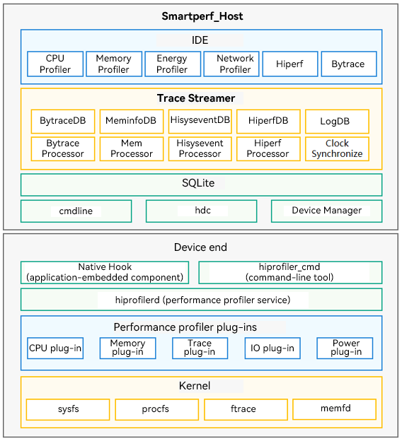

# Smartperf-Host User Guide
## Overview
Smartperf-Host is an intuitive performance and power optimization tool that offers in-depth data mining and fine-grained data visualization. In this tool, you can gain visibility into a multitude of metrics in terms of CPU scheduling, frequency, process and thread time slices, heap memory, frame rate, and more, in swimlanes. Better yet, you can analyze the collected data intuitively on the GUI.
## Architecture


Smartperf-Host consists of the device end and PC end, which exchange data with each other based on gRPC – a high-performance remote procedure call (RPC) framework.

The device end consists of modules such as Native Hook (application-embedded component), hiprofiler_command (command-line tool), hiprofilerd (performance profiler service), a set of performance profiler plug-ins, and some system tools and kernels. The device end provides the plug-in extension capability by exposing plug-in interfaces for external systems. By drawing on this capability, you can integrate custom plug-ins into the framework. For details about the preset plug-ins, see [Performance Profiler Component](https://gitee.com/openharmony/developtools_profiler).

The PC end is accessible from the Smartperf-Host website. It consists of modules such as Trace Streamer, SQLite, HDC device management, data import, UI drawing, and data analysis.  
## Project Directory
```
/smartperf_host
├── host                          # Smartperf-Host related code
│   ├── doc                       # Smartperf-Host documentation
│   ├── ide                       # Smartperf-Host IDE module
│   │    └── src                  # Profiler module
│   │    │   ├── base-ui          # Basic components
│   │    │   └── Trace            # Service logic
│   ├── trace_streamer            # Trace Streamer module
│   │    ├── base                 # Basic functionality
│   │    ├── cfg                  # Configuration
│   │    ├── filter               # Filter
│   │    ├── include              # Header files
│   │    ├── multi_platform       # Platform adaptation
│   │    ├── parser               # Parsing service logic
│   │    │   ├── bytrace_parser   # byTrace service logic
│   │    │   └── htrace_parser    # hTrace service logic
│   │    ├── table                # Table structure
│   │    ├── trace_data           # Trace structure
│   │    ├── trace_streamer       # Trace Streamer structure
│   │    │   └── kits             # JS APIs and native APIs
```
## Function Description
- Loading Trace Files on Web Pages

  Load local trace files (such as htrace and ftrace) and display the data in swimlanes. For details, see [Loading Trace Files on Web Pages](https://gitee.com/openharmony-sig/developtools_smartperf_host/blob/master/ide/src/doc/md/quickstart_systemtrace.md).
- Capturing Traces Online

  Use Smartperf_Host to capture traces online, with the content, duration, and save path all customizable. For details, see [Capturing Traces on Web Pages](https://gitee.com/openharmony-sig/developtools_smartperf_host/blob/master/ide/src/doc/md/quickstart_web_record.md).
- Capturing Traces on a Device

  Capture traces on the target device, with the content, duration, and save path all customizable. For details, see [Capturing Traces from a Device](https://gitee.com/openharmony-sig/developtools_smartperf_host/blob/master/ide/src/doc/md/quickstart_device_record.md).
- Using Ability Monitor

  With Ability Monitor in Smartperf_Host, you can learn the CPU, memory, disk I/O, and network usage of your application. For details, see [Ability Monitor Usage](https://gitee.com/openharmony-sig/developtools_smartperf_host/blob/master/ide/src/doc/md/quickstart_ability_monitor.md).
- Using Native Memory

  With Native Memory in Smartperf_Host, you can track the allocation and release of your application's native memory (specific to C and C++). For details, see [Native Memory Usage](https://gitee.com/openharmony-sig/developtools_smartperf_host/blob/master/ide/src/doc/md/quickstart_native_memory.md).
- Using Hiperf
  
  With Hiperf in Smartperf_Host, you can view the CPU usage of your application and the call stack. For details, see [Hiperf Usage](https://gitee.com/openharmony-sig/developtools_smartperf_host/blob/master/ide/src/doc/md/quickstart_hiperf.md).
- Using HiSystemEvent

  With HiSystemEvent in Smartperf_Host, you can inspect the power consumption of each category (CPU, network, and location, and more) of your application, resource application and usage records (WorkScheduler, Runninglock, Alarm, and Location Request), power consumption exceptions, and system states associated with the power consumption (battery level and screen status). For details, see [HiSystemEvent Usage](https://gitee.com/openharmony-sig/developtools_smartperf_host/blob/master/ide/src/doc/md/quickstart_hisystemevent.md).
- Collecting FileSystem Records

  In Smartperf_Host, you can find out the system invoking information and read/write invoking times of all file systems. For details, see [Usage of FileSystem Recording](https://gitee.com/openharmony-sig/developtools_smartperf_host/blob/master/ide/src/doc/md/quickstart_filesystem.md).
- Collecting Page Fault Records

  In Smartperf_Host, you can collect page fault records, covering various aspects such as start time, duration, triggering process, triggering thread, event type, memory address, and memory size of page memory events. For details, see [Usage of Page Fault Recording](https://gitee.com/openharmony-sig/developtools_smartperf_host/blob/master/ide/src/doc/md/quickstart_page_fault.md).
- Collecting BIO Records

  In Smartperf_Host, you can collect I/O operation records, which provide the following information: start time, total latency, process, average latency of every 4 KB data, thread, operation (write data, page swap-in, and metadata), access traffic, path, block number, priority, and backtrace call stack. For details, see [Usage of BIO Latency Recording](https://gitee.com/openharmony-sig/developtools_smartperf_host/blob/master/ide/src/doc/md/quickstart_bio.md).
- Collecting Smaps Records

  In Smartperf_Host, you can collect the smaps data (type, Pss, Rss, Vss, and more) on a process-by-process basis. The data source is **/proc/$pid/smaps**. For details, see [Smaps Usage](https://gitee.com/openharmony-sig/developtools_smartperf_host/blob/master/ide/src/doc/md/quickstart_smaps.md).
- Using SQL Analysis and Metrics

  You can use Query (SQL) and Metrics features to quickly locate the trace data. For details, see [SQL Analysis and Metrics Usage](https://gitee.com/openharmony-sig/developtools_smartperf_host/blob/master/ide/src/doc/md/quickstart_sql_metrics.md).
## Compilation Guidance
Project compilation includes Trace Streamer compilation and Smartperf-Host compilation and deployment.
### Prerequisites
- C++ version: 11 or later
- Node.js version: 16.15.1 or later
- npm version: 8.13.2 or later
- TypeScript version: 4.2.3 or later
- Go version: 1.13.8 or later
### Compiling Trace Streamer
To set up the Smartperf_Host website, you need to compile the WASM version of Trace Streamer for the web page to parse the original trace data. For details about the compilation process, see [Compiling Trace Streamer](https://gitee.com/openharmony-sig/developtools_smartperf_host/blob/master/trace_streamer/doc/compile_trace_streamer.md).
### Compiling and Deploying Smartperf-Host
For details about the compilation and deployment process, see [SmartPerf Compilation and Deployment Guide](https://gitee.com/openharmony-sig/developtools_smartperf_host/blob/master/ide/README_zh.md)). After successful deployment, you can start to use Smartperf_Host by visiting **https://[*IP address of the device where SmartPerf is deployed*]:9000/application/**.
