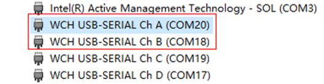
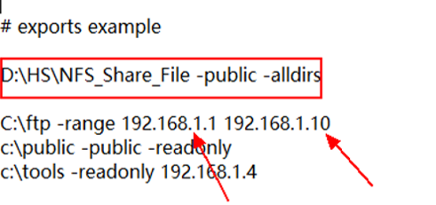

# xDevice User Guide


## Overview

As an open-source OS, OpenHarmony supports product development in many chip scenarios. To ensure compatibility of the OpenHarmony ecosystem, OpenHarmony provides the [compatibility test service](https://www.openharmony.cn/certification/document/guid). For related products, API tests are required for verification. However, executing a large number of automated test cases requires a scheduling and execution framework that supports capabilities such as generating visual test reports. Therefore, we designed and developed the xDevice test scheduling and execution framework.

### Introduction

The xDevice test scheduling and execution framework is a core component of the test infrastructure of OpenHarmony. It provides related services required for scheduling and executing automated test cases, supports scheduling and execution of a large number of automated test cases, as well as supports the generation of visual test reports. The binary package of xDevice will be compiled together with the XTS suite of OpenHarmony. You can obtain the xDevice tool from the XTS archiving path.

Based on the device type, xDevice mainly tests tasks in the following scenarios:

- Perform XTS tests for mini-system devices (such as the Hi3861 development board).
- Perform XTS tests for small-system devices (such as the Hi3516 development board).
- Perform XTS tests for standard-system devices (such as the RK3568 development board).

### Implementation Principles

The xDevice tool includes the following functional modules:

- **command**: enables command-based interactions between users and the test platform. It parses and processes user commands.
- **config**: sets test framework configurations and provides different configuration options for the serial port connection and USB connection modes.
- **driver**: functions as a test case executor, which defines main test steps, such as test case distribution, execution, and result collection.
- **report**: parses test results and generates test reports.
- **scheduler**: schedules various test case executors in the test framework.
- **environment**: configures the test framework environment, enabling device discovery and device management.
- **testkit**: provides test tools to implement JSON parsing, network file mounting, etc.
- **log**: records task logs and device logs.

In addition to the preceding functional modules, the framework depends on user-defined configuration files, which are classified into two types:

**Test Task Configuration File**

The test task configuration file provided by the framework is **user_config.xml**. You can modify the configuration file based on your environment information.

The environment configuration is as follows:

```xml
<environment>

 <!-- Large-system device configuration -->
<device type="usb-hdc">  <!-- type: device connection mode. usb-hdc (default) indicates to control devices using the HDC. Currently, the framework supports only one USB device. -->
    <ip></ip>        <!-- ip: remote device IP address. The local device is used if ip and port are empty, and the remote device is used if ip and port are not empty. -->
    <port></port>    <!-- port: remote device port number. -->
    <sn></sn>        <!-- sn: device SN list. SNs are separated using semicolons (;). All local devices are used when the SN is empty. The device with the specified SN will be used if the SN is not empty. -->
</device>

<!-- Mini-system device configuration -->
<device type="com" label="wifiiot">    <!-- type: device connection mode. com indicates the serial port connection mode. label indicates the device type, for example, wifiot. -->
    <serial>                           <!-- serial: serial port definition. -->
        <com></com>                    <!-- com: serial port of the local connection, for example, COM20. -->
        <type>cmd</type>               <!-- type indicates the serial port type. cmd is the command serial port. -->
        <baud_rate>115200</baud_rate>  <!-- baud_rate, data_bits, stop_bits, timeout: serial port parameters. Generally, the default values are used. -->
        <data_bits>8</data_bits>    
        <stop_bits>1</stop_bits>
        <timeout>20</timeout>
    </serial>
    <serial>                        
        <com></com>
        <type>deploy</type>            <!-- type indicates the serial port type. deploy indicates the deployment serial port. -->  
        <baud_rate>115200</baud_rate>
    </serial>
</device>

<!-- Small-system device local connection configuration -->
<device type="com" label="ipcamera">
    <serial>
        <com></com>                       
        <type>cmd</type>
        <baud_rate>115200</baud_rate>
        <data_bits>8</data_bits>
        <stop_bits>1</stop_bits>
        <timeout>1</timeout>
    </serial>
</device>

<!-- Small-system device remote connection configuration. Multiple connections can be configured. -->
<device type="com" label="ipcamera">
    <ip></ip>
    <port></port>
</device>
</environment>
```

Set the test case directory.

```xml
<testcases>
  <!-- If both dir and server are configured, only either of them takes effect. -->
  <!-- Specify the test case directory. If this parameter is empty, the testcase directory in the current project will be used. -->
  <dir></dir> 

  <!-- NFS mounting configuration. Set the value to NfsServer. -->
  <server label="NfsServer">
      <ip></ip>             <!-- Mounting environment IP address. -->
      <port></port>         <!-- Mounting environment port. -->
      <dir></dir>           <!-- Mounted external path. -->
      <username></username> <!-- Login user name. -->
      <password></password> <!-- Login user password. -->
      <remote></remote>     <!-- whether the NFS server and the XDevice executor are deployed on different devices. If yes, set this parameter to true. Otherwise, set it to false. -->
  </server>
</testcases>
```

Set the resource directory.

```xml
<resource>
  <!-- Specify the resource directory. If this parameter is empty, the resource directory in the current project will be used. -->
  <dir></dir>
</resource>
```

Set the log level.

```xml
<!-- The default level is INFO. For more detailed information, change the level to DEBUG. -->
<loglevel>INFO</loglevel>
```

**Test Suite Configuration File**

The test support suite executed by the device is specified by the test configuration file.

Each test suite has a test configuration file, which mainly specifies the test support suites (kits) that need to be used. In addition, the setup and teardown operations are supported.

The following is a configuration file example:

```json
{
    // Description of the test support suite.
    "description": "Configuration for aceceshi Tests",
    
    // Specify the device for executing the current test support suite.
    "environment": {
        "type": "device", 
        "label": "wifiiot"
    },

    // Specify the driver executed by the device.
    "driver": {
        "type": "OHJSUnitTest", 
        "test-timeout": "700000",
        "bundle-name": "com.open.harmony.acetestfive",
        "package-name": "com.open.harmony.acetestfive",
        "shell-timeout": "700000"
    },
    // The kit is mainly used to support test execution activities, including the setup operation before the test and the teardown operation after the test.
    "kits": [
       {
            "type": "ShellKit",
            "run-command": [
                "remount",
                "mkdir /data/data/resource",
                "chmod -R 777 /data/data/resource",
                "settings put secure adb_install_need_confirm 0"
            ],
            "teardown-command": [
                "remount",
                "rm -rf /data/data/resource"
            ]
        },
    ]
}
```

### Test Commands

Test commands can be classified into three groups: **help**, **list**, and **run**. Among them, **run** commands are most commonly used in the instruction sequence.

------

You can run **help** commands to obtain help information about the test framework commands.

```text
help:
     use help to get information.  
usage:
     run:  Display a list of supported run command.
     list: Display a list of supported device and task record.  
Examples:
     help run
     help list
```

**NOTE**

**help run**: displays the description of **run** commands.

**help list**: displays the description of **list** commands.

------

You can run **list** commands to display device information and related task information.

```text
list:
     This command is used to display device list and task record.  
usage:
      list
      list history
      list <id>  
Introduction:
     list:         display device list
     list history: display history record of a serial of tasks
     list <id>:    display history record about task what contains specific id  
Examples:
     list
     list history
     list 6e****90
```

 **NOTE**

 **list**: displays device information.

 **list history**: displays historical task information.

 **list *\<id>***: displays historical information about tasks with specified IDs.

------

Run the **run** commands to execute test tasks.

```text
run:
     This command is used to execute the selected testcases.
     It includes a series of processes such as use case compilation, execution, and result collection.  
usage: run [-l TESTLIST [TESTLIST ...] | -tf TESTFILE
            [TESTFILE ...]] [-tc TESTCASE] [-c CONFIG] [-sn DEVICE_SN]
            [-rp REPORT_PATH [REPORT_PATH ...]]
            [-respath RESOURCE_PATH [RESOURCE_PATH ...]]
            [-tcpath TESTCASES_PATH [TESTCASES_PATH ...]]
            [-ta TESTARGS [TESTARGS ...]] [-pt]
            [-env TEST_ENVIRONMENT [TEST_ENVIRONMENT ...]]
            [-e EXECTYPE] [-t [TESTTYPE [TESTTYPE ...]]]
            [-td TESTDRIVER] [-tl TESTLEVEL] [-bv BUILD_VARIANT]
            [-cov COVERAGE] [--retry RETRY] [--session SESSION]
            [--dryrun] [--reboot-per-module] [--check-device]
            [--repeat REPEAT]
            action task  
Specify tests to run.
  positional arguments:
   action                Specify action
   task                  Specify task name,such as "ssts", "acts", "hits"
```

The table below describes how to use **run** commands.

| xDevice Command |                             Function                            |                             Example                            |
| :----------: | :----------------------------------------------------------: | :----------------------------------------------------------: |
|   run xts    |       Runs all XTS modules of the specified type, for example, **acts**, **hits**, and **ssys**.       |                           run acts                           |
|  run -l xxx  |            Runs specified module test suites. Multiple module test suites are separated using semicolons (;).           |           run -l ActsWifiServiceTest;ActsLwipTest            |
|   run -sn    |            Specifies the SNs of the executed devices. Multiple SNs are separated using semicolons (;).           | run acts -sn 10.117.183.37:17001<br>run acts -sn 88Y02******57723;VEG02******16642 |
|   run -rp    | Specifies the report generation path. By default, subdirectories will be created under **reports** of the work directory using the timestamp or task ID.| run acts -rp /suites/hits/xdevice_reports/2020.09.28-14.21.26 |
| run -respath |             Specifies the test resource path. The default value is **resource**.            | run acts -respath /cloud/zidane/xts/release/suites/resource  |
|   run -ta    | Specifies module running parameters. You can specify test cases in the running module. Multiple cases are separated using commas (,). Currently, the JS driver test suite is supported.| run acts -ta class:ohos.hardware.soundtrigger.SoundTriggerTest#testKeyphraseParcelUnparcel_noUsers |
| run --retry  |        Executes failed test cases of the previous task to generate a new test report.       | run –retryrun --retry --session 2020-10-30-17-15-11 (task directory name)|

### Test Report

After the test framework executes the **run** commands, the console outputs the corresponding logs, and the execution report is generated. The report is generated in the path specified by the **-rp** parameter if set. If the parameter is not set, the report will be generated in the default directory.

```text
Structure of the report directory (the default or the specified one)
    ├── result (test case execution results of the module)
    │     ├── *Module name*.xml
    │     ├──  ... ... 
    │      
    ├── log (running logs of devices and tasks)
    │     ├── *Device 1*.log
    │     ├── ... ...
    │     ├── *<Task>*.log
    ├── summary_report.xml (task summary report)
    ├── summary_report.html (task summary visual report)
    ├── details_report.html (case execution visual report)
    ├── failures_report.html (failed case visual report, which will not be generated if no case fails)
    ├── summary.ini (Records information such as the used device, start time, and end time.)
    ├── task_info.record (Records executed commands and list of failed cases.)
    ├── xxxx.zip (compression file generated by compressing the preceding files)
    ├── summary_report.hash (file obtained by encrypting the compression file using SHA-256)
    └── ... ...
```


## Environment Preparations


### Environment Requirements

- Python version: 3.7 or later
- pyserial: 3.3 or later
- paramiko: 2.7.1 or later
- rsa: 4.0 or later


### Installing the xDevice

- Install the basic framework of xDevice.

  1. Go to the root directory of xDevice.

     ```bash
     cd testfwk_xdevice
     ```

  2. Open the console and run the following command:

     ```bash
     python setup.py install
     ```

- Install the OpenHarmony driver plugin **ohos**.

  1. Go to the **plugin/ohos** directory.

     ```bash
     cd testfwk_xdevice/plugin/ohos
     ```
  
  2. Open the console and run the following command as the current user:
  
     ```bash
     python setup.py install
     ```

### Verifying the Environment

Check whether xDevice is installed successfully.

1. Go to the root directory of xDevice.

   ```bash
   cd testfwk_xdevice
   ```

2. Open the console and run the following command:

   ```bash
   python -m pip list
   ```

3. Check whether the **xdevice** and **xdevice-ohos** libraries are successfully installed.

   ```text
   xdevice                 0.0.0
   xdevice-ohos            0.0.0
   ```

Check whether xDevice runs properly.

1. Go to the root directory of xDevice.

   ```bash
   cd testfwk_xdevice
   ```

2. Open the console and run the following command:

   ```bash
   python -m xdevice
   ```

3. Check whether the following information is displayed on the console:

   ```text
   [2022-10-13 15:43:31,284] [30076] [Main] [INFO] [*************** xDevice Test Framework 2.11.0.1091 Starting ***************]
   [2022-10-13 15:43:31,286] [30076] [ManagerLite] [WARNING] [wifiiot local com cannot be empty, please check]
   [2022-10-13 15:43:31,286] [30076] [ManagerLite] [WARNING] [ipcamera local com cannot be empty, please check]
   [2022-10-13 15:43:31,287] [30076] [ManagerLite] [WARNING] [device com or ip cannot be empty, please check]
   >>>
   ```


## Mini-System Device XTS Test Guide (wifiiot)

1. Identify the serial port usage and modify the **user_config.xml** file in the root directory.

   The COM port whose **type** is **cmd** corresponds to the AT command serial port on the board. The port is used to send commands to the device. In the example, the **ChA(COM20)** serial port is used.

   The COM port whose **type** is **deploy** corresponds to the log output serial port on the board. The port is used to burn the image and print logs. In the example, the **ChB(COM18)** serial port is used.

   If the AT command serial port is the same as the log output serial port, the serial ports can be set to the same port. That is, in the **user_config** file, the COM port whose **type** is **cmd** and the COM port whose **type** is **deploy** can be set to the same port, for example, **COM18**.

   

   The following is an example of the modified **user_config.xml** file:

   ```xml
   <user_config>
       <environment>
           <device type="com" label="wifiiot">
               <serial>
                   <com>com20</com>
                   <type>cmd</type>
                   <baud_rate>115200</baud_rate>
                   <data_bits>8</data_bits>
                   <stop_bits>1</stop_bits>
                   <timeout>20</timeout>
               </serial>
               <serial>
                   <com>com18</com>
                   <type>deploy</type>
                   <baud_rate>115200</baud_rate>
               </serial>
           </device>
       </environment>
       <testcases>
           <dir></dir>
           <server label="NfsServer">
               <ip></ip>
               <port></port>
               <dir></dir>
               <username></username>
               <password></password>
               <remote></remote>
           </server>
       </testcases>
       <resource>
           <dir></dir>
       </resource>
       <loglevel>DEBUG</loglevel>
   </user_config>
   ```

2. Create a **testcase** directory in the root directory of xDevice to store test suite files. XTS test suites are obtained from the daily builds of the system.

   Daily builds: http://ci.openharmony.cn/dailys/dailybuilds

   The following is an example of the test suite configuration file in JSON format:

   ```json
   {
   	"description": "Config for ActsAllTest test cases",
   	"environment": [
   		{
   			"type": "device",
   			"label": "wifiiot"
   		}
   	],
   	"kits": [
   		{
   			"type": "DeployKit",
   			"timeout": "20000",
   			"burn_file": "acts/Hi3861_wifiiot_app_allinone.bin"
   		}
   	],
   	"driver": {
   		"type": "CTestLite"
   	}
   }
   ```

3. Execute test cases.

   Go to the root directory of xDevice, open the xDevice console, and run the following command:

   ```bash
   python -m xdevice
   ```

   Run the test suite command.

   ```text
   run -l ActsAllTest
   ```

   The command output is as follows.

   

## Small-System Device XTS Test Guide (ipcamera)

1. Identify the serial port usage.

   The COM port whose **type** is **cmd** corresponds to the AT command serial port on the board. The port is used to send commands to the device. In the example, the **ChA(COM20)** serial port is used.

   

   IP camera devices have two connection modes. One is to connect through the local serial port, and the other is to connect through the IP address of the local area network.

2. Configure the NFS server.

   There are two NFS mounting modes. One is to mount through the remote PC, and the other is to mount through the local area network.

   To configure the NFS service on the local area network, perform the following steps:

   1. Download and install the NFS server. Download address: https://www.hanewin.net/nfs-e.htm

   2. Configure output and edit the output table file.

      Add an NFS sharing path, for example, **D:\HS\NFS_Share_File -public –alldirs**. Note that the FTP IP address 192.168.1.10 is the IP address of the development board.

      

   3. Stop the NFS server and restart the NFS server to make the added sharing path take effect.

   4. Find the mapped network port of the IP camera device on the PC, and manually set the IP address to 192.168.1.11 on the PC.

3. Modify the **user_config.xml** file in the root directory. The following is an example:

   ```xml
   <user_config>
       <environment>
           <device type="com" label="ipcamera">     <!--local connection mode-->
               <serial>
                   <com>com20</com>
                   <type>cmd</type>
                   <baud_rate>115200</baud_rate>
                   <data_bits>8</data_bits>
                   <stop_bits>1</stop_bits>
                   <timeout>1</timeout>
               </serial>
           </device>
           <device type="com" label="ipcamera">     <!--local area network connection mode-->
               <ip>10.176.49.47</ip>
               <port>10003</port>
           </device>
       </environment>
       <testcases>
           <dir></dir>
           <server label="NfsServer">               <!--remote mounting mode-->
               <ip>10.176.48.202</ip>
               <port>1022</port>
               <dir>/data/data/local/</dir>
               <username>root</username>
               <password>xxx</password>
               <remote>true</remote>                
           </server>
           <server label="NfsServer">               <!--local area network mounting mode-->
               <ip>192.168.1.11</ip>
               <port>2049</port>
               <dir>D:\test</dir>
               <remote>false</remote>                
           </server>
       </testcases>
       <resource>
           <dir></dir>
       </resource>
       <loglevel>DEBUG</loglevel>
   </user_config>
   ```

4. Create a **testcase** directory in the root directory of xDevice to store test suite files. XTS test suites are obtained from the daily builds of the system.

   Daily builds: http://ci.openharmony.cn/dailys/dailybuilds

   The following is an example of the test suite configuration file in JSON format:

   ```json
   {
   	"description": "Config for kernel test cases",
   	"environment": [
   		{
   			"type": "device",
   			"label": "ipcamera"
   		}
   	],
   	"kits": [
   		{
   			"type": "MountKit",
               "server": "NfsServer",
               "mount": [
                   {
                       "source": "testcases/kernel",
                       "target": "/test_root/kernel"
                   }
               ]
   		}
   	],
   	"driver": {
   		"type": "CppTestLite",
           "excute": "/test_root/kernel/ActsKernelIPCTest.bin"
   	}
   }
   ```

5. Execute test cases.

   Go to the root directory of xDevice, open the xDevice console, and run the following command:

   ```bash
   python -m xdevice
   ```

   Run the test suite command.

   ```text
   run -l kernel
   ```

   The command output is as follows.

   

## Standard-System Device XTS Test Guide (RK3568)

1. Configure the HDC tool, and download the latest **ohos_sdk** from daily builds.

   Daily builds: http://ci.openharmony.cn/dailys/dailybuilds

   After downloading the tool, configure HDC into the environment variables on the PC. To do so, right-click the **Computer** or **My Computer** desktop icon and select **Properties**. Choose **Advanced system settings**. Select the **Advanced** tab, and click **Environment Variables**. In the **Environment Variables** dialog box, select the path of the environment variable.

2. Run the following command to check whether the device is properly connected:

   ```bash
   hdc_std list targets
   ```

3. Modify the **user_config.xml** file. The following is an example:

   ```xml
   <user_config>
       <environment>
           <device type="usb-hdc">
               <ip></ip>
               <port></port>
               <sn>xxx;xxx</sn>                          <!--SNs of multiple connected devices are separated using semicolons.-->
           </device>
       </environment>
       <testcases>
           <dir></dir>
       </testcases>
       <resource>
           <dir></dir>
       </resource>
       <loglevel>DEBUG</loglevel>
   </user_config>
   ```

4. Create a **testcase** directory in the root directory of xDevice to store test suite files. XTS test suites are obtained from the daily builds of the system.

   Daily builds: http://ci.openharmony.cn/dailys/dailybuilds

   The following is an example of the test suite configuration file in JSON format:

   ```json
   {
       "description": "Configuration for hjunit demo Tests",
       "driver": {
           "type": "OHJSUnitTest",
           "test-timeout": "180000",
           "bundle-name": "ohos.acts.bundle.stage.test",
           "module-name": "phone",
           "shell-timeout": "600000",
           "testcase-timeout": 70000
       },
       "kits": [
           {
               "test-file-name": [
                   "ActBmsStageEtsTest.hap"
               ],
               "type": "AppInstallKit",
               "cleanup-apps": true
           },
           {
               "type": "ShellKit",
               "teardown-command":[
                   "bm uninstall -n ohos.acts.bundle.stage.test"
               ]
           }
       ] 
   }
   ```

5. Execute test cases.

   Go to the root directory of xDevice, open the xDevice console, and run the following command:

   ```bash
   python -m xdevice
   ```

   Run the test suite command.

   ```text
   run -l ActBmsStageEtsTest
   ```

   The command output is as follows.

   

## FAQs

### The **hdc list targets** command can find a device, but xDevice cannot identify the device.

**Issue Description**

The following error information is displayed.


**Possible Causes**

The **HDC_SERVER_PORT** variable has been set and the HDC port has been modified. By default, xDevice uses port **8710**. If the port has been modified, the xDevice framework cannot identify the device.

**Solution**

Check whether the **HDC_SERVER_PROT** variable is set. If yes, change the port number to **8710** and restart xDevice.
