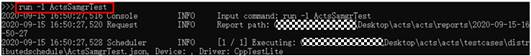

# XTS Test Case Development Guide


## Introduction

The X test suite (XTS) subsystem contains a set of OpenHarmony compatibility test suites, including the currently supported application compatibility test suite (ACTS) and the device compatibility test suite (DCTS) that will be supported in the future.

This subsystem contains the ACTS and **tools** software package.

- The **acts** directory stores the source code and configuration files of ACTS test cases. The ACTS helps device vendors detect the software incompatibility as early as possible and ensures that the software is compatible with OpenHarmony during the entire development process.

- The **tools** software package stores the test case development framework related to **acts**.


## System Types

The following system types are supported:

- Mini system
  The mini system fits into the devices that come with MCU processors, such as Arm Cortex-M and 32-bit RISC-V, and memory greater than or equal to 128 KiB. This system provides a variety of lightweight network protocols, a lightweight graphics framework, and a wide range of read/write components with the Internet of Things (IoT) bus. Typical products include connection modules, sensors, and wearables for smart home.

- Small system
  The small system fits into the devices that come with application processors, such as Arm Cortex-A, and memory greater than or equal to 1 MiB. This system provides higher security capabilities, a standard graphics framework, and video encoding and decoding capabilities. Typical products include smart home IP cameras, electronic cat eyes, and routers, and event data recorders (EDRs) for easy travel.

- Standard system
  The standard system fits into the devices that come with application processors, such as Arm Cortex-A, and memory greater than or equal to 128 MiB. This system provides a complete application framework supporting enhanced interaction, 3D GPU, hardware composer, diverse components, and rich animations. The standard system applies to high-end refrigerator displays. 


## Contents


```
/test/xts
├── acts                 # Test code
│   └── subsystem       # Source code of subsystem test cases for the standard system
│   └── subsystem_lite  # Source code of subsystems test cases for mini and small systems
│   └── BUILD.gn        # Build configuration of test cases for the standard system
│   └── build_lite      
│       └── BUILD.gn    # Build configuration of test cases for mini and small systems
└── tools                # Test tool code
```


## Constraints

Test cases for the mini system must be developed based on C, and those for the small system must be developed based on C++.


## How to Use

**Table 1** Case levels

| Level| Basic Definition| Test Scope|
| -------- | -------- | -------- |
| Level0 | Smoke| Verifies basic functionalities of key features and basic DFX attributes with the most common input. The pass result indicates that the features are runnable.|
| Level1 | Basic| Verifies basic functionalities of key features and basic DFX attributes with common input. The pass result indicates that the features are testable.|
| Level2 | Major| Verifies basic functionalities of key features and basic DFX attributes with common input and errors. The pass result indicates that the features are functional and ready for beta testing.|
| Level3 | Minor| Verifies functionalities of all key features, and all DFX attributes with common and uncommon input combinations or normal and abnormal preset conditions.|
| Level4 | Rare| Verifies functionalities of key features under extremely abnormal presets and uncommon input combinations.|

**Table 2** Case scales

| Case Scale| Test Object| Test Environment|
| -------- | -------- | -------- |
| LargeTest | Service functionalities, all-scenario features, and mechanical power environment (MPE) and scenario-level DFX| Devices close to real devices|
| MediumTest | Modules, subsystem functionalities after module integration, and DFX| Single device that is actually used. You can perform message simulation, but do not mock functions.|
| SmallTest | Modules, classes, and functions| Local PC. Use a large number of mocks to replace dependencies with other modules.|

**Table 3** Test types

| Test Type| Definition|
| -------- | -------- |
| Function | Tests the correctness of both service and platform functionalities provided by the tested object for end users or developers.|
| Performance | Tests the processing capability of the tested object under specific preset conditions and load models. The processing capability is measured by the service volume that can be processed in a unit time, for example, call per second, frame per second, or event processing volume per second.|
| Power | Tests the power consumption of the tested object in a certain period of time under specific preset conditions and load models.|
| Reliability | Tests the service performance of the tested object under common and uncommon input conditions, or specified service volume pressure and long-term continuous running pressure. The test covers stability, pressure handling, fault injection, and Monkey test items.|
| Security | Tests the capability of defending against security threats, including but not limited to unauthorized access, use, disclosure, damage, modification, and destruction, to ensure information confidentiality, integrity, and availability. Tests the privacy protection capability to ensure that the collection, use, retention, disclosure, and disposal of users' private data comply with laws and regulations. Tests the compliance with various security specifications, such as security design, security requirements, and security certification of the Ministry of Industry and Information Technology (MIIT).|
| Global | Tests the internationalized data and localization capabilities of the tested object, including multi-language display, various input/output habits, time formats, and regional features, such as currency, time, and culture taboos.|
| Compatibility | Tests backward compatibility of an application with its own data, the forward and backward compatibility with the system, and the compatibility with different user data, such as audio file content of the player and smart SMS messages. Tests system backward compatibility with its own data and the compatibility of common applications in the ecosystem. Tests software compatibility with related hardware.|
| User | Tests user experience of the object in real user scenarios. All conclusions and comments should come from the users, which are all subjective evaluation in this case.|
| Standard | Tests the compliance with industry and company-specific standards, protocols, and specifications. The standards here do not include any security standards that should be classified into the security test.|
| Safety | Tests the safety property of the tested object to avoid possible hazards to personal safety, health, and the object itself.|
| Resilience | Tests the resilience property of the tested object to ensure that it can withstand and maintain the defined running status (including downgrading) when being attacked, and recover from and adapt defense to the attacks to approach mission assurance.|


## Test Case Development Guide

You should select the appropriate programming language and your target test framework to develop test cases.

**Table 4** Test frameworks and test case languages for different systems

| System| Test Framework| Language|
| -------- | -------- | -------- |
| Mini system| hctest | c |
| Small system| hcpptest | c++ |
| Standard system| HJSUnit and HCPPTest| JavaScript and C++|

### C-based Test Case Development and Compilation (for the Mini System)

**Developing test cases for the mini system**

The HCTest framework is used to support test cases developed with the C language. HCTest is enhanced and adapted based on the open-source test framework Unity.

1. Access the **test/xts/acts** repository where the test cases will be stored.
  
   ```
   ├── acts
   │ └──subsystem_lite
   │ │ └── module_hal
   │ │ │ └── BUILD.gn
   │ │ │ └── src
   │ └──build_lite
   │ │ └── BUILD.gn
   ```

2. Write the test case in the **src** directory.
  
    1. Import the test framework header file.
    
     ```
     #include "hctest.h"
     ```

   2. Use the **LITE_TEST_SUIT** macro to define names of the subsystem, module, and test suite.


      ```
      /**  
      * @brief  register a test suite named "IntTestSuite"  
      * @param  test subsystem name  
      * @param  example module name  
      * @param  IntTestSuite test suite name  
      */
       LITE_TEST_SUIT(test, example, IntTestSuite);
      ```

   3. Define SetUp and TearDown.

      Format: Test suite name+SetUp, Test suite name+TearDown.

      The SetUp and TearDown functions must exist, but function bodies can be empty.

   4. Use the **LITE_TEST_CASE** macro to write the test case.

      Three parameters are involved: test suite name, test case name, and test case properties (including type, granularity, and level).
      ```
      LITE_TEST_CASE(IntTestSuite, TestCase001, Function | MediumTest | Level1) 
      {  
        //do something 
         };
      ```
   5. Use the **RUN_TEST_SUITE** macro to register the test suite.


      ```
      RUN_TEST_SUITE(IntTestSuite);
      ```

3. Create a configuration file (**BUILD.gn**) of the test module.
   Create a **BUILD.gn** (example) build file in each test module directory. Specify the name of the built static library and its dependent header file and library in the build file. The format is as follows:

   
   ```
   import("//test/xts/tools/lite/build/suite_lite.gni")
   hctest_suite("ActsDemoTest") {
       suite_name = "acts"
       sources = [
           "src/test_demo.c",
       ]
       include_dirs = [ ]
       cflags = [ "-Wno-error" ]
   }
   ```

4. Add build options to the **BUILD.gn** file in the **acts** directory.
   You need to add the test module to the **test/xts/acts/build_lite/BUILD.gn** script in the **acts** directory.

   
   ```
   lite_component("acts") {  
       ...
       if(board_name == "liteos_m") {
           features += [    
               ...
               "//xts/acts/subsystem_lite/module_hal:ActsDemoTest"
           ]    
       }
   }
   ```

5. Run build commands.
   Test suites are built along with the version build. The ACTS is built together with the debug version.

   > **NOTE**
   > The ACTS build middleware is a static library, which will be linked to the image.

### C-based Test Case Execution (for the Mini System)

**Executing test cases for the mini system**

Burn the image into the development board.

**Executing the test**

1. Use a serial port tool to log in to the development board and save information about the serial port.

2. Restart the device and view serial port logs.

**Analyzing the test result**

View the serial port logs, whose format is as follows:

The log for each test suite starts with **Start to run test suite:** and ends with **xx Tests xx Failures xx Ignored**.


### C++-based Test Case Development and Compilation (for Standard and Small Systems)

**Developing test cases for small-system devices** (For examples of the standard system, go to the **global/i18n_standard** directory.)

The HCPPTest framework is enhanced and adapted based on the open-source framework Googletest.

1. Access the **test/xts/acts** repository where the test cases will be stored.
  
   ```
   ├── acts
   │ └──subsystem_lite
   │ │ └── module_posix
   │ │ │ └── BUILD.gn
   │ │ │ └── src
   │ └──build_lite
   │ │ └── BUILD.gn
   ```

2. Write the test case in the **src** directory.
   1. Import the test framework header file.

      The following statement includes **gtest.h**:

   
      ```
      #include "gtest/gtest.h"
      ```

   2. Define SetUp and TearDown.

   
      ```
      using namespace std;
      using namespace testing::ext;
      class TestSuite: public testing::Test {
      protected:
      // Preset action of the test suite, which is executed before the first test case
      static void SetUpTestCase(void){
      }
      // Test suite cleanup action, which is executed after the last test case
      static void TearDownTestCase(void){
      }
      // Preset action of the test case
      virtual void SetUp()
      {
      }
      // Cleanup action of the test case
      virtual void TearDown()
      {
      }
      };
      ```

   3. Use the **HWTEST** or **HWTEST_F** macro to write the test case.

      **HWTEST**: definition of common test cases, including the test suite name, test case name, and case annotation.

      **HWTEST_F**: definition of SetUp and TearDown test cases, including the test suite name, test case name, and case annotation.
   
      Three parameters are involved: test suite name, test case name, and test case properties (including type, granularity, and level).

   
      ```
      HWTEST_F(TestSuite, TestCase_0001, Function | MediumTest | Level1) {
      // do something
      }
      ```

3. Create a configuration file (**BUILD.gn**) of the test module.
   Create a **BUILD.gn** build file in each test module directory. Specify the name of the built static library and its dependent header file and library in the build file. Each test module is independently built into a **.bin** executable file, which can be directly pushed to the development board for testing.

   Example:
   
   ```
   import("//test/xts/tools/lite/build/suite_lite.gni")
   hcpptest_suite("ActsDemoTest") {
       suite_name = "acts"
       sources = [
           "src/TestDemo.cpp"
       ]
   
       include_dirs = [
           "src",
           ...
       ]
       deps = [
           ...
       ]
       cflags = [ "-Wno-error" ]
   }
   
   ```

4. Add build options to the **BUILD.gn** file in the **acts** directory.
   Add the test module to the **test/xts/acts/build_lite/BUILD.gn** script in the **acts** directory.

   
   ```
    lite_component("acts") {  
   ...
   else if(board_name == "liteos_a") {
           features += [
               ...
               "//xts/acts/subsystem_lite/module_posix:ActsDemoTest"
           ]
       }
   }
   ```

5. Run build commands.
     Test suites are built along with the version build. The ACTS is built together with the debug version.
   > **NOTE**
   >
   > The ACTS for the small system is independently built to an executable file (.bin) and archived in the **suites\acts** directory of the build result.


### C++-based Test Case Execution (for Standard and Small Systems)

**Executing test cases for the small system**

Currently, test cases are shared by the NFS and mounted to the development board for execution.

**Setting up the environment**

1. Use a network cable or wireless network to connect the development board to your PC.

2. Configure the IP address, subnet mask, and gateway for the development board. Ensure that the development board and the PC are on the same network segment.

3. Install and register the NFS server on the PC and start the NFS service.

4. Run the **mount** command for the development board to ensure that the development board can access NFS shared files on the PC.
   Format: **mount** *NFS server IP address***:/***NFS shared directory* **/***development board directory* **nfs**

     Example:
   
   ```
   mount 192.168.1.10:/nfs /nfs nfs
   ```

**Executing test cases**

Execute **ActsDemoTest.bin** to trigger test case execution, and analyze serial port logs generated after the execution is complete.

### JavaScript-based Test Case Development (for the Standard System)

The HJSUnit framework is used to support automated tests of OpenHarmony applications that are developed using the JavaScript language based on the JS application framework.

**Basic syntax of test cases**

The test cases are developed with the JavaScript language and must meet the programming specifications of the language.

**Table 7** Basic syntax of test cases

| Syntax| Description| Requirement|
| -------- | -------- | -------- |
| beforeAll | Presets a test-suite-level action executed only once before all test cases are executed. You can pass the action function as the only parameter.| Optional|
| afterAll | Presets a test-suite-level clear action executed only once after all test cases are executed. You can pass the clear function as the only parameter.| Optional|
| beforeEach | Presets a test-case-level action executed before each test case is executed. The number of execution times is the same as the number of test cases defined by **it**. You can pass the action function as the only parameter.| Optional|
| afterEach | Presets a test-case-level clear action executed after each test case is executed. The number of execution times is the same as the number of test cases defined by **it**. You can pass the clear function as the only parameter.| Optional|
| describe | Defines a test suite. You can pass two parameters: test suite name and test suite function. **describe** supports embedding. **beforeAll**, **beforeEach**, **afterEach**, and **afterAll** can be defined in each **describe**.| Mandatory|
| it | Defines a test case. You can pass three parameters: test case name, filter parameter, and test case function.<br>**NOTE**<br>**Filter parameter**: The filter parameter is a 32-bit parameter of the **Int** type. **1** of bit 0 indicates not to filter. **1** of bits 0-10 indicates the test case type. **1** of bits 16-18 indicates the test case scale. **1** of bits 24-28 indicates the test level.<br>**Test case type**: Bits 0-10 indicate the following respectively: FUNCTION test, PERFORMANCE test, POWER test, RELIABILITY test, SECURITY test, GLOBAL test, COMPATIBILITY test, USER test, STANDARD test, SAFETY test, and RESILIENCE test.<br>**Test case scale**: Bits 16-18 indicate the following respectively: SMALL test, MEDIUM test, and LARGE test.<br>**Test level**: Bits 24-28 indicate the following respectively: LEVEL0-0 test, LEVEL1-1 test, LEVEL2-2 test, LEVEL3-3 test, and LEVEL4-4 test.| Mandatory|

Use the standard syntax of Jasmine to write test cases. The ES6 specification is supported.

1. Store the test cases in the **entry/src/main/js/test** directory, whose structure is as follows:
  
   ```
   ├── BUILD.gn   
   │ └──entry
   │ │ └──src
   │ │ │ └──main
   │ │ │ │ └──js
   │ │ │ │ │ └──default               
   │ │ │ │ │ │ └──pages
   │ │ │ │ │ │ │ └──index             
   │ │ │ │ │ │ │ │ └──index.js        # Entry file
   │ │ │ │ │ └──test                  # Test code 
   │ │ │ └── resources                # HAP resources
   │ │ │ └── config.json              # HAP configuration file
   ```

2. Start the JS test framework and load test cases. The following is an example for **index.js**:
  
   ```
   // Start the JS test framework and load test cases.
   import {Core, ExpectExtend} from 'deccjsunit/index'
   
   export default {
       data: {
           title: ""
       },
       onInit() {
           this.title = this.$t('strings.world');
       },
       onShow() {
           console.info('onShow finish')
           const core = Core.getInstance()
           const expectExtend = new ExpectExtend({
               'id': 'extend'
           })
           core.addService('expect', expectExtend)
           core.init()
           const configService = core.getDefaultService('config')
           configService.setConfig(this)
           require('../../../test/List.test')
           core.execute()
       },
       onReady() {
       },
   }
   ```

3. Write a unit test case by referring to the following example:
  
   ```
   // Use HJSUnit to perform the unit test.
   describe('appInfoTest', function () {    
       it('app_info_test_001', 0, function () {
           var info = app.getInfo()
           expect(info.versionName).assertEqual('1.0')
           expect(info.versionCode).assertEqual('3')
       })
   }) 
   ```

### JavaScript-based Test Case Packaging (for the Standard System)

For details about HAP package compilation, see [JS application development guide for the standard system](https://developer.harmonyos.com/en/docs/documentation/doc-guides/build_overview-0000001055075201).


## Full Compilation (for the Standard System)

1. Perform full compilation.
   Command:

   
   ```
   ./build.sh suite=acts system_size=standard
   ```

   Test case output directory: **out/release/suites/acts/testcases**

   Test framework and case output directory: **out/release/suites/acts** (The test suite execution framework is compiled during case compilation.)


## Full Test Case Execution (for Small and Standard Systems)

**Setting up a test environment**

Install Python 3.7 or a later version on a Windows environment and ensure that the Windows environment is properly connected to the test device.

**Test execution directory** (corresponding to the **out/release/suites/acts** directory generated during compilation)

```
├── testcase                       # Directory for storing test suite files
│ └──xxx.hap                       # HAP file executed by the test suite
│ └──xxx.json                      # Execution configuration file of the test suite
├── tools                          # Test framework tool directory
├── run.bat                        # File for starting the test suite on the Windows platform
├── report                         # Directory for storing the test reports
```

**Executing test cases**

1. On the Windows environment, locate the directory in which the test cases are stored (**out/release/suites/acts**, copied from the Linux server), go to the directory in the Windows command line interface (CLI), and run **acts\run.bat**.

2. Enter the command for executing the test case.
   - Execute all test cases.
     
      ```
      run acts
      ```

        **Figure 1** Running process

        

   - Execute the test cases of a module (view specific module information in **\acts\testcases\**).
     
      ```
      run –l ActsSamgrTest
      ```

        **Figure 2** Viewing the running command

        

   Wait until the execution is complete.

3. View test reports.
   Go to **acts\reports\**, obtain the current execution record, and open **summary_report.html** to view the test report.
