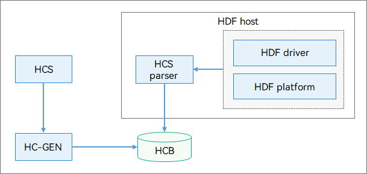

# HDF Driver Development Process

## Overview

The Hardware Driver Foundation (HDF) provides a driver development framework to implement driver loading, driver service management, driver messaging mechanism, and configuration management. It provides a component-based driver model to normalize driver development and deployment. The HDF strives to build a unified driver platform to back up a more precise and efficient environment for one-time development for multi-device deployment.

### Driver Loading

The HDF allows loading of the drivers that match the configured device list.

### Driver Service Management

The HDF supports centralized management of driver services. You can obtain a driver service by using the APIs provided by the HDF.

### Driver Messaging Mechanism

The HDF provides a unified driver messaging mechanism, which allows messages to be exchanged between user-mode applications and kernel-mode drivers.

### Configuration Management

HDF Configuration Source (HCS) provides the source code of the HDF configuration in key-value (KV) pairs. It decouples the configuration code from the driver code, thereby facilitating configuration management.

### Driver Model

The device model involves the following concepts:

- Host: In the HDF, the device drivers of the same type are placed in a host. The host manages the startup and loading of a group of devices.  You can deploy the drivers that depend on each other to the same host, and deploy independent drivers to different hosts.
- Device: A device corresponds to a physical device.
- Device Node: A device node is a component of a device. A device has at least one device node. Each device node can publish a device service. Each device node corresponds to a unique driver to interact with the hardware. 

The following figure shows the HDF driver model.

**Figure 1** HDF driver model


## Driver Functions

### Driver Loading

The HDF implements loading of the drivers that match the configured device list. The drivers can be loaded on demand or in sequence. The **preload** field in the configuration file specifies the loading policy. The values of **preload** are as follows:

```c
typedef enum {
    DEVICE_PRELOAD_ENABLE = 0,
    DEVICE_PRELOAD_ENABLE_STEP2 = 1,
    DEVICE_PRELOAD_DISABLE = 2,
    DEVICE_PRELOAD_INVALID
} DevicePreload;
```

#### On-Demand Loading

- **0** (**DEVICE_PRELOAD_ENABLE**): loads the driver during the system boot process.
- **1** (**DEVICE_PRELOAD_ENABLE_STEP2**): loads the driver after a quick start is complete. If the system does not support quick start, the value **1** has the same meaning as **DEVICE_PRELOAD_ENABLE**.
- **2** (**DEVICE_PRELOAD_DISABLE**): dynamically loads the driver after the system starts. If the driver service does not exist when a user-mode process attempts to obtain the driver service [messaging mechanism](#driver-messaging-mechanism), the HDF will dynamically load the driver.

#### Sequential Loading (Default)

The **priority** field (ranging from 0 to 200) in the configuration file determines the loading sequence of a host and a driver. For the drivers in different hosts, the driver with a smaller host priority is loaded first. For the drivers in the same host, the driver with a smaller priority is loaded first.

#### Exception Recovery (User-Mode Driver)

The policies for restoring from a driver service exception are as follows:
- If **preload** is set to **0** (**DEVICE_PRELOAD_ENABLE**) or **1** (**DEVICE_PRELOAD_ENABLE_STEP2**) for the driver service, the startup module starts the host and reloads the service.
- If **preload** is set to **2** (**DEVICE_PRELOAD_DISABLE**), the service module needs to register an HDF service status listener. When receiving a notification on service exit, the service module calls **LoadDevice()** to reload the service.

### Driver Service Management

Driver services, as capability objects externally provided by HDF driver devices, are managed by the HDF in a unified manner. Driver service management involves publishing and obtaining driver services. The **policy** field in the configuration file defines the service publishing policies. The values of this field are as follows:

```c
typedef enum {
    /* The driver does not provide services. */
    SERVICE_POLICY_NONE = 0,
    /* The driver publishes services only for kernel-mode processes. */
    SERVICE_POLICY_PUBLIC = 1,
    /* The driver publishes services for both kernel- and user-mode processes. */
    SERVICE_POLICY_CAPACITY = 2,
    /** The driver services are not published externally but can be subscribed to. */
    SERVICE_POLICY_FRIENDLY = 3,
    /* The driver private services cannot be published externally or subscribed to. */
    SERVICE_POLICY_PRIVATE = 4,
    /** Invalid service policy. */
    SERVICE_POLICY_INVALID
} ServicePolicy;
```

#### When to Use

You need to implement HDF driver service management when your driver needs to provide external capabilities via APIs.

#### Available APIs

The following table describes the APIs for driver service management.

**Table 1** APIs for driver service management

| API                                                        | Description                                                        |
| ------------------------------------------------------------ | ------------------------------------------------------------ |
| int32_t (*Bind)(struct HdfDeviceObject *deviceObject)        | Binds a service interface to the HDF. You need to implement **Bind**.|
| const struct HdfObject *DevSvcManagerClntGetService(const char *svcName) | Obtains a driver service.                                            |
| int HdfDeviceSubscribeService( struct HdfDeviceObject *deviceObject, const char *serviceName, struct SubscriberCallback callback) | Subscribes to a driver service.                                            |


### Driver Messaging Mechanism

#### When to Use

The HDF messaging mechanism implements interaction between the user-mode applications and kernel-mode drivers.

#### Available APIs

The messaging mechanism allows:
- A user-mode application to send a message to a driver.
- A user-mode application to receive events reported by a driver.

**Table 2** APIs for the driver messaging mechanism

| API                                                          | Description                                                  |
| ------------------------------------------------------------ | ------------------------------------------------------------ |
| struct HdfIoService *HdfIoServiceBind(const char *serviceName); | Obtains a driver service. After obtaining the driver service, the user-mode application calls **Dispatch()** in the driver service obtained to send messages to the driver. |
| void HdfIoServiceRecycle(struct HdfIoService *service);      | Releases a driver service.                                   |
| int HdfDeviceRegisterEventListener(struct HdfIoService *target, struct HdfDevEventlistener *listener); | Registers an event listener to receive events from the driver. |
| int32_t HdfDeviceSendEvent(const struct HdfDeviceObject *deviceObject, uint32_t id, const struct HdfSBuf *data) | Sends an event.                                              |


### Configuration Management

#### HDF Configuration Overview

The HCS provides the HDF configuration source code in KV pairs. It decouples the configuration code from the driver code, thereby facilitating configuration management. You can use the HDF Configuration Generator (HC-GEN) to convert an HCS configuration file into a file that can be read by the software.

-   In a low-performance system on a chip (SoC), the HC-GEN tool converts an HCS configuration file into the source code or macro definitions of the configuration tree. The driver can obtain the configuration by calling the C code or macro-based APIs.
-   In a high-performance SoC, the tool converts an HCS configuration file into an HDF configuration binary (HCB) file. The driver can obtain the configuration by calling the configuration parsing APIs provided by the HDF.

The following figure illustrates the configuration management process.

**Figure 2** Configuration management process



The HC-GEN converts the HCS into an HCB file. The HCS Parser module in the HDF rebuilds a configuration tree from the HCB file. The HDF driver obtains the configuration through the APIs provided by the HCS Parser.

#### Configuration Syntax

The following describes the HCS syntax.

##### Keyword

The following table describes the keywords used in the HCS syntax.

**Table 3** Keywords used in the HCS syntax

| Keyword    | Description            | Remarks                               |
| ---------- | -------------------------- | ------------------------------------------ |
| root       | Sets the root node.                | -                                          |
| include    | Includes another HCS file.       | -                                          |
| delete     | Deletes a node or an attribute.            | Applicable only to the configuration tree imported by using **include**.           |
| template   | Defines a template node.              | -                                          |
| match_attr | Marks the node attribute for matching.| During configuration parsing, the attribute value can be used to locate the corresponding node.|

##### Basic Structs

The HCS has two structs: **Attribute** and **Node**.

**Attribute**

**Attribute** is the minimum, independent configuration unit. The syntax is as follows:

```
  attribute_name = value;
```

-   **attribute_name** is a case-sensitive string consisting of letters, digits, and underscores (\_) and must start with a letter or underscore (_).
-   The **value** can be in any of the following formats:
    -   Numeric constant. The value can be a binary, octal, decimal, or hexadecimal number. For details, see [Data Types](#data-types).
    -   String quoted by double quotation marks ("").
    -   Node reference.
-   An attribute key-value pair must end with a semicolon (;) and belong to a node.

**Node**

**Node** is a set of attributes. The syntax is as follows:

```
  node_name {
      module = "sample";
      ...
  }
```

-   **node_name** is a case-sensitive string consisting of letters, digits, and underscores (\_) and must start with a letter or underscore (_).
-   No semicolon (;) is required after the curly brace ({) or (}).
-   The keyword **root** is used to declare the root node of a configuration table. Each configuration table must start with the root node.
-   The root node must contain a **module** attribute. The value is a string indicating the module to which the configuration belongs.
-   The **match_attr** attribute can be added to a node. Its value is a globally unique string. When parsing the configuration, the driver can use the value of this attribute as a parameter to call an API to locate the node that has this attribute.

##### Data Types

Attributes use built-in data types. You do not need to explicitly specify the data type for attribute values. Attributes support the following data types:

**Integer**

An integer can be in any of the following formats. The data type is assigned based on the actual data length and minimum space required.

-   Binary: prefixed with **0b**. For example, **0b1010**.
-   Octal: prefixed with **0**. For example, **0664**.
-   Decimal: signed or unsigned, without prefix. For example, **1024** or **+1024**. Negative integers can be read only via APIs with signed numbers.
-   Hexadecimal: prefixed with **0x**. For example, **0xff00** and **0xFF**.

**String**

A string is enclosed in double quotation marks ("").

**Array**

An array can hold either integers or strings, but not both of them. The mixed use of **uint32_t** and **uint64_t** in an integer array will cause typecasting to **uint64**. The following is an example of an integer array and a string array:

```
attr_foo = [0x01, 0x02, 0x03, 0x04];
attr_bar = ["hello", "world"];
```

**Boolean**

Boolean is a form of data with only two possible values: **true** and **false**.

##### Preprocessing

**include**

The keyword **include** is used to import an HCS file. The syntax is as follows:

```
#include "foo.hcs"
#include "../bar.hcs"
```

-   The file name must be enclosed in double quotation marks (""). If the file to be included is in a different directory with the target file, use a relative path. The included file must be a valid HCS file.
-   If multiple HCS files included contain the same nodes, the same nodes will be overridden and other nodes are listed in sequence.

##### Comments

The following two comment formats are supported:

-   Single-line comment

    ```
    // comment
    ```

-   Multi-line comment

    ```
    /*
    comment
    */
    ```

    >   **NOTE**
    >
    >   Multi-line comments cannot be nested.

##### Reference Modification

You can reference the content of a node to modify the content of another node. The syntax is as follows:

```
 node :& source_node
```

In this statement, the content of **node** is referenced to modify the content of **source_node**. <br>Example:

```
root {
    module = "sample";
    foo {
        foo_ :& root.bar{
            attr = "foo";
        }
        foo1 :& foo2 {
            attr = 0x2;
        }
        foo2 {
            attr = 0x1;
        }
    }

    bar {
        attr = "bar";
    }
}
```

The configuration tree generated is as follows:

```
root {
    module = "sample";
    foo {
        foo2 {
            attr = 0x2;
        }
    }
    bar {
        attr = "foo";
    }
}
```

In this example, the value of **bar.attr** is changed to **foo** by referencing **foo.foo_**, and the value of **foo.foo2.attr** is changed to **0x2** by referencing **foo.foo1**. The **foo.foo_** and **foo.foo1** nodes are used to modify the content of the target nodes, and do not exist in the configuration tree generated.

-   A node of the same level can be referenced simply by using the node name. To reference a node of a different level, use the absolute path starting with **root**, and separate the node names using a period (.). **root** indicates the root node. For example, **root.foo.bar**.
-   If multiple modifications are made to the same attribute, only one modification takes effect and a warning will be displayed for you to confirm the result.

##### Node Replication

You can replicate a node to define a node with similar content. The syntax is as follows:

```
 node : source_node
```

This statement replicates the attributes of the **source_node** node to define **node**. <br>Example:

```
root {
    module = "sample";
    foo {
        attr_0 = 0x0;
    }
    bar:foo {
        attr_1 = 0x1;
    }
}
```

The configuration tree generated is as follows:

```
root {
    module = "sample";
    foo {
        attr_0 = 0x0;
    }
    bar {
        attr_1 = 0x1;
        attr_0 = 0x0;
    }
}
```

In this example, the **bar** node contains **attr_0** and **attr_1** attributes, and the modification of the **attr_0** attribute in the **bar** node does not affect the **foo** node.

You do not need to specify the path of the **foo** node if **foo** and **bar** are of the same level. Otherwise, you need to specify the absolute path of **foo** by using [Reference Modification](#reference-modification).

##### Delete

You can use the keyword **delete** to delete unnecessary nodes or attributes from the base configuration tree imported by using the **include** keyword. The following example includes the configuration in **sample2.hcs** to **sample1.hcs** and deletes the **attribute2** attribute and the **foo_2** node. <br>Example:

```
// sample2.hcs
root {
    attr_1 = 0x1;
    attr_2 = 0x2;
    foo_2 {
        t = 0x1;
    }
}

// sample1.hcs
#include "sample2.hcs"
root {
    attr_2 = delete;
    foo_2 : delete {
    }
}
```

The configuration tree generated is as follows:

```
root {
    attr_1 = 0x1;
}
```

>   **NOTE**<br>
>   The keyword **delete** cannot be used to delete nodes or attributes in the same HCS file. In an HCS file, you can directly delete unnecessary attributes.

##### Attribute References

You can associate an attribute and a node so that the node can be quickly located when the attribute is read during configuration parsing. The syntax is as follows:

```
 attribute = &node;
```

In this statement, the value of **attribute** is a referenced to the node. During code parsing, you can quickly locate the node based on this **attribute**. <br>Example:

```
node1 {
    attributes;
}
node2 {
    attr_1 = &root.node1;
}
```

or

```
node2 {
    node1 {
        attributes;
    }
    attr_1 = &node1;
}
```

##### Template

The template is used to generate nodes with consistent syntax, thereby facilitating the traverse and management of nodes of the same type. If a node is defined using the keyword **template**, its child nodes inherit from the node configuration through the double colon operator (::). The child nodes can modify or add but cannot delete attributes in **template**. The attributes not defined in the child nodes will use the attributes defined in **template** as the default values. <br>Example:

```
root {
    module = "sample";
    template foo {
        attr_1 = 0x1;
        attr_2 = 0x2;
    }

    bar :: foo {
    }

    bar_1 :: foo {
        attr_1 = 0x2;
    }
}
```

 The configuration tree generated is as follows:

```
root {
    module = "sample";
    bar {
        attr_1 = 0x1;
        attr_2 = 0x2;
    }
    bar_1 {
        attr_1 = 0x2;
        attr_2 = 0x2;
    }
}
```

In this example, the **bar** and **bar_1** nodes inherit from the **foo** node. The structure of the generated configuration tree is the same as that of the **foo** node, except that the attribute values are different.

#### Configuration Generation

The HC-GEN tool checks the HCS configuration syntax and converts HCS source files into HCB files.

**HC-GEN**

HC-GEN options:

```
Usage: hc-gen [Options] [File]
options:
  -o <file>   output file name, default same as input
  -a          hcb align with four bytes
  -b          output binary output, default enable
  -t          output config in C language source file style
  -m          output config in macro source file style
  -i          output binary hex dump in C language source file style
  -p <prefix> prefix of generated symbol name
  -d          decompile hcb to hcs
  -V          show verbose info
  -v          show version
  -h          show this help message
```

Generate a .c or .h configuration file.

```
hc-gen -o [OutputCFileName] -t [SourceHcsFileName]
```

Generate an HCB file.

```
hc-gen -o [OutputHcbFileName] -b [SourceHcsFileName]
```

Generate a macro definition file.

```
hc-gen -o [OutputMacroFileName] -m [SourceHcsFileName]
```

Decompile an HCB file to an HCS file.

```
hc-gen -o [OutputHcsFileName] -d [SourceHcbFileName]
```

## Development

### When to Use

During driver development, the driver cannot be loaded in the code compilation process without service management and messaging mechanism. The following describes the driver development process.

### Driver Development Example

The HDF-based driver development involves the following:<br>1. Implement the driver.<br>2. Write the driver build script.<br>3. Configure the driver.

#### Implementing a Driver

Write the driver code and register the driver entry with the HDF.

-   Write the driver service code.<br>Example:

    ```c
    #include "hdf_device_desc.h"          // Include the driver development APIs provided by the HDF.
    #include "hdf_log.h"                  // Include the log APIs provided by the HDF.

    #define HDF_LOG_TAG "sample_driver"   // Define the tag contained in logs. If no tag is defined, the default HDF_TAG is used.

    // Bind the service capability interface provided by the driver to the HDF.
    int32_t HdfSampleDriverBind(struct HdfDeviceObject *deviceObject)
    {
        HDF_LOGD("Sample driver bind success");
        return HDF_SUCCESS;
    }

    // Initialize the driver service.
    int32_t HdfSampleDriverInit(struct HdfDeviceObject *deviceObject)
    {
        HDF_LOGD("Sample driver Init success");
        return HDF_SUCCESS;
    }

    // Release the driver resources.
    void HdfSampleDriverRelease(struct HdfDeviceObject *deviceObject)
    {
        HDF_LOGD("Sample driver release success");
        return;
    }
    ```

-   Register the driver entry with the HDF.

    ```c
    // Define a driver entry object. It must be a global variable of the HdfDriverEntry type (defined in hdf_device_desc.h).
    struct HdfDriverEntry g_sampleDriverEntry = {
        .moduleVersion = 1,
        .moduleName = "sample_driver",
        .Bind = HdfSampleDriverBind,
        .Init = HdfSampleDriverInit,
        .Release = HdfSampleDriverRelease,
    };

    // Call HDF_INIT to register the driver entry with the HDF. When loading the driver, the HDF calls Bind() and then Init(). If Init() fails to be called, the HDF will call Release() to release driver resources and exit the driver model.
    HDF_INIT(g_sampleDriverEntry);
    ```

#### Writing the Driver Compilation Script

- ##### LiteOS

  If a LiteOS is used, you need to modify **makefile** and **BUILD.gn** files.

  - **Makefile**:

    Use the **makefile** template provided by the HDF to compile the driver code.

    ```makefile
    include $(LITEOSTOPDIR)/../../drivers/hdf_core/adapter/khdf/liteos/lite.mk # (Mandatory) Import the HDF predefined content.
    MODULE_NAME :=        # File to be generated.
    LOCAL_INCLUDE: =      # Directory of the driver header files.
    LOCAL_SRCS : =         # Source code files of the driver.
    LOCAL_CFLAGS : =      # Custom compiler options.
    include $(HDF_DRIVER) # Import the Makefile template to complete the build.
    ```

    Add the path of the generated file to **hdf_lite.mk** in the **drivers/hdf_core/adapter/khdf/liteos** directory to link the file to the kernel image.

    Example:

    ```makefile
    LITEOS_BASELIB += -lxxx   # Static library generated by the link.
    LIB_SUBDIRS    +=         # Directory in which makefile is located.
    ```

  -   **BUILD.gn**:

      Add the module **BUILD.gn**.

      Example:

      ```
      import("//build/lite/config/component/lite_component.gni")
      import("//drivers/hdf_core/adapter/khdf/liteos/hdf.gni")
      module_switch = defined(LOSCFG_DRIVERS_HDF_xxx)
      module_name = "xxx"
      hdf_driver(module_name) {
          sources = [
              "xxx/xxx/xxx.c",           # Source code to compile.
          ]
          public_configs = [ ":public" ] # Head file configuration of the dependencies.
      }
      config("public") {                 # Define the head file configuration of the dependencies.
          include_dirs = [
              "xxx/xxx/xxx",             # Directory of dependency header files.
          ]
  }
      ```

      Add the **BUILD.gn** directory to **/drivers/hdf_core/adapter/khdf/liteos/BUILD.gn**.

      ```
      group("liteos") {
          public_deps = [ ":$module_name" ]
          deps = [
              "xxx/xxx", # Directory of the new module BUILD.gn, /drivers/hdf_core/adapter/khdf/liteos
          ]
      }
      ```

-   ##### Linux

    To define the driver control macro, add the **Kconfig** file to the driver directory **xxx** and add the path of the **Kconfig** file to **drivers/hdf_core/adapter/khdf/linux/Kconfig**.

    ```
    source "drivers/hdf/khdf/xxx/Kconfig" # Kernel directory to which the HDF module is soft linked.
    ```

    Add the driver directory to **drivers/hdf_core/adapter/khdf/linux/Makefile**.

    ```makefile
    obj-$(CONFIG_DRIVERS_HDF)  += xxx/
    ```

    Add a **Makefile** to the driver directory **xxx** and add code compiling rules of the driver to the **Makefile** file.

    ```makefile
    obj-y  += xxx.o
    ```

#### Configuring the Driver

The HDF uses HCS as the configuration description source code. For details about the HCS, see [HDF Configuration Overview](#hdf-configuration-overview).

The driver configuration consists of the driver device description defined by the HDF and the private driver configuration.

- (Mandatory) Set driver device information.

  The HDF loads a driver based on the driver device description defined by the HDF. Therefore, the driver device description must be added to the **device_info.hcs** file defined by the HDF.

  Example:

  ```
  root {
      device_info {
          match_attr = "hdf_manager";
          template host {       // Host template. If a node (for example, sample_host) uses the default values in this template, the node fields can be omitted.
              hostName = "";
              priority = 100;
              uid = "";        // User ID (UID) of the user-mode process. It is left empty by default. If you do not set the value, this parameter will be set to the value of hostName, which indicates a common user.
              gid = "";        // Group ID (GID) of the user-mode process. It is left empty by default. If you do not set the value, this parameter will be set to the value of hostName, which indicates a common user group.
              caps = [""]];     // Linux capabilities of the user-mode process. It is left empty by default. Set this parameter based on service requirements.
              template device {
                  template deviceNode {
                      policy = 0;
                      priority = 100;
                      preload = 0;
                      permission = 0664;
                      moduleName = "";
                      serviceName = "";
                      deviceMatchAttr = "";
                  }
              }
          }
          sample_host :: host{
              hostName = "host0";    // Host name. The host node is used as a container to hold a type of drivers.
              priority = 100;        // Host startup priority (0-200). A smaller value indicates a higher priority. The default value 100 is recommended. The hosts with the same priority start based on the time when the priority was configured. The host configured first starts first.
              caps = ["DAC_OVERRIDE", "DAC_READ_SEARCH"];   // Linux capabilities of a user-mode process.
              device_sample :: device {        // Sample device node.
                  device0 :: deviceNode {      // DeviceNode of the sample driver.
                      policy = 1;              // Policy for publishing the driver service. For details, see Driver Service Management.
                      priority = 100;          // Driver startup priority (0-200). A smaller value indicates a higher priority. The default value 100 is recommended. The drivers with the same priority start based on the time when the priority was configured. The driver configured first starts first.
                      preload = 0;             // The value 0 means to load the driver by default during the startup of the system.
                      permission = 0664;       // Permission for the DeviceNode created.
                      moduleName = "sample_driver";      // Driver name. The value must be the same as that of moduleName in the HdfDriverEntry structure.
                      serviceName = "sample_service";    // Name of the service published by the driver. The service name must be unique.
                      deviceMatchAttr = "sample_config"; // Keyword for matching the private data of the driver. The value must be the same as that of match_attr in the private data configuration table of the driver.
                  }
              }
          }
      }
  }
  ```

  >   **NOTE**<br>
  >
  >   -   **uid**, **gid**, and **caps** are startup parameters for user-mode drivers only.
  >   -   According to the principle of least privilege for processes, **uid** and **gid** do not need to be configured for service modules. In the preceding example, **uid** and **gid** are left empty (granted with the common user rights) for sample_host.
  >   -   If you need to set **uid** and **gid** to **system** or **root** due to service requirements, contact security experts for review.
  >   -   The process UIDs are configured in **base/startup/init/services/etc/passwd**, and the process GIDs are configured in **base/startup/init/services/etc/group**. For details, see [Adding a System Service User Group]( https://gitee.com/openharmony/startup_init_lite/wikis).
  >   -   The **caps** value is in the caps = ["xxx"] format. To configure **CAP_DAC_OVERRIDE**, set this parameter to **caps = ["DAC_OVERRIDE"]**. Do not set it to **caps = ["CAP_DAC_OVERRIDE"]**.
  >   -   **preload** specifies the loading policy for the driver.

-   (Optional) Set driver private information.

    If the driver has private configuration, add a driver configuration file to set default driver configuration. When loading the driver, the HDF obtains and saves the driver private information in **property** of **HdfDeviceObject**, and passes the information to the driver using **Bind()** and **Init()** (see [Implementing a Driver](implementing-a-driver)). 

    Example:

    ```
    root {
        SampleDriverConfig {
            sample_version = 1;
            sample_bus = "I2C_0";
            match_attr = "sample_config"; // The value must be the same as that of deviceMatchAttr in device_info.hcs.
        }
}
    ```

    Add the configuration file to the **hdf.hcs** file.

    Example:

    ```
    #include "device_info/device_info.hcs"
    #include "sample/sample_config.hcs"
    ```

### Driver Messaging Mechanism Development

1.  Set the **policy** field in the driver configuration information to **2** (SERVICE_POLICY_CAPACITY). For details about the policy, see [Driver Service Management](#driver-service-management).

    ```
    device_sample :: Device {
        policy = 2;
        ...
    }
    ```

2.  Set permissions for the device node of the driver. By default, the **permission** field is set to **0666**. You can set it based on service requirements.

3.  Implement the **Dispatch()** method of **IDeviceIoService**.

    ```c
    // Dispatch() is used to process messages sent from the user-mode application.
    int32_t SampleDriverDispatch(struct HdfDeviceIoClient *device, int cmdCode, struct HdfSBuf *data, struct HdfSBuf *reply)
    {
        HDF_LOGI("sample driver lite A dispatch");
        return HDF_SUCCESS;
    }
    int32_t SampleDriverBind(struct HdfDeviceObject *device)
    {
        HDF_LOGI("test for lite os sample driver A Open!");
        if (device == NULL) {
            HDF_LOGE("test for lite os sample driver A Open failed!");
            return HDF_FAILURE;
        }
        static struct ISampleDriverService sampleDriverA = {
            .ioService.Dispatch = SampleDriverDispatch,
            .ServiceA = SampleDriverServiceA,
            .ServiceB = SampleDriverServiceB,
        };
        device->service = (struct IDeviceIoService *)(&sampleDriverA);
        return HDF_SUCCESS;
    }
    ```

4.  Define the cmd type in the message processing function.

    ```c
    #define SAMPLE_WRITE_READ 1 // Read and write operation 1
    ```

5.  Enable the user-mode application to obtain a service and send a message to the driver.

    ```c
    int SendMsg(const char *testMsg)
    {
        if (testMsg == NULL) {
            HDF_LOGE("test msg is null");
            return HDF_FAILURE;
        }
        struct HdfIoService *serv = HdfIoServiceBind("sample_driver");
        if (serv == NULL) {
            HDF_LOGE("fail to get service");
            return HDF_FAILURE;
        }
        struct HdfSBuf *data = HdfSbufObtainDefaultSize();
        if (data == NULL) {
            HDF_LOGE("fail to obtain sbuf data");
            return HDF_FAILURE;
        }
        struct HdfSBuf *reply = HdfSbufObtainDefaultSize();
        if (reply == NULL) {
            HDF_LOGE("fail to obtain sbuf reply");
            ret = HDF_DEV_ERR_NO_MEMORY;
            goto out;
        }
        if (!HdfSbufWriteString(data, testMsg)) {
            HDF_LOGE("fail to write sbuf");
            ret = HDF_FAILURE;
            goto out;
        }
        int ret = serv->dispatcher->Dispatch(&serv->object, SAMPLE_WRITE_READ, data, reply);
        if (ret != HDF_SUCCESS) {
            HDF_LOGE("fail to send service call");
            goto out;
        }
    out:
        HdfSbufRecycle(data);
        HdfSbbufRecycle(reply);
        HdfIoServiceRecycle(serv);
        return ret;
    }
    ```

6.  Enable the user-mode process to receive messages from the driver.

    1.  Implement the method for the user-mode application to process the events reported by the driver.

        ```c
        static int OnDevEventReceived(void *priv,  uint32_t id, struct HdfSBuf *data)
        {
            OsalTimespec time;
            OsalGetTime(&time);
            HDF_LOGI("%{public}s received event at %{public}llu.%{public}llu", (char *)priv, time.sec, time.usec);

            const char *string = HdfSbufReadString(data);
            if (string == NULL) {
                HDF_LOGE("fail to read string in event data");
                return HDF_FAILURE;
            }
            HDF_LOGI("%{public}s: dev event received: %{public}d %{public}s",  (char *)priv, id, string);
            return HDF_SUCCESS;
        }
        ```

    2.  Register the method for the user-mode application to receive messages from the driver.

        ```c
        int RegisterListen()
        {
            struct HdfIoService *serv = HdfIoServiceBind("sample_driver");
            if (serv == NULL) {
                HDF_LOGE("fail to get service");
                return HDF_FAILURE;
            }
            static struct HdfDevEventlistener listener = {
                .callBack = OnDevEventReceived,
                .priv ="Service0"
            };
            if (HdfDeviceRegisterEventListener(serv, &listener) != 0) {
                HDF_LOGE("fail to register event listener");
                return HDF_FAILURE;
            }
            ......
            HdfDeviceUnregisterEventListener(serv, &listener);
            HdfIoServiceRecycle(serv);
            return HDF_SUCCESS;
        }
        ```

    3.  Enable the driver to report events.

        ```c
        int32_t SampleDriverDispatch(HdfDeviceIoClient *client, int cmdCode, struct HdfSBuf *data, struct HdfSBuf *reply)
        {
            ... // process api call here
            return HdfDeviceSendEvent(client->device, cmdCode, data);
        }
        ```

### Driver Service Management Development

The development procedure is as follows:

#### Defining the Services to be Published by the Driver

```c
// Define the driver service struct.
struct ISampleDriverService {
    struct IDeviceIoService ioService;       // The first member must be of the IDeviceIoService type.
    int32_t (*ServiceA)(void);               // API of the first driver service.
    int32_t (*ServiceB)(uint32_t inputCode); // API of the second driver service. You can add more as required.
};

// Implement the driver service APIs.
int32_t SampleDriverServiceA(void)
{
    // You need to implement the service logic.
    return HDF_SUCCESS;
}

int32_t SampleDriverServiceB(uint32_t inputCode)
{
    // You need to implement the service logic.
    return HDF_SUCCESS;
}
```

#### Binding Driver Services

Implement the **Bind** pointer function, for example, **SampleDriverBind**, in **HdfDriverEntry** to bind the driver service to the HDF.

```c
int32_t SampleDriverBind(struct HdfDeviceObject *deviceObject)
{
    // deviceObject is a pointer to the device object created by the HDF for each driver. The device object holds private device data and service APIs.
    if (deviceObject == NULL) {
        HDF_LOGE("Sample device object is null!");
        return HDF_FAILURE;
    }
    static struct ISampleDriverService sampleDriverA = {
        .ServiceA = SampleDriverServiceA,
        .ServiceB = SampleDriverServiceB,
    };
    deviceObject->service = &sampleDriverA.ioService;
    return HDF_SUCCESS;
}
```

#### Obtaining Driver Services

The driver service can be obtained by using either of the following methods:

##### Using the API provided by the HDF

If the service requester clearly knows when the driver is loaded, it can obtain the driver service by using the API provided by the HDF. The following is an example:

```c
const struct ISampleDriverService *sampleService =
        (const struct ISampleDriverService *)DevSvcManagerClntGetService("sample_driver");
if (sampleService == NULL) {
    return HDF_FAILURE;
}
sampleService->ServiceA();
sampleService->ServiceB(5);
```

##### Using the subscription mechanism

If the service requester is unaware of when the driver (in the same host) is loaded, it can use the subscription mechanism provided by the HDF to subscribe to the service. After the driver is loaded, the HDF publishes the driver service to the subscriber. The implementation is as follows:

```c
// Callback invoked to return the driver service after the subscribed driver is loaded.
// object is the pointer to the private data of the subscriber, and service is the pointer to the subscribed service object.
int32_t TestDriverSubCallBack(struct HdfDeviceObject *deviceObject, const struct HdfObject *service)
{
    const struct ISampleDriverService *sampleService =
        (const struct ISampleDriverService *)service;
    if (sampleService == NULL) {
        return HDF_FAILURE;
    }
    sampleService->ServiceA();
    sampleService->ServiceB(5);
}
// Implement the subscription process.
int32_t TestDriverInit(struct HdfDeviceObject *deviceObject)
{
    if (deviceObject == NULL) {
        HDF_LOGE("Test driver init failed, deviceObject is null!");
        return HDF_FAILURE;
    }
    struct SubscriberCallback callBack;
    callBack.deviceObject = deviceObject;
    callBack.OnServiceConnected = TestDriverSubCallBack;
    int32_t ret = HdfDeviceSubscribeService(deviceObject, "sample_driver", callBack);
    if (ret != HDF_SUCCESS) {
        HDF_LOGE("Test driver subscribe sample driver failed!");
    }
    return ret;
}
```

## HDF Development Example

The following is a HDF-based driver development example.

### Adding the Driver Configuration

Add the driver configuration to the HDF configuration file, for example, **vendor/hisilicon/xxx/hdf_config/device_info**.

```
root {
    device_info {
        match_attr = "hdf_manager";
        template host {
            hostName = "";
            priority = 100;
            template device {
                template deviceNode {
                    policy = 0;
                    priority = 100;
                    preload = 0;
                    permission = 0664;
                    moduleName = "";
                    serviceName = "";
                    deviceMatchAttr = "";
                }
            }
        }
        sample_host :: host {
            hostName = "sample_host";
            sample_device :: device {
                device0 :: deviceNode {
                    policy = 2;
                    priority = 100;
                    preload = 1;
                    permission = 0664;
                    moduleName = "sample_driver";
                    serviceName = "sample_service";
                }
            }
        }
    }
}
```

### Writing the Driver Code

The sample driver code compiled based on the HDF framework is as follows:

```c
#include <fcntl.h>
#include <sys/stat.h>
#include <sys/ioctl.h>
#include "hdf_log.h"
#include "hdf_base.h"
#include "hdf_device_desc.h"

#define HDF_LOG_TAG sample_driver

#define SAMPLE_WRITE_READ 123

static int32_t HdfSampleDriverDispatch(
    struct HdfDeviceIoClient *client, int id, struct HdfSBuf *data, struct HdfSBuf *reply)
{
    HDF_LOGI("%{public}s: received cmd %{public}d", __func__, id);
    if (id == SAMPLE_WRITE_READ) {
        const char *readData = HdfSbufReadString(data);
        if (readData != NULL) {
            HDF_LOGE("%{public}s: read data is: %{public}s", __func__, readData);
        }
        if (!HdfSbufWriteInt32(reply, INT32_MAX)) {
            HDF_LOGE("%{public}s: reply int32 fail", __func__);
        }
        return HdfDeviceSendEvent(client->device, id, data);
    }
    return HDF_FAILURE;
}

static void HdfSampleDriverRelease(struct HdfDeviceObject *deviceObject)
{
    // Release resources here
    return;
}

static int HdfSampleDriverBind(struct HdfDeviceObject *deviceObject)
{
    if (deviceObject == NULL) {
        return HDF_FAILURE;
    }
    static struct IDeviceIoService testService = {
        .Dispatch = HdfSampleDriverDispatch,
    };
    deviceObject->service = &testService;
    return HDF_SUCCESS;
}

static int HdfSampleDriverInit(struct HdfDeviceObject *deviceObject)
{
    if (deviceObject == NULL) {
        HDF_LOGE("%{public}s::ptr is null!", __func__);
        return HDF_FAILURE;
    }
    HDF_LOGI("Sample driver Init success");
    return HDF_SUCCESS;
}

static struct HdfDriverEntry g_sampleDriverEntry = {
    .moduleVersion = 1,
    .moduleName = "sample_driver",
    .Bind = HdfSampleDriverBind,
    .Init = HdfSampleDriverInit,
    .Release = HdfSampleDriverRelease,
};

HDF_INIT(g_sampleDriverEntry);
```

### Implementing Interaction Between the Application and the Driver

Write the code for interaction between the user-mode application and the driver. Place the code in the **drivers/hdf_core/adapter/uhdf** directory for compilation. For details about **BUILD.gn**, see **drivers/hdf_core/framework/sample/platform/uart/dev/BUILD.gn**.

```c
#include <fcntl.h>
#include <sys/stat.h>
#include <sys/ioctl.h>
#include <unistd.h>
#include "hdf_log.h"
#include "hdf_sbuf.h"
#include "hdf_io_service_if.h"

#define HDF_LOG_TAG sample_test
#define SAMPLE_SERVICE_NAME "sample_service"

#define SAMPLE_WRITE_READ 123

int g_replyFlag = 0;

static int OnDevEventReceived(void *priv,  uint32_t id, struct HdfSBuf *data)
{
    const char *string = HdfSbufReadString(data);
    if (string == NULL) {
        HDF_LOGE("fail to read string in event data");
        g_replyFlag = 1;
        return HDF_FAILURE;
    }
    HDF_LOGI("%{public}s: dev event received: %{public}u %{public}s",  (char *)priv, id, string);
    g_replyFlag = 1;
    return HDF_SUCCESS;
}

static int SendEvent(struct HdfIoService *serv, char *eventData)
{
    int ret = 0;
    struct HdfSBuf *data = HdfSbufObtainDefaultSize();
    if (data == NULL) {
        HDF_LOGE("fail to obtain sbuf data");
        return 1;
    }

    struct HdfSBuf *reply = HdfSbufObtainDefaultSize();
    if (reply == NULL) {
        HDF_LOGE("fail to obtain sbuf reply");
        ret = HDF_DEV_ERR_NO_MEMORY;
        goto out;
    }

    if (!HdfSbufWriteString(data, eventData)) {
        HDF_LOGE("fail to write sbuf");
        ret = HDF_FAILURE;
        goto out;
    }

    ret = serv->dispatcher->Dispatch(&serv->object, SAMPLE_WRITE_READ, data, reply);
    if (ret != HDF_SUCCESS) {
        HDF_LOGE("fail to send service call");
        goto out;
    }

    int replyData = 0;
    if (!HdfSbufReadInt32(reply, &replyData)) {
        HDF_LOGE("fail to get service call reply");
        ret = HDF_ERR_INVALID_OBJECT;
        goto out;
    }
    HDF_LOGI("Get reply is: %{public}d", replyData);
out:
    HdfSbufRecycle(data);
    HdfSbufRecycle(reply);
    return ret;
}

int main()
{
    char *sendData = "default event info";
    struct HdfIoService *serv = HdfIoServiceBind(SAMPLE_SERVICE_NAME);
    if (serv == NULL) {
        HDF_LOGE("fail to get service %s", SAMPLE_SERVICE_NAME);
        return HDF_FAILURE;
    }

    static struct HdfDevEventlistener listener = {
        .callBack = OnDevEventReceived,
        .priv ="Service0"
    };

    if (HdfDeviceRegisterEventListener(serv, &listener) != HDF_SUCCESS) {
        HDF_LOGE("fail to register event listener");
        return HDF_FAILURE;
    }
    if (SendEvent(serv, sendData)) {
        HDF_LOGE("fail to send event");
        return HDF_FAILURE;
    }

    while (g_replyFlag == 0) {
        sleep(1);
    }

    if (HdfDeviceUnregisterEventListener(serv, &listener)) {
        HDF_LOGE("fail to  unregister listener");
        return HDF_FAILURE;
    }

    HdfIoServiceRecycle(serv);
    return HDF_SUCCESS;
}
```

>   **NOTE**
>
>   The user-mode application uses the message sending API of the HDF, and the compilation of the user-mode application depends on the dynamic libraries **hdf_core** and **osal** provided by the HDF. Therefore, you need to add the following dependencies to the .gn file:
>
>   deps = [
>
>   ​        "//drivers/hdf_core/adapter/uhdf/manager:hdf_core",
>
>   ​        "//drivers/hdf_core/adapter/uhdf/posix:hdf_posix_osal",
>
>   ]
