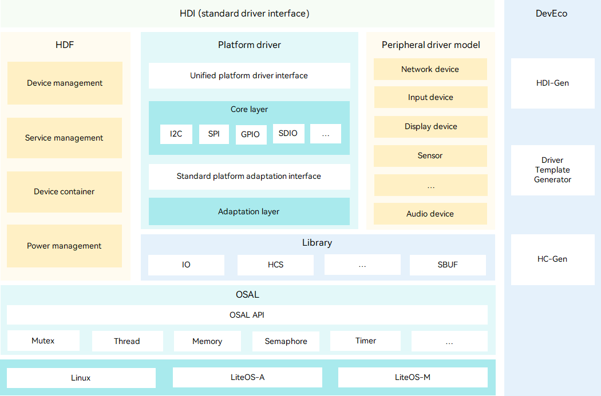

# Driver Overview

## Introduction

OpenHarmony uses the multi-kernel (Linux kernel and LiteOS) design, which allows the operating system to select suitable kernels from the abstraction layer for devices with diverse resources. The OpenHarmony driver subsystem is designed to streamline device drivers to work with different kernels on the same hardware with the minimum workloads on driver code porting and maintenance.

The OpenHarmony driver subsystem provides the following features and capabilities to shorten the driver development period and simplify third-party device driver integration:

- Elastic framework

  Based on the traditional driver framework, the OpenHarmony driver subsystem provides an elastic framework to support deployment on devices with hundreds KB to hundreds MB memory.

- Standardized driver interfaces

  The OpenHarmony driver subsystem provides diverse driver APIs compatible with the APIs of future-proof smartphones, tablets, and smart TVs.

- Component-based driver model

  The OpenHarmony driver subsystem provides the component-based driver model to implement refined driver management. You can configure components as required and focus on the interaction between the hardware and driver. The driver subsystem is also prebuilt with template-based driver model components, such as the network device model.

- Unified configuration UI

  The OpenHarmony driver subsystem provides a unified configuration tool to generate and convert driver configuration across different platforms.

## HDF

The Hardware Driver Foundation (HDF) provides driver framework capabilities, including driver loading, driver service management, and driver messaging mechanism. It strives to build a unified driver platform to back up a more precise and efficient environment for one-time development for multi-device deployment.

The HDF is built in an object-oriented programming model in C language. It provides a unified platform base for different kernels through platform decoupling and kernel decoupling. 

The following figure shows the HDF architecture.

  **Figure 1** HDF architecture 

The HDF architecture consists of the following:

- Hardware Device Interface (HDI) layer: provides unified and stable APIs for hardware operations.

- HDF: provides unified hardware resource management, driver loading management, device node management, device power management, and driver service models. It consists of the device management, service management, Device Host, and PnPManager modules.

- Unified configuration interface (DevEco Studio): supports abstract description of hardware resources to shield hardware differences, and enables development of universal driver code that is not bound to configuration information. You can use HC-Gen to quickly generate configuration files. This unified configuration interface improves development and porting efficiency.

- Operating system abstraction layer (OSAL): provides encapsulated kernel operation APIs, including the APIs for the memory, locks, threads, and semaphores, to shield operation differences between different systems.

- Platform driver layer: provides unified APIs for peripheral drivers to operate board hardware, such as I2C, SPI, and UART buses, and uniformly abstracts the APIs for board hardware operations.

- Peripheral driver model: provides common driver abstraction models for peripheral drivers to provide standard device drivers and implement driver model abstraction. With standard device driver models, you can deploy drivers through configuration without independent development. The driver model abstraction makes the drivers more general by shielding the interaction between drivers and different system components.

## Driver Development

### Platform Drivers

The OpenHarmony platform driver (platform device driver) layer provides access APIs for system and peripheral drivers. The platform devices refer to buses, such as I2C and UART, and specific hardware resources, such as GPIO and RTC. 

As an important part of the OpenHarmony driver framework, the platform driver framework provides standard models for implementing a variety of platform device drivers based on the HDF, OSAL, and driver configuration and management mechanism. It provides standard APIs for peripherals to access platform devices regardless of the difference in underlying hardware. It also provides platform device drivers unified APIs for interface adaptation, making you focus only on hardware control.

The platform driver framework provides the following:

- Unified APIs for accessing platform devices. The platform device operation APIs are encapsulated in a unified manner to shield hardware differences between SoC platforms and differences between OSs.

- Unified platform driver adaptation APIs. Unified adaptation APIs are provided for platform device drivers. You only need to focus on the hardware control, rather than the device management and common service processes.

- Common capabilities irrelevant to SoCs, such as device registration, management, and access control.

Currently, the platform driver framework supports devices, including the ADC, DAC, GPIO, HDMI, I2C, I3C, MIPI CSI, MIPI DSI, MMC, pin, PWM, regulator, RTC, SDIO, SPI, UART, and watchdog.

### Peripheral Drivers

Based on the HDF and platform driver framework, OpenHarmony provides common driver models for peripheral drivers. These models provide standard peripheral drivers to reduce repeated development. In addition, the abstraction of peripheral driver models shields the interaction between drivers and different system devices, making the driver development more general.

Currently, OpenHarmony supports peripherals, covering audio devices, cameras, codecs, LCDs, lights, motion devices, sensors, touchscreens, USBs, vibrators, WLAN devices, and devices for face authentication, fingerprint authentication, PIN authentication, and user authentication.

### Driver Code Repositories

The following table describes the code repositories of the HDF.

**Table 1** HDF code repositories

| Repository| Description|
| -------- | -------- |
| drivers/hdf_core/framework | Provides common platform-independent frameworks: - **framework/core**: &nbsp;&nbsp;-&nbsp;Provides capabilities of loading and starting drivers. &nbsp;&nbsp;-&nbsp;Implements elastic deployment and expansion of the driver framework through the object manager. - **framework/model**: &nbsp;&nbsp;Provides driver models, such as the network device model. - **framework/ability**: &nbsp;&nbsp;Provides basic drive ability models, such as the I/O communication model. - **framework/tools**: &nbsp;&nbsp;Provides tools for converting HDI APIs and configuring and building drivers. -&nbsp;**framework/support**: &nbsp;&nbsp;Provides standardized platform driver interfaces and system interface abstraction capabilities. |
| drivers/hdf_core/adapter | Provides adaptation code and build scripts for LiteOS-M and LiteOS-A kernels and user-mode interface libraries. |
| drivers/hdf_core//adapter/khdf/linux | Provides adaptation code and build scripts for Linux. |
| drivers/peripheral | Provides the hardware abstraction layer for peripheral modules, such as the display, input, sensor, WLAN, audio, and camera.|
| drivers/interface | Defines the HDI APIs of peripheral modules, such as the display, input, sensor, WLAN, audio, and camera.|

### How to Use

- To adapt an OpenHarmony driver to a new platform device, use the standard models and APIs provided by the OpenHarmony platform driver framework for interface adaptation. You only need to focus on hardware control, without caring about the device management and common service processes. For details, see **Developing Platform Drivers**.

- After the platform driver adaptation, you can use the APIs provided by the OpenHarmony platform driver framework for the system and peripheral drivers to further develop services and applications. For details, see **Using Platform Drivers**.

- The OpenHarmony HDF provides a variety of standard peripheral driver models. These models shield hardware differences and provide stable and standard APIs for upper-layer services. You can use these models to develop peripheral drivers. For details, see **Using Peripheral Drivers**.
